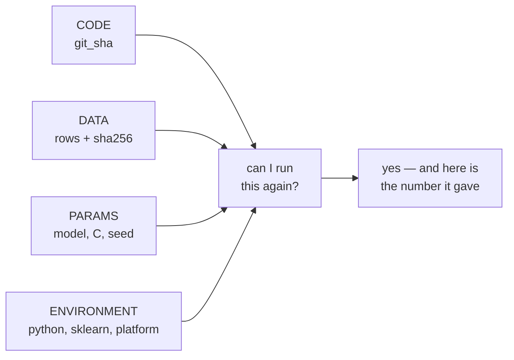

# Lesson 07 — Reproducibility and Experiment Tracking

**Goal:** be able to produce the same number again in three months, and to say
exactly which of forty experiments produced the model that is running.

## What you will learn

- Seeds, and how much your result moves without them
- Fingerprinting the data
- A run record you can write with the standard library
- The four things that must be recorded for every model

---

## The number moves on its own

```python
import numpy as np
import pandas as pd
from sklearn.pipeline import Pipeline
from sklearn.compose import ColumnTransformer
from sklearn.preprocessing import OneHotEncoder, StandardScaler
from sklearn.impute import SimpleImputer
from sklearn.linear_model import LogisticRegression
from sklearn.model_selection import train_test_split
from sklearn.metrics import roc_auc_score

df = pd.read_parquet("/tmp/subscribers.parquet")
numeric = ["tenure_days", "logins_last_30d", "support_tickets_last_30d",
           "payment_failures_last_90d", "monthly_fee"]
categorical = ["plan", "country", "age_band"]
X, y = df[numeric + categorical], df["churned_next_30d"]

def build():
    pre = ColumnTransformer([
        ("num", Pipeline([("impute", SimpleImputer(strategy="median")),
                          ("scale", StandardScaler())]), numeric),
        ("cat", OneHotEncoder(handle_unknown="ignore", sparse_output=False), categorical)])
    return Pipeline([("pre", pre),
                     ("model", LogisticRegression(C=0.1, max_iter=2000))])

def run(seed):
    X_tr, X_te, y_tr, y_te = train_test_split(
        X, y, test_size=0.25, random_state=seed, stratify=y)
    m = build().fit(X_tr, y_tr)
    return roc_auc_score(y_te, m.predict_proba(X_te)[:, 1])

unseeded = [run(None) for _ in range(5)]   # skip-verify: different every run
print("no seed :", " ".join(f"{a:.4f}" for a in unseeded))
print(f"spread  : {max(unseeded) - min(unseeded):.4f}")
seeded = [run(0) for _ in range(3)]
print("seed=0  :", " ".join(f"{a:.4f}" for a in seeded))
print("identical:", len(set(seeded)) == 1)
```

```text
no seed : 0.6796 0.6884 0.6735 0.6844 0.6794
spread  : 0.0149
seed=0  : 0.6828 0.6828 0.6828
identical: True
```

The first two lines are the only output in this course that will not reproduce
on your machine, which is the entire point of them. A second run here gave
0.6777 0.6743 0.6834 0.6637 0.6657, a spread of 0.0197.

The same code, the same data, the same model: **0.6735 to 0.6884**. A spread of
0.0149, from nothing but which rows landed in the test set.

Now compare that to lesson 05, where logistic regression beat gradient boosting
by 0.0200 and we published it as a finding. The seed alone can manufacture
that entire difference. Two consequences:

1. **An unseeded comparison is not a comparison.** You can pick either winner
   by rerunning.
2. **The seed's spread is the resolution of your instrument.** Report it once,
   then refuse to discuss differences smaller than it.

Seed everything that draws random numbers: the split, the model, any sampler,
NumPy's global RNG if a library touches it. In scikit-learn that means
`random_state=` on the split and on the estimator, and it makes the result
*reproducible* — it does not make it *right*, which is what cross-validation is
for.

---

## Fingerprint the data

"Same data" is a claim people make casually and are often wrong about.

```python
import hashlib

def fingerprint(frame):
    payload = pd.util.hash_pandas_object(frame, index=True).to_numpy().tobytes()
    return {
        "rows": len(frame),
        "columns": list(frame.columns),
        "sha256": hashlib.sha256(payload).hexdigest()[:16],
    }

fp = fingerprint(df)
print("rows    :", fp["rows"])
print("sha256  :", fp["sha256"])
changed = df.copy()
changed.loc[0, "logins_last_30d"] += 1
print("after changing ONE value in one cell:")
print("sha256  :", fingerprint(changed)["sha256"])
```

```text
rows    : 12000
sha256  : 6b3f8cdbebe1ed9e
after changing ONE value in one cell:
sha256  : 30d264ae35e25838
```

One incremented integer in 12,000 rows and 13 columns changes the fingerprint
completely. That is the property you want: the hash answers "is this the same
table?" and nothing else.

Hash the **frame**, not the file. Parquet files differ byte-for-byte between
writer versions and compression settings while holding identical data, so a
file hash raises false alarms. `hash_pandas_object` hashes the values.

Where this earns its keep: someone asks why last month's report said 0.68 and
today's says 0.71. With fingerprints you answer in ten seconds — the data
changed — instead of spending a day re-reading your own code.

---

## The run record

You do not need a tracking platform to start. You need a JSON file per run and
the discipline to write it every time.

```python
import json, platform, subprocess, sys, time
from pathlib import Path
import sklearn

RUNS = Path("/tmp/ds_runs")
RUNS.mkdir(exist_ok=True)

def git_sha():
    try:
        return subprocess.run(["git", "rev-parse", "--short", "HEAD"],
                              capture_output=True, text=True,
                              check=True).stdout.strip()
    except Exception:
        return "not-a-git-repo"

def record(name, params, metrics, data_fp):
    run = {
        "name": name,
        "utc": time.strftime("%Y-%m-%dT%H:%M:%SZ", time.gmtime()),
        "git_sha": git_sha(),
        "python": sys.version.split()[0],
        "sklearn": sklearn.__version__,
        "platform": platform.platform().split("-")[0],
        "data": data_fp,
        "params": params,
        "metrics": metrics,
    }
    (RUNS / f"{name}.json").write_text(json.dumps(run, indent=2, sort_keys=True))
    return run

r = record("logreg-C0.1",
           {"model": "LogisticRegression", "C": 0.1, "seed": 0},
           {"roc_auc": round(run(0), 4)}, fp)

for key in sorted(r):
    value = r[key]
    if key in {"utc", "git_sha"}:
        print(f"{key:<10} <varies per run>")
    elif key == "data":
        print(f"{key:<10} rows={value['rows']} sha256={value['sha256']}")
    else:
        print(f"{key:<10} {value}")
```

```text
data       rows=12000 sha256=6b3f8cdbebe1ed9e
git_sha    <varies per run>
metrics    {'roc_auc': 0.6828}
name       logreg-C0.1
params     {'model': 'LogisticRegression', 'C': 0.1, 'seed': 0}
platform   macOS
python     3.12.2
sklearn    1.8.0
utc        <varies per run>
```

Four groups of fields, each answering a question someone will ask you:



The environment block is the one people leave out and regret. scikit-learn
changes defaults between versions; a notebook that gave 0.68 on 1.4 can give a
different number on 1.8 with byte-identical code and data, and without the
version recorded that difference is unexplainable.

**`git_sha` requires the code to be committed.** A run recorded from a dirty
working tree is a run you cannot reproduce, whatever the field says. The
discipline is: commit, then run, then record. A stricter version of `git_sha`
appends `-dirty` when `git status --porcelain` is non-empty, and refuses to
record a final result at all.

---

## Comparing runs

```python
from sklearn.ensemble import HistGradientBoostingClassifier
from sklearn.tree import DecisionTreeClassifier

def evaluate(estimator, seed=0):
    X_tr, X_te, y_tr, y_te = train_test_split(
        X, y, test_size=0.25, random_state=seed, stratify=y)
    pre = ColumnTransformer([
        ("num", Pipeline([("impute", SimpleImputer(strategy="median")),
                          ("scale", StandardScaler())]), numeric),
        ("cat", OneHotEncoder(handle_unknown="ignore", sparse_output=False), categorical)])
    m = Pipeline([("pre", pre), ("model", estimator)]).fit(X_tr, y_tr)
    return round(roc_auc_score(y_te, m.predict_proba(X_te)[:, 1]), 4)

experiments = {
    "logreg-C0.1": (LogisticRegression(C=0.1, max_iter=2000), {"C": 0.1}),
    "tree-d4": (DecisionTreeClassifier(max_depth=4, random_state=0), {"max_depth": 4}),
    "hgb-default": (HistGradientBoostingClassifier(random_state=0), {}),
}
for name, (est, params) in experiments.items():
    record(name, {"model": type(est).__name__, "seed": 0, **params},
           {"roc_auc": evaluate(est)}, fp)

rows = [json.loads(p.read_text()) for p in sorted(RUNS.glob("*.json"))]
table = pd.DataFrame([{
    "run": r["name"],
    "model": r["params"]["model"],
    "roc_auc": r["metrics"]["roc_auc"],
    "data_sha": r["data"]["sha256"],
    "sklearn": r["sklearn"],
} for r in rows]).sort_values("roc_auc", ascending=False)
print(table.to_string(index=False))
print(f"\nall runs on the same data? {table['data_sha'].nunique() == 1}")
```

```text
        run                          model  roc_auc         data_sha sklearn
    tree-d4         DecisionTreeClassifier   0.6835 6b3f8cdbebe1ed9e   1.8.0
logreg-C0.1             LogisticRegression   0.6828 6b3f8cdbebe1ed9e   1.8.0
hgb-default HistGradientBoostingClassifier   0.6694 6b3f8cdbebe1ed9e   1.8.0

all runs on the same data? True
```

A leaderboard, from forty lines of standard library, with the data fingerprint
beside every score so you can tell a real improvement from a changed input.

And a warning about leaderboards: the decision tree is on top here at 0.6835,
while in lesson 05's five-fold cross-validation it scored 0.660 and logistic
regression scored 0.682. This table ranks them on **one split**, whose noise you
measured at 0.0149 — larger than the 0.0007 gap it is ranking on. The table is
correct and the ranking is meaningless.

Single-split leaderboards are how teams spend a quarter climbing noise. Record
single-split runs for traceability; **select** on cross-validated scores, and
put the fold standard deviation in the table so the reader cannot misread it.

---

## What good looks like

| Level | What you have | Good enough for |
|---|---|---|
| 0 | Notebook, no seeds, results in your head | Nothing |
| 1 | Seeds, one script, printed metrics | A one-off analysis |
| **2** | **JSON run records, data fingerprints, committed code** | **Most production models** |
| 3 | MLflow / W&B, artefacts stored, model registry | Teams, many models, audit requirements |

Level 2 is reachable this afternoon and covers the questions that actually get
asked. Do not skip it while waiting for permission to install a platform.

The one thing that no tool gives you: **a `README` line saying which run is in
production.** Write it by hand.

```text
PRODUCTION: logreg-C0.1  (run 2026-09-27, data sha 6b3f8cdb, git 4a91c02)
            deployed 2026-10-01, owner: adam, retrain: monthly
```

---

## Common mistakes

| Mistake | Why it hurts |
|---|---|
| No seed | Your result moves 0.015 on its own and comparisons are meaningless |
| Seeding the split but not the model | Half-reproducible is not reproducible |
| Hashing the parquet file instead of the frame | False alarms on every writer upgrade |
| No environment record | "It gave 0.68 last year" becomes unfalsifiable |
| Recording a run from a dirty working tree | The sha points at code you did not run |
| Ranking on a single split | You optimise noise, confidently, for a quarter |
| Not writing down which run is deployed | The most expensive missing line in the repo |

---

## Exercises

1. Make `git_sha` append `-dirty` when `git status --porcelain` is non-empty.
   Run it with an uncommitted change and confirm the suffix appears.
2. Add `cv_auc_mean` and `cv_auc_std` to `metrics` and re-sort the leaderboard
   on the cross-validated mean. Does the ranking change?
3. Change one value in `df`, rerun `record` under a new name, and write the
   query that finds every run whose `data_sha` differs from the current data.
4. Extend the record with `n_rows_train`, `n_positives_train` and
   `feature_names`. For each, name the specific question it answers later.

---

**Next:** [Lesson 08 — Shipping the Model](08-shipping-the-model.md)
