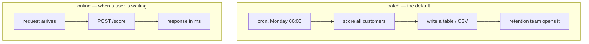

# Lesson 08 — Shipping the Model

**Goal:** get predictions to the people who act on them, in a form that does
not break quietly.

## What you will learn

- The artefact bundle: a model is never just a model
- Validating input at the boundary
- Batch scoring, which is what you probably need
- An HTTP service, when you need one
- Latency, measured rather than assumed

---

## Two ways to ship



Choose batch unless something forces you online. The retention team works a
call list once a week; nothing in that sentence needs a web server, and a cron
job that writes a CSV has perhaps a tenth of the failure modes.

| Go online when | Stay batch when |
|---|---|
| A person or system is waiting for this specific prediction | The action happens on a schedule |
| Features only exist at request time (what is in the cart now) | Features come from a warehouse |
| The population is too large to score in full | You can score everyone in one pass |

---

## The bundle

The pipeline alone is not deployable. The threshold, the column order and the
provenance must travel with it, in one file, or they will disagree with each
other within a month.

```python
import joblib
import pandas as pd
import sklearn
from pathlib import Path
from sklearn.compose import ColumnTransformer
from sklearn.pipeline import Pipeline
from sklearn.preprocessing import OneHotEncoder, StandardScaler
from sklearn.impute import SimpleImputer
from sklearn.linear_model import LogisticRegression
from sklearn.model_selection import train_test_split

df = pd.read_parquet("/tmp/subscribers.parquet")
numeric = ["tenure_days", "logins_last_30d", "support_tickets_last_30d",
           "payment_failures_last_90d", "monthly_fee"]
categorical = ["plan", "country", "age_band"]
X, y = df[numeric + categorical], df["churned_next_30d"]
X_tr, X_te, y_tr, y_te = train_test_split(
    X, y, test_size=0.25, random_state=0, stratify=y)

pre = ColumnTransformer([
    ("num", Pipeline([("impute", SimpleImputer(strategy="median")),
                      ("scale", StandardScaler())]), numeric),
    ("cat", OneHotEncoder(handle_unknown="ignore", sparse_output=False), categorical)])
pipe = Pipeline([("pre", pre),
                 ("model", LogisticRegression(C=0.1, max_iter=2000))]).fit(X_tr, y_tr)

ART = Path("/tmp/ds_model")
ART.mkdir(exist_ok=True)
bundle = {
    "pipeline": pipe,
    "feature_order": numeric + categorical,
    "numeric": numeric,
    "categorical": categorical,
    "threshold": 0.192,                 # from lesson 06: capacity of 1,000 calls
    "trained_utc": "2026-09-27T00:00:00Z",
    "sklearn_version": sklearn.__version__,
    "training_rows": int(len(X_tr)),
    "training_base_rate": round(float(y_tr.mean()), 4),
}
joblib.dump(bundle, ART / "churn-v1.joblib")
print(f"saved churn-v1.joblib  "
      f"({(ART / 'churn-v1.joblib').stat().st_size / 1024:.1f} KB)")
print("keys:", ", ".join(sorted(bundle)))
```

```text
saved churn-v1.joblib  (4.7 KB)
keys: categorical, feature_order, numeric, pipeline, sklearn_version, threshold, trained_utc, training_base_rate, training_rows
```

4.7 KB. A logistic regression is eight coefficients and an encoder's category
lists; almost everything expensive about this project is not in the file.

`feature_order` is the field that prevents the worst class of production bug. A
`ColumnTransformer` selects columns by name, so it is safe — but the moment
anyone builds a NumPy array by hand, or a service sends a JSON object whose keys
iterate in a different order, positional misalignment scores customers using
another customer's numbers and nothing raises.

`training_base_rate` is there for lesson 09. You cannot detect that the
population moved if you did not record where it started.

```python
loaded = joblib.load(ART / "churn-v1.joblib")
one = X_te.iloc[[0]]
print("trained with sklearn", loaded["sklearn_version"],
      "- running on", sklearn.__version__)
print("threshold:", loaded["threshold"])
p = loaded["pipeline"].predict_proba(one[loaded["feature_order"]])[0, 1]
print(f"probability {p:.4f} -> action: {'CALL' if p >= loaded['threshold'] else 'skip'}")
```

```text
trained with sklearn 1.8.0 - running on 1.8.0
threshold: 0.192
probability 0.1721 -> action: skip
```

Compare those two versions **on load**, and log a warning when they differ.
Pickles are not guaranteed across scikit-learn versions; loading a 1.4 model
under 1.8 may work, may warn, or may silently behave differently. Pin the
version in `requirements.txt` and treat a mismatch as an incident, not a
curiosity.

---

## The contract at the boundary

Every prediction service is really a data-validation service with a model
attached.

```python
def validate(frame, bundle):
    problems = []
    missing = [c for c in bundle["feature_order"] if c not in frame.columns]
    if missing:
        problems.append(f"missing columns: {missing}")
    for col in bundle["numeric"]:
        if col not in frame:
            continue
        if not pd.api.types.is_numeric_dtype(frame[col]):
            problems.append(f"{col} is not numeric ({frame[col].dtype})")
            continue                      # a range check would raise TypeError
        if (frame[col] < 0).any():
            problems.append(f"{col} has negative values")
    for col in bundle["categorical"]:
        if col in frame and frame[col].isna().any():
            problems.append(f"{col} has nulls")
    return problems

print("valid batch  :", validate(X_te.head(5), loaded) or "ok")

bad = X_te.head(5).copy()
bad["tenure_days"] = bad["tenure_days"].astype(str)
bad.loc[bad.index[0], "logins_last_30d"] = -3
bad = bad.drop(columns=["monthly_fee"])
for problem in validate(bad, loaded):
    print("  reject:", problem)
```

```text
valid batch  : ok
  reject: missing columns: ['monthly_fee']
  reject: tenure_days is not numeric (object)
  reject: logins_last_30d has negative values
```

Three defects, three specific messages, no exception. Note the `continue` after
the dtype failure — the first version of this function did not have it, and
comparing a string column to `0` raised `TypeError: '<' not supported between
instances of 'str' and 'int'`. **A validator that crashes on bad input is not a
validator**, and the only way to find that out is to feed it bad input on
purpose. Write the malformed-batch test at the same time as the function.

What the model does with each of these if you skip validation:

| Defect | Without validation |
|---|---|
| Missing column | `ColumnTransformer` raises — the good case, it fails loudly |
| String where a number belongs | The scaler raises, *or* casts, depending on content |
| Negative tenure | Scores happily; the number is meaningless |
| Unseen category | Encoded as all-zeros, scored silently (lesson 04) |

Only the first one fails loudly on its own. That is why the boundary check
exists.

---

## Batch scoring

This is the whole deployment for most projects.

```python
import numpy as np

def score_batch(frame, bundle, top_k=None):
    problems = validate(frame, bundle)
    if problems:
        raise ValueError("input rejected: " + "; ".join(problems))
    ordered = frame[bundle["feature_order"]]
    probability = bundle["pipeline"].predict_proba(ordered)[:, 1]
    out = pd.DataFrame({
        "probability": probability.round(4),
        "action": np.where(probability >= bundle["threshold"], "call", "skip"),
        "model": "churn-v1",
    }, index=frame.index)
    out = out.sort_values("probability", ascending=False)
    if top_k is not None:
        out = out.head(top_k)
    return out

call_list = score_batch(X_te, loaded, top_k=1_000)
print(call_list.head(5).to_string())
print(f"\nrows written: {len(call_list):,}")
print(f"lowest probability on the list: {call_list['probability'].min():.4f}")
print(f"actual churners among them: {y_te.loc[call_list.index].sum()}")
```

```text
      probability action     model
6088       0.6318   call  churn-v1
3405       0.5448   call  churn-v1
3614       0.5376   call  churn-v1
7177       0.5352   call  churn-v1
9305       0.5296   call  churn-v1

rows written: 1,000
lowest probability on the list: 0.1923
actual churners among them: 256
```

Four properties worth copying into your own scoring job:

1. **It validates before it scores.** The `raise` is deliberate: a batch job
   should fail and page someone rather than write a plausible-looking wrong
   file.
2. **It returns the action, not only the score.** The retention team should
   never have to remember the threshold.
3. **It stamps the model name on every row.** Three months later you can join
   outcomes back to the version that predicted them, which is the only way
   lesson 09 works.
4. **`top_k` is a parameter of the job, not of the model.** Capacity changes
   without retraining.

The lowest probability on the list is 0.1923 — that is the threshold, derived
from the capacity, exactly as lesson 06 argued.

---

## An HTTP service, when you need one

```python
# serve.py
import joblib
import pandas as pd
from fastapi import FastAPI, HTTPException
from pydantic import BaseModel, Field

BUNDLE = joblib.load("/tmp/ds_model/churn-v1.joblib")
app = FastAPI(title="churn-scorer", version="1")


class Customer(BaseModel):
    tenure_days: int = Field(ge=0)
    logins_last_30d: int = Field(ge=0)
    support_tickets_last_30d: int = Field(ge=0)
    payment_failures_last_90d: int = Field(ge=0)
    monthly_fee: float = Field(gt=0)
    plan: str
    country: str
    age_band: str


@app.get("/health")
def health():
    return {
        "status": "ok",
        "model": "churn-v1",
        "trained_utc": BUNDLE["trained_utc"],
        "sklearn": BUNDLE["sklearn_version"],
        "threshold": BUNDLE["threshold"],
    }


@app.post("/score")
def score(customer: Customer):
    frame = pd.DataFrame([customer.model_dump()])[BUNDLE["feature_order"]]
    try:
        probability = float(BUNDLE["pipeline"].predict_proba(frame)[0, 1])
    except Exception as exc:                      # never leak a traceback
        raise HTTPException(status_code=500, detail="scoring failed") from exc
    return {
        "probability": round(probability, 4),
        "threshold": BUNDLE["threshold"],
        "action": "call" if probability >= BUNDLE["threshold"] else "skip",
        "model": "churn-v1",
    }
```

The `Customer` model *is* the contract, and it is enforced before your code
runs. `Field(ge=0)` does the job the hand-written validator did above, and
FastAPI turns a violation into a 422 with the offending field named.

Run it:

```bash
uvicorn serve:app --port 8931
```

```bash
curl -s localhost:8931/health
```

```text
{
    "status": "ok",
    "model": "churn-v1",
    "trained_utc": "2026-09-27T00:00:00Z",
    "sklearn": "1.8.0",
    "threshold": 0.192
}
```

A `/health` endpoint that returns the **model version and training date** is
worth writing on the first day. When someone asks "is the new model live yet?",
this answers it without a deploy log.

```bash
curl -s -X POST localhost:8931/score -H 'content-type: application/json' \
  -d '{"tenure_days":45,"logins_last_30d":1,"support_tickets_last_30d":3,
       "payment_failures_last_90d":2,"monthly_fee":99,"plan":"basic",
       "country":"EG","age_band":"18-29"}'
```

```text
{
    "probability": 0.788,
    "threshold": 0.192,
    "action": "call",
    "model": "churn-v1"
}
```

Then a healthy customer:

```bash
curl -s -X POST localhost:8931/score -H 'content-type: application/json' \
  -d '{"tenure_days":500,"logins_last_30d":25,"support_tickets_last_30d":0,
       "payment_failures_last_90d":0,"monthly_fee":399,"plan":"pro",
       "country":"AE","age_band":"30-44"}'
```

```text
{
    "probability": 0.0137,
    "threshold": 0.192,
    "action": "skip",
    "model": "churn-v1"
}
```

0.788 and 0.0137. Both sensible — and the first one is also a warning. The
highest probability the model assigned to any of the 3,000 real test customers
was 0.632 (lesson 06). This request asked about a customer more extreme than
anything in the data, and the model answered with more confidence than it has
ever been entitled to. An API accepts inputs your training set never contained;
the honest response to an out-of-range request is to serve it *and* log it, and
lesson 09 is where that log gets read.

And the invalid request:

```bash
curl -s -X POST localhost:8931/score -H 'content-type: application/json' \
  -d '{"tenure_days":-5,"logins_last_30d":1,"support_tickets_last_30d":0,
       "payment_failures_last_90d":0,"monthly_fee":99,"plan":"basic",
       "country":"EG","age_band":"18-29"}'
```

```text
HTTP 422
{
  "type": "greater_than_equal",
  "loc": ["body", "tenure_days"],
  "msg": "Input should be greater than or equal to 0",
  "input": -5,
  "ctx": {"ge": 0}
}
```

Rejected before the model was touched, with the field named. That is the
behaviour you want at an online boundary — and note it is the *opposite* of the
batch choice, where `handle_unknown="ignore"` kept the 6 a.m. job alive. A
caller who can read the error should get the error; an unattended job should
degrade and log.

---

## Latency, measured

```python
import time   # skip-verify: wall-clock numbers differ per machine

batch = X_te[loaded["feature_order"]]
t0 = time.perf_counter()
loaded["pipeline"].predict_proba(batch)
batch_ms = (time.perf_counter() - t0) * 1000

rows = [batch.iloc[[i]] for i in range(200)]
t0 = time.perf_counter()
for r in rows:
    loaded["pipeline"].predict_proba(r)
single_ms = (time.perf_counter() - t0) * 1000 / 200

print(f"one batch of {len(batch):,}: {batch_ms:.1f} ms total, "
      f"{batch_ms / len(batch) * 1000:.1f} us per row")
print(f"one row at a time      : {single_ms:.2f} ms per row")
print(f"ratio                  : {single_ms * 1000 / (batch_ms / len(batch) * 1000):.0f}x")
```

```text
one batch of 3,000: 7.1 ms total, 2.4 us per row
one row at a time      : 1.69 ms per row
ratio                  : 710x
```

(Timings are wall-clock on one machine; the ratio is the transferable part.)

**710 times more expensive per row.** Almost none of that is the model — eight
multiplications take nanoseconds. It is the per-call overhead: building a
one-row DataFrame, the `ColumnTransformer` dispatch, the pandas object
construction. Two consequences:

- Scoring 12,000 customers as 12,000 API calls costs about 20 seconds of CPU;
  as one batch, 30 milliseconds. Never loop an API for a population you have in
  a table.
- 1.69 ms per request is still fine for an online service. The overhead only
  matters when you multiply it by a population.

---

## Before you call it deployed

- [ ] The bundle contains pipeline, `feature_order`, threshold, versions, dates
- [ ] Input is validated at the boundary, and the validator has a test with
      malformed input
- [ ] Every output row carries the model version
- [ ] `/health` (or the job's log line) reports the model version and training
      date
- [ ] Prediction inputs and outputs are **stored**, not just returned
- [ ] The previous model is still on disk and one config change from being live
- [ ] Someone other than you can run the retrain command
- [ ] A failed batch alerts a human instead of writing a partial file

The fifth item is the one that gets skipped and cannot be recovered
retroactively. Lesson 09 needs those stored predictions.

---

## Common mistakes

| Mistake | Why it hurts |
|---|---|
| Pickling the estimator without the preprocessing | Production reimplements it, slightly differently |
| Threshold hardcoded in the consuming app | Nobody can change capacity without a deploy |
| No column order in the artefact | A reordered payload scores the wrong features, silently |
| No version in the output rows | Outcomes cannot be joined back to the model that predicted them |
| Returning the traceback in the API response | Leaks internals to callers |
| Looping a single-row endpoint over a whole table | 710x the cost, for nothing |
| Not storing predictions | Lesson 09 becomes impossible |

---

## Exercises

1. Add a `/score/batch` endpoint accepting `list[Customer]`. Measure its
   throughput against 100 single calls and explain the gap using the ratio
   above.
2. Add an `expected_ranges` dict to the bundle (min/max per numeric feature from
   training) and make `validate` warn — not reject — when a value is outside.
   Which of the two curl requests above would warn?
3. Bump the bundle's `sklearn_version` to `"1.4.0"` by hand and make the loader
   emit a warning on mismatch. Why a warning and not a refusal?
4. Write the `score_daily.py` cron entry point: read yesterday's customers,
   score, write `predictions_YYYY-MM-DD.parquet` with the model version, exit
   non-zero on validation failure. Fifteen lines.

---

**Next:** [Lesson 09 — Monitoring and Drift](09-monitoring-and-drift.md)
