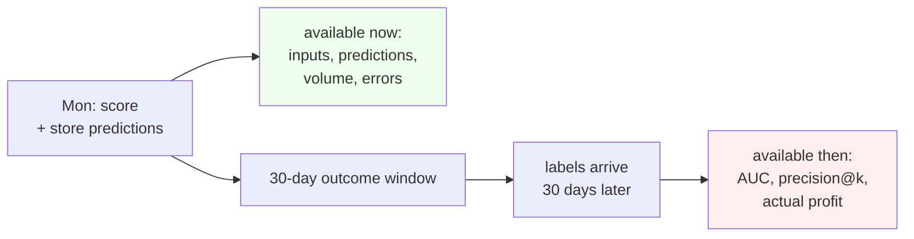

# Lesson 09 — Monitoring and Drift

**Goal:** find out that the model broke before the business tells you, and know
which kind of broken it is.

## What you will learn

- The four things to monitor, and which are available immediately
- PSI, and what values mean
- Three realistic failures, and which monitor catches each
- When drift means retrain — and when it does not

---

## The delay that shapes everything



The target is "churn in the next 30 days", so the truth about today's
predictions is knowable in a month. Any monitoring that depends on labels is a
month behind reality. Everything you can act on this week is computed from
inputs and predictions alone.

| Layer | Examples | Latency |
|---|---|---|
| **Operational** | job ran, rows scored, rows rejected, runtime | minutes |
| **Input** | PSI per feature, null rate, unseen categories, ranges | minutes |
| **Prediction** | mean score, score distribution, count above threshold | minutes |
| **Outcome** | AUC, precision@k, realised profit | 30+ days |

Teams build the fourth layer first because it is the interesting one, then find
out about outages from an email. Build them in the order above.

---

## PSI

Population Stability Index compares a feature's distribution now against its
distribution during training.

```python
import numpy as np
import pandas as pd
import joblib
from sklearn.model_selection import train_test_split
from sklearn.metrics import roc_auc_score

bundle = joblib.load("/tmp/ds_model/churn-v1.joblib")
pipe, order = bundle["pipeline"], bundle["feature_order"]
df = pd.read_parquet("/tmp/subscribers.parquet")
X, y = df[order], df["churned_next_30d"]
X_tr, X_te, y_tr, y_te = train_test_split(
    X, y, test_size=0.25, random_state=0, stratify=y)

def psi(baseline, current, buckets=10):
    edges = np.unique(np.quantile(baseline, np.linspace(0, 1, buckets + 1)))
    edges[0], edges[-1] = -np.inf, np.inf
    b = np.histogram(baseline, bins=edges)[0] / len(baseline)
    c = np.histogram(current, bins=edges)[0] / len(current)
    b, c = np.clip(b, 1e-6, None), np.clip(c, 1e-6, None)
    return float(np.sum((c - b) * np.log(c / b)))

print(f"identical data          PSI {psi(X_tr['logins_last_30d'], X_tr['logins_last_30d']):.4f}")
print(f"held-out sample         PSI {psi(X_tr['logins_last_30d'], X_te['logins_last_30d']):.4f}")
print(f"logins down 20%         PSI {psi(X_tr['logins_last_30d'], X_te['logins_last_30d'] * 0.8):.4f}")
print(f"logins down 50%         PSI {psi(X_tr['logins_last_30d'], X_te['logins_last_30d'] * 0.5):.4f}")
```

```text
identical data          PSI 0.0000
held-out sample         PSI 0.0046
logins down 20%         PSI 0.3502
logins down 50%         PSI 1.8957
```

The scale is calibrated by those four numbers. Identical data gives 0. A
genuine random sample of the same population gives **0.0046** — that is your
noise floor, and it is worth computing on your own data so your alert threshold
is not borrowed from a blog post.

| PSI | Convention | What to do |
|---|---|---|
| < 0.1 | Stable | Nothing |
| 0.1 - 0.25 | Moderate shift | Investigate, do not page anyone |
| > 0.25 | Large shift | Investigate today |

A 20% shift in one feature already reads 0.35. PSI is sensitive, which is what
you want from a leading indicator and also why it produces false alarms — a
marketing campaign that brings in a different kind of customer will light it up
without breaking anything.

---

## Three failures

```python
rng = np.random.default_rng(5)
base_p = pipe.predict_proba(X_te[order])[:, 1]

def report(name, frame, truth):
    p = pipe.predict_proba(frame[order])[:, 1]
    return {
        "scenario": name,
        "PSI logins": round(psi(X_tr["logins_last_30d"], frame["logins_last_30d"]), 3),
        "mean pred": round(p.mean(), 4),
        "pred shift": round(p.mean() - base_p.mean(), 4),
        "flagged>1000": int((p >= bundle["threshold"]).sum()),
        "AUC": round(roc_auc_score(truth, p), 3),
    }

rows = [report("baseline", X_te, y_te)]

engaged = X_te.copy()                       # the product got less sticky
engaged["logins_last_30d"] = (engaged["logins_last_30d"] * 0.6).round().astype(int)
rows.append(report("engagement -40%", engaged, y_te))

newplan = X_te.copy()                       # sales launched a plan
newplan.loc[rng.choice(newplan.index, 600, replace=False), "plan"] = "enterprise"
rows.append(report("600 on a new plan", newplan, y_te))

broken = X_te.copy()                        # the events job half-failed
broken.loc[rng.choice(broken.index, int(0.3 * len(broken)), replace=False),
           "logins_last_30d"] = 0
rows.append(report("upstream bug: 30% logins=0", broken, y_te))

print(pd.DataFrame(rows).to_string(index=False))
```

```text
                  scenario  PSI logins  mean pred  pred shift  flagged>1000   AUC
                  baseline       0.005     0.1615      0.0000          1004 0.683
           engagement -40%       0.879     0.2076      0.0461          1574 0.681
         600 on a new plan       0.005     0.1602     -0.0012           993 0.681
upstream bug: 30% logins=0       0.558     0.2042      0.0428          1543 0.642
```

This table is the lesson. Read it column by column, because **no single monitor
catches all three**.

### Engagement fell 40% — huge PSI, no accuracy loss

PSI 0.879, and AUC moves from 0.683 to **0.681**. The model is fine: the
relationship between logins and churn did not change, only how many logins
people have. The ranking still works.

The damage is operational. `flagged` jumps from 1,004 to **1,574** — a 57%
overrun of a call-centre budget sized for 1,000. Nobody's AUC dashboard shows
this, and the retention team finds out by running out of hours on Thursday.

**Covariate shift with a fixed threshold is a capacity incident, not an
accuracy incident.** It is also the argument for ranking to a fixed `k` rather
than cutting at a fixed probability: top-1000 is immune to this by
construction.

### A new plan — invisible to everything numeric

PSI on the numeric features: **0.005**, indistinguishable from the noise floor.
Prediction mean moves by -0.0012. AUC 0.681. Every dashboard says green.

And yet 600 customers — a fifth of the batch — are being scored with their plan
encoded as all-zeros, because `handle_unknown="ignore"` did exactly what lesson
04 said it would. The model is silently pretending they have no plan.

Numeric drift detection cannot see this. The monitor that catches it is three
lines of set arithmetic:

```python
unseen = {c: sorted(set(newplan[c]) - set(X_tr[c]))
          for c in bundle["categorical"] if set(newplan[c]) - set(X_tr[c])}
print("unseen categories:", unseen)
print("rows affected:", int((newplan["plan"] == "enterprise").sum()),
      f"({(newplan['plan'] == 'enterprise').mean():.1%} of the batch)")
```

```text
unseen categories: {'plan': ['enterprise']}
rows affected: 600 (20.0% of the batch)
```

Run that on every batch. It costs nothing and catches a class of failure that
statistics cannot.

### The upstream bug — the only real accuracy loss

PSI 0.558, AUC **0.642**, down 0.041 from 0.683. This is the one that is
actually costing money, and it is not a modelling problem at all: an events job
half-failed and wrote zeros where login counts belong.

Note how it hides:

```python
print("null rates:", {c: round(float(broken[c].isna().mean()), 3)
                      for c in order if broken[c].isna().mean() > 0}
      or "none - the bug wrote zeros, not nulls")
print(f"zeros in logins_last_30d: baseline {(X_te['logins_last_30d'] == 0).mean():.3f}"
      f"  broken {(broken['logins_last_30d'] == 0).mean():.3f}")
```

```text
null rates: none - the bug wrote zeros, not nulls
zeros in logins_last_30d: baseline 0.001  broken 0.301
```

**A null-rate monitor would have reported nothing.** Zero is a legal value for a
login count, so nothing is missing, nothing is out of range, and nothing raises.
The share of exact zeros went from 0.1% to 30.1%, which is why you monitor the
rate of *sentinel* values — zeros, empty strings, defaults, `1970-01-01` — and
not only nulls.

---

## Drift does not mean retrain

```python
from sklearn.base import clone

drifted = X.copy()
drifted["logins_last_30d"] = (drifted["logins_last_30d"] * 0.6).round().astype(int)
Xd_tr, Xd_te, yd_tr, yd_te = train_test_split(
    drifted, y, test_size=0.25, random_state=0, stratify=y)

print(f"old model on drifted data  : AUC "
      f"{roc_auc_score(yd_te, pipe.predict_proba(Xd_te[order])[:, 1]):.3f}")
fresh = clone(pipe).fit(Xd_tr, yd_tr)
print(f"retrained on drifted data  : AUC "
      f"{roc_auc_score(yd_te, fresh.predict_proba(Xd_te[order])[:, 1]):.3f}")
print(f"old model on original data : AUC "
      f"{roc_auc_score(y_te, pipe.predict_proba(X_te[order])[:, 1]):.3f}")
```

```text
old model on drifted data  : AUC 0.681
retrained on drifted data  : AUC 0.684
old model on original data : AUC 0.683
```

Retraining on the drifted data bought **0.003 AUC** — nothing. The alarm read
0.879 and the correct response was not to retrain.

The distinction:

| Kind | What changed | Retraining helps? |
|---|---|---|
| **Covariate shift** | `P(X)` — the population | Rarely. The ranking still holds |
| **Concept drift** | `P(y \| X)` — the relationship | Yes. This is the case retraining is for |
| **Data quality** | Neither — the pipeline broke | **No.** Fix the pipeline. Retraining bakes the bug in |

The third row is the expensive mistake. Retraining on the broken batch would
teach the model that 30% of customers genuinely have zero logins, quietly
absorbing a bug into the coefficients where nobody will find it. **Diagnose
before you retrain.**

Retrain on a schedule, because new data is usually worth having. Retrain *in
response to an alarm* only after you know which of the three rows you are in.

---

## One row per run

Write a single record per scoring run and keep them forever. This is the whole
monitoring system for a small project, and the input to any dashboard for a
large one.

```python
import json

def monitor(frame, bundle, baseline_train, date):
    p = bundle["pipeline"].predict_proba(frame[bundle["feature_order"]])[:, 1]
    return {
        "date": date,
        "model": "churn-v1",
        "rows_scored": len(frame),
        "rows_rejected": 0,
        "mean_prediction": round(float(p.mean()), 4),
        "training_base_rate": bundle["training_base_rate"],
        "flagged": int((p >= bundle["threshold"]).sum()),
        "psi": {c: round(psi(baseline_train[c], frame[c]), 3)
                for c in bundle["numeric"]},
        "unseen_categories": {c: sorted(set(frame[c]) - set(baseline_train[c]))
                              for c in bundle["categorical"]
                              if set(frame[c]) - set(baseline_train[c])},
    }

print(json.dumps(monitor(newplan, bundle, X_tr, "2026-10-05"), indent=2))
```

```text
{
  "date": "2026-10-05",
  "model": "churn-v1",
  "rows_scored": 3000,
  "rows_rejected": 0,
  "mean_prediction": 0.1602,
  "training_base_rate": 0.1608,
  "flagged": 993,
  "psi": {
    "tenure_days": 0.007,
    "logins_last_30d": 0.005,
    "support_tickets_last_30d": 0.0,
    "payment_failures_last_90d": 0.003,
    "monthly_fee": 0.0
  },
  "unseen_categories": {
    "plan": [
      "enterprise"
    ]
  }
}
```

`mean_prediction` 0.1602 against `training_base_rate` 0.1608 — those two numbers
sitting side by side are the cheapest sanity check in machine learning. A
calibrated model on a stable population predicts, on average, the base rate. If
they diverge, either the population moved or something upstream broke, and you
know within minutes of the job finishing.

And `unseen_categories` is non-empty, which is the only field in this record
that noticed anything at all.

### Alerts worth having

| Condition | Severity |
|---|---|
| The job did not run, or wrote fewer rows than usual | page |
| Rows rejected by validation > 1% | page |
| Any unseen category on > 1% of rows | investigate today |
| `mean_prediction` outside base rate +/- 30% relative | investigate today |
| `flagged` outside 0.7x-1.3x of capacity | investigate today |
| Any feature PSI > 0.25 | investigate this week |
| Sentinel-value rate (zeros, defaults) up > 5x | investigate today |
| precision@k below the agreed floor, 30 days later | review the model |

Note that only the last one needs labels, and only the last one is about the
model.

---

## Common mistakes

| Mistake | Why it hurts |
|---|---|
| Monitoring accuracy only | It is 30 days late, and it missed two of the three failures here |
| Monitoring nulls but not sentinel values | The 30% zeros bug produced no nulls at all |
| No unseen-category check | 600 customers scored as plan-less, every dashboard green |
| Retraining because PSI alarmed | Bought 0.003 AUC; would have baked in a bug in the other case |
| A fixed probability threshold with a moving population | Budget overrun of 57% with unchanged accuracy |
| Not storing predictions | Nothing above can be computed retroactively |
| Alert thresholds copied from an article | Your noise floor here was 0.0046; measure your own |

---

## Exercises

1. Compute PSI on the **predictions** rather than the inputs for all three
   scenarios. Which failures does prediction PSI catch that input PSI misses,
   and vice versa?
2. Add a `sentinel_rates` field to `monitor` that reports the share of exact
   zeros per numeric feature. Confirm it fires on the broken batch.
3. Build the concept-drift case: keep `X_te` unchanged but flip the churn label
   for half the customers with `payment_failures_last_90d > 0`. Show that PSI
   sees nothing and AUC falls, then that retraining recovers it.
4. Write the runbook for "unseen category on 20% of rows": who is called, what
   they check first, and what the rollback is. One page.

---

**Next:** [Lesson 10 — Limits, Fairness and the Model Card](10-limits-and-fairness.md)
