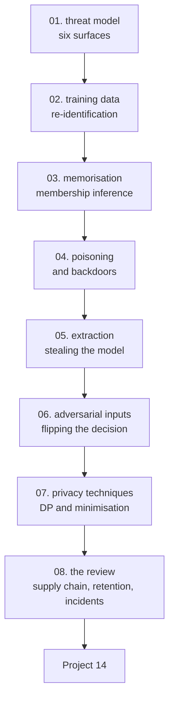

# Data Security for AI — Tayel AI Labs

The fourteenth course. Every other course in this track asks whether the model
works. This one asks **what someone can do to it, and what it gives away**.

Nothing here is theoretical: every attack is implemented in a few lines of
NumPy and scikit-learn, run against a model, and measured.

**Prerequisites**

- [`../Machine-Learning`](../Machine-Learning) — you must be able to train and
  evaluate a model
- [`../Data-Science`](../Data-Science) — lessons 03 (leakage), 07 (versioning)
  and 10 (model cards) are used directly
- [`../AI-Agents`](../AI-Agents) lesson 05 covers prompt injection, which is
  this course's subject applied to agents

**A note on ethics.** These attacks are implemented against models you train
yourself, on synthetic data, so that you can defend real ones. Run them on
systems you own or have written permission to test.

---

## The path



## Lessons

| # | Lesson | The measured result |
|---|---|---|
| 01 | [The Threat Model](lessons/01-threat-model.md) | Six surfaces, and the ten questions to answer first |
| 02 | [Training Data and Re-identification](lessons/02-training-data.md) | Four ordinary facts uniquely identify **46.3%** of 5,000 people |
| 03 | [Memorisation and Membership Inference](lessons/03-memorisation.md) | Attack AUC **0.805** on a deep forest, **0.498** on logistic regression |
| 04 | [Poisoning and Backdoors](lessons/04-poisoning.md) | Poison **1%** of rows: 98.2% attack success, accuracy unchanged |
| 05 | [Model Extraction](lessons/05-model-extraction.md) | 10,000 random queries clone the model to **91.3%** agreement |
| 06 | [Adversarial Inputs](lessons/06-adversarial-inputs.md) | 12% of a standard deviation drops accuracy from 0.894 to 0.695 |
| 07 | [Privacy Techniques](lessons/07-privacy-techniques.md) | Epsilon 0.1: unbiased, and one answer was 85.6 off |
| 08 | [The Security Review](lessons/08-security-review.md) | One page, with named risk acceptance |

## Then

- **[`Project-14/`](Project-14/)** — attack a model you built, measure each
  attack, then fix what you found and prove it

---

## Setup

```bash
python3 -m venv .venv
source .venv/bin/activate
pip install -r requirements.txt
```

Everything runs in seconds on a CPU.

---

## What this course argues

1. **The boring attacks are the likely ones.** An exposed bucket beats a
   membership inference attack every time (lesson 01).
2. **Removing the name is not anonymisation.** Four ordinary columns identified
   nearly half the dataset (lesson 02).
3. **Overfitting is the privacy leak.** Capping tree depth took the attack from
   0.805 to 0.547 — a regularisation choice, not a privacy technique (lesson 03).
4. **The dangerous poisoning is invisible.** 1% of rows bought 98.2% control and
   cost 0.003 accuracy (lesson 04).
5. **Your API is your model.** 10,000 queries of pure noise produced a 91.3%
   clone (lesson 05).
6. **Not collecting the data is the only perfect control** (lesson 07).
