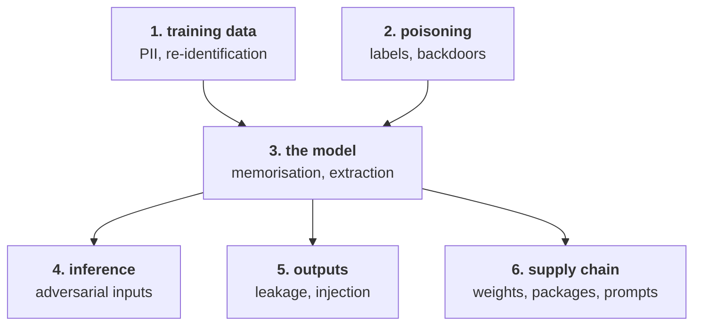

# Lesson 01 — The Threat Model

**Goal:** know what an attacker can do to an AI system, and which of those
things your design already allows.

## What you will learn

- The six places an AI system can be attacked
- Why the model is rarely the weakest part
- Writing a threat model that fits on a page
- What changes when the system is AI and what does not

---

## Six surfaces



| Surface | The attack | Lesson |
|---|---|---|
| Training data | Re-identify people in an "anonymised" dataset | 02 |
| The model's memory | Tell whether a specific person was in the training set | 03 |
| Poisoning | Corrupt the model, or install a backdoor | 04 |
| Extraction | Rebuild the model from its API | 05 |
| Inference | Craft an input that flips the decision | 06 |
| Outputs | Make the system leak data or act on injected text | AI-Agents 05 |
| Supply chain | Compromise weights, a package, or a prompt template | 08 |

---

## What is different about AI, and what is not

**Not different.** Access control, secrets management, network boundaries,
dependency hygiene, logging, least privilege. An AI system is a system, and
most of its incidents will be ordinary ones: an exposed bucket of training data,
a key in a notebook, an over-broad service account. **Do not let the interesting
attacks distract you from the boring ones**, which are far more likely.

**Different**, and genuinely new:

1. **The model is a lossy copy of the training data.** It can be interrogated
   about what it learned from (lesson 03). No other artefact in your stack has
   this property.
2. **The training data is an input channel.** Anyone who can write a row can try
   to shape the model (lesson 04).
3. **The decision boundary is attackable.** Small, deliberate input changes flip
   outputs in ways no validation rule catches (lesson 06).
4. **The API gives away the asset.** Enough queries reconstruct a usable copy
   (lesson 05).
5. **Text is both data and instruction.** Anything the model reads can try to
   command it (AI-Agents lesson 05).

---

## A threat model on one page

For each surface, four questions:

```text
ASSET        what is valuable here?        training data / the model / the decision
ACTOR        who would attack it?          an outsider, a customer, an employee, a competitor
ACCESS       what do they legitimately have?   an API key, a form field, a support ticket
IMPACT       what does success cost us?    money, a person's privacy, a licence, reputation
```

Then, for each row, one of four decisions: **mitigate**, **accept**, **transfer**
(insurance, a vendor), or **avoid** (do not build it).

A worked row:

```text
ASSET    the churn model's training data (real customer records)
ACTOR    a customer who can query the scoring API
ACCESS   unlimited authenticated requests, full probability output
IMPACT   membership inference reveals that a named person is a customer
DECISION mitigate - return a bucketed score, rate-limit, and stop
         training a model that overfits (lesson 03 measures why)
```

The value of writing this down is that it forces the **ACCESS** line, which is
where most arguments end. A great deal of "the model could leak data" anxiety
dissolves once you notice the attacker has no access to the model at all — and a
great deal of complacency dissolves when you notice they do.

---

## Who is actually in your threat model

Ranked by how often they cause real incidents:

| Actor | Typical incident |
|---|---|
| **Your own team, by accident** | Real data in a notebook, a public bucket, a key in git |
| **A curious insider** | Querying the model about people they know |
| **A customer** | Probing the API, gaming the decision |
| A competitor | Model extraction (lesson 05) |
| An outsider | The ordinary security attacks, unchanged by AI |
| A researcher | Publishing a re-identification of your public dataset |

The first row is not a joke. Most data-loss incidents in AI teams are a
`df.to_csv("/tmp/customers.csv")` that ended up somewhere it should not, or a
notebook with a production connection string, committed. The controls are
boring: separate environments, synthetic data in development, secret scanning in
CI, and no production credentials on a laptop.

---

## The security review, before the project starts

Ten questions. If you cannot answer them, that is the finding.

```text
1. What personal data does this system touch, and who approved that?
2. Where does the training data live, and who can read it?
3. Is there production data in any development environment?
4. Who can query the model, and how often?
5. What does the model return - a label, a bucket, or a full probability?
6. Can an outsider write into the training data, directly or indirectly?
7. What happens if an input is crafted to flip the decision?
8. What does the model's output reach - a human, or an action?
9. Where do the weights come from, and how are they verified?
10. How long is everything retained, and who deletes it?
```

Questions 4 and 5 together decide lessons 03 and 05. Question 6 decides lesson
04. Question 8 decides how much lesson 06 matters — a wrong decision shown to a
human is an inconvenience; a wrong decision that moves money is an incident.

---

## Common mistakes

| Mistake | Why it hurts |
|---|---|
| Treating AI security as separate from security | The likely incident is an exposed bucket |
| No threat model, because "we are just experimenting" | Experiments use real data |
| Production data in development | The most common source of loss |
| Returning full probabilities by default | Gives away the attack surface of lessons 03 and 05 |
| Assuming the training data is trusted | Anything a user writes into is an input channel |
| Reviewing security after the model works | The data decisions were made months earlier |

---

## Exercises

1. Write the one-page threat model for a system you have built. Four lines per
   surface, six surfaces.
2. Answer the ten questions for that system. Count how many you had to go and
   find out.
3. Search your repositories for real data and credentials. Report what you find
   as a number, not a story.
4. For each actor in the table, name the specific access they have in your
   system today.
5. Pick one row of your threat model and write the mitigate / accept / transfer
   / avoid decision, with the name of the person who owns it.

---

**Next:** [Lesson 02 — Training Data and Re-identification](02-training-data.md)
