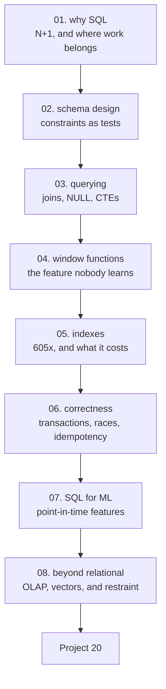

# Databases and SQL — Tayel AI Labs

The twentieth course. Every dataset in this track came out of a database, and
the courses that follow assume you can get it out correctly.

**Nothing to install.** Lessons 01-07 run on `sqlite3`, which is in the Python
standard library, against a 200,000-row fixture built in memory by the lesson.

**Prerequisites**

- [`../Python/Basic-Python`](../Python/Basic-Python) — through lesson 05
- Nothing else. This course comes **before** Data-Engineering

---

## The path



## Lessons

| # | Lesson | The measured result |
|---|---|---|
| 01 | [Why SQL](lessons/01-why-sql.md) | 500 queries in a loop: **161x slower** than one grouped query |
| 02 | [Designing a Schema](lessons/02-schema-design.md) | Four bad rows, four rejections, **zero application code** |
| 03 | [Querying](lessons/03-querying.md) | An inner join silently dropped **1,948 of 5,000 customers** |
| 04 | [Window Functions](lessons/04-window-functions.md) | `GROUP BY` gives 5 rows; `OVER` gives **5,000** |
| 05 | [Indexes and Query Plans](lessons/05-indexes.md) | **605x** faster reads, **1.97x** slower writes |
| 06 | [Correctness](lessons/06-correctness.md) | Three retries, one refund, **450 EGP** instead of 1,350 |
| 07 | [SQL for Machine Learning](lessons/07-sql-for-ml.md) | One join condition removes the future from your features |
| 08 | [Beyond Relational](lessons/08-beyond-relational.md) | Postgres until it hurts — and measure the hurt |

## Then

- **[`Project-20/`](Project-20/)** — design a schema, load real data, and prove
  the queries are both correct and fast

---

## Setup

```bash
python3 -m venv .venv
source .venv/bin/activate
pip install -r requirements.txt     # only needed for lesson 08's optional DuckDB
```

Every lesson runs in seconds.

---

## What this course argues

1. **SQL reduces, Python computes.** Push filtering, joining and aggregation
   down; pull the small result up (lesson 01).
2. **A loop that queries is the most common performance bug there is** — 161x
   here, far worse over a network (lesson 01).
3. **Constraints are the cheapest tests you will ever write**, and they hold for
   every writer, forever (lesson 02).
4. **An inner join where you wanted a left join loses rows silently.** Check the
   count after every join (lesson 03).
5. **Window functions are the most useful SQL feature most people never learn** —
   ranking, deduplication, running totals, previous period (lesson 04).
6. **Run `EXPLAIN QUERY PLAN` before changing anything**, and look for the word
   SEARCH, not just the index's name (lesson 05).
7. **Let the database do the arithmetic.** `n = n + 1` is safe;
   read-modify-write is a race (lesson 06).
8. **Every feature query takes an `as_of`.** In SQL the cutoff is a join
   condition, and it is the difference between a model and a leak (lesson 07).

---

## How this connects

| This course | Feeds |
|---|---|
| Schema design, constraints | [Data-Engineering 02](../Data-Engineering/lessons/02-data-modelling.md) |
| Query plans, indexes | [Data-Engineering 10](../Data-Engineering/lessons/10-scale.md) |
| Point-in-time features (07) | [Data-Science 02](../Data-Science/lessons/02-framing-the-problem.md), [03](../Data-Science/lessons/03-the-data-you-have.md) |
| Transactions, idempotency (06) | [AI-Agents 06](../AI-Agents/lessons/06-reliability.md) |
| Vector stores (08) | [LLM 05](../LLM-and-GenAI/lessons/05-embeddings-and-search.md) |
| Minimum group size, k-anonymity | [Data-Security 02](../Data-Security-for-AI/lessons/02-training-data.md) |
