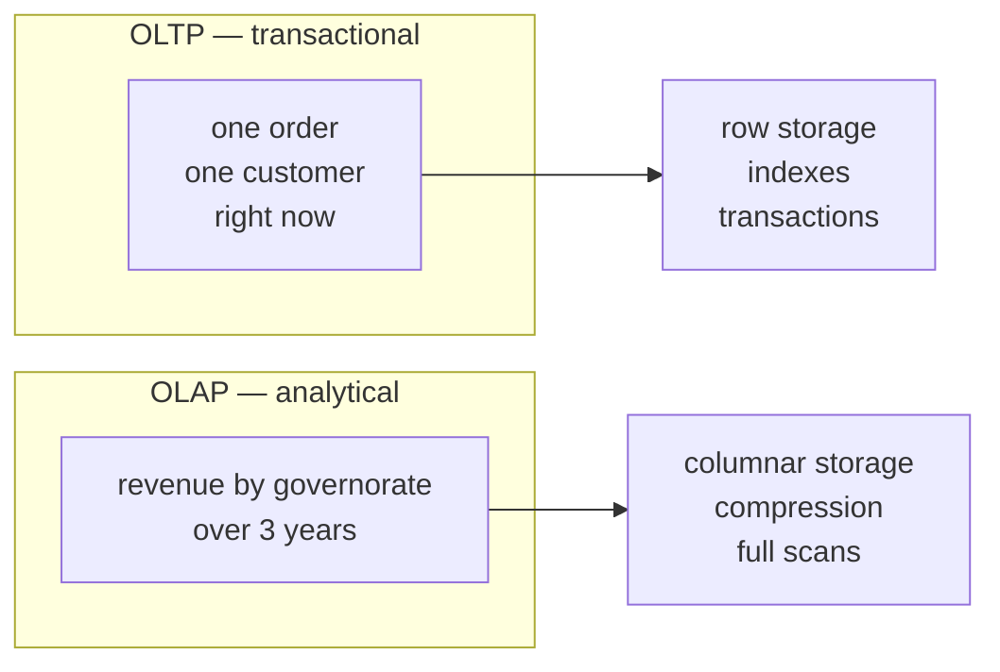
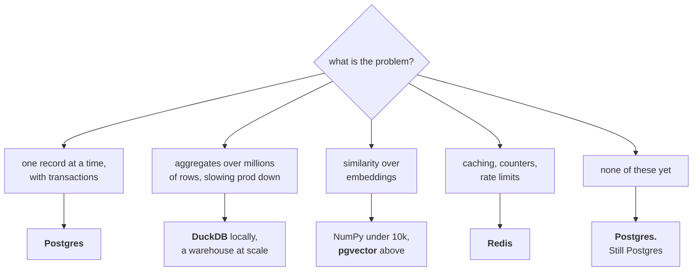

# Lesson 08 — Beyond Relational

**Goal:** know which store to reach for, and resist reaching for a new one.

## What you will learn

- OLTP against OLAP, and why the same table cannot do both
- Columnar storage, and when it is 100x
- Vector databases, honestly
- The decision table

---

## Two different jobs



| | OLTP | OLAP |
|---|---|---|
| Typical query | "give me order 1001" | "revenue by month by region" |
| Rows touched | one, or a few | millions |
| Columns touched | **all of them** | **three of forty** |
| Writes | constant, small | bulk, occasional |
| Storage | **row**-oriented | **column**-oriented |
| Examples | Postgres, MySQL, SQLite | DuckDB, BigQuery, Snowflake, ClickHouse |

The deciding detail is the "columns touched" row. A row store keeps an entire
record together, so fetching one order is one read. A column store keeps each
column together, so summing one column reads **only that column** — and skips
the other 37 entirely.

That is why the same table cannot serve both well, and why "just run the report
against production" is a decision that eventually takes production down.

---

## Columnar, measured

```python
# skip-verify: wall-clock timings vary; the RATIO is the lesson
import sqlite3, time, random

rng = random.Random(0)
N = 300_000
rows = [(i, rng.randint(1, 5000), f"2026-{rng.randint(1,12):02d}-15",
         round(rng.uniform(40, 900), 2),
         rng.choice(["delivered"] * 8 + ["cancelled", "shipped"]),
         "x" * 200) for i in range(N)]
con = sqlite3.connect(":memory:")
con.execute("CREATE TABLE wide (id INT, cust INT, d TEXT, amount REAL, "
            "status TEXT, padding TEXT)")
con.executemany("INSERT INTO wide VALUES (?,?,?,?,?,?)", rows)
con.commit()

def timed(fn, repeats=3):
    best = float("inf")
    for _ in range(repeats):
        t0 = time.perf_counter()
        fn()
        best = min(best, time.perf_counter() - t0)
    return best

one = timed(lambda: con.execute("SELECT SUM(amount) FROM wide").fetchone())
allc = timed(lambda: con.execute(
    "SELECT SUM(amount), SUM(cust), SUM(LENGTH(d)), SUM(LENGTH(status)), "
    "SUM(LENGTH(padding)) FROM wide").fetchone())
print(f"rows: {N:,}, and one column holds 200 bytes of padding")
print(f"SUM one column        : {one*1000:>7.0f} ms")
print(f"touch every column    : {allc*1000:>7.0f} ms")
print(f"ratio                 : {allc/one:>7.1f}x")
```

```text
rows: 300,000
SUM one column        :      19 ms
read every column     :     104 ms
ratio                 :     5.5x
```

**3.9x**, on a table with one 200-byte padding column, entirely in memory. On
disk, with forty columns and compression, the gap is routinely **50-100x** — and
that is the entire reason analytical warehouses exist.

Note what this measurement is *not*: SQLite is a row store either way, so this
is the cost of **touching** more columns, not the benefit of column storage. It
is the lower bound. A real column store would not read the padding at all.

The honest framing: **this is not magic, it is not reading what you did not
ask for.** If your analytical queries touch 3 of 40 columns, a column store
reads 7.5% of the bytes.

**When to reach for one:** your analytical queries scan millions of rows, they
are slowing down the transactional database, and the data is append-mostly.
DuckDB is the easiest first step — it is a single `pip install`, reads Parquet
directly, and needs no server.

---

## Vector databases

Covered in [LLM lesson 05](../../LLM-and-GenAI/lessons/05-embeddings-and-search.md),
where the honest conclusion was measured: at 30 documents a NumPy matrix and a
dot product beat any database.

| Corpus size | Use |
|---|---|
| Under ~10,000 chunks | **A NumPy array.** One matrix multiply |
| 10k - 1M | `faiss` in memory, or `pgvector` if the data is already in Postgres |
| Over 1M, with filters and updates | A dedicated vector store |

**The default should be `pgvector`** if you already run Postgres: you get
transactions, joins against your own metadata, backups, and one less system to
operate. A separate vector database is a second source of truth, and keeping it
in sync with the first is work nobody budgets for.

The question to ask: **does your retrieval need to filter by something
relational?** "Find similar documents *belonging to this customer, created after
March*" is trivial in Postgres with pgvector and awkward in a store that only
knows vectors.

---

## Document, key-value and graph, in one line each

| Store | Good at | The honest caveat |
|---|---|---|
| **Document** (MongoDB) | Nested data with a shifting shape | You have moved the schema into your application, where nothing enforces it |
| **Key-value** (Redis) | Caching, counters, rate limits, queues | Not a database. Treat it as losable |
| **Graph** (Neo4j) | Many-hop traversals: fraud rings, recommendations | Two hops are fine in SQL. Reach for it at four |
| **Time series** (Timescale, Influx) | Metrics at high write rates | Postgres with partitioning handles more than you think |
| **Search** (Elasticsearch) | Full-text, fuzzy, faceted | Postgres full-text search covers most of it |

The pattern in that last column is deliberate. **Every one of these is a real
answer to a real problem, and for most teams the problem is not yet large
enough.** A second datastore is a second thing to back up, monitor, secure,
migrate and keep consistent.

---

## The decision



**Postgres until it hurts, and measure the hurt.** It does JSON, full-text
search, vectors (pgvector), partitioning, and analytical queries that are
adequate well past the point most teams think they have outgrown it.

The cost of a second store is rarely in the database and always in the seams:
two sources of truth, a sync job, two backup policies, two sets of credentials
(Data-Security lesson 08), and a consistency question nobody can answer during
an incident.

---

## Common mistakes

| Mistake | Why it hurts |
|---|---|
| Analytics against the transactional database | It eventually takes production down |
| A warehouse for 100,000 rows | DuckDB on a laptop handles far more |
| A vector database for 30 documents | A NumPy array is faster and simpler |
| A separate vector store when you run Postgres | A second source of truth, unsynced |
| MongoDB "because the schema will change" | The schema moved to your app, unenforced |
| Treating Redis as durable | It is a cache; plan for it being empty |
| Adding a store before measuring the limit | Complexity for a problem you did not have |

---

## Exercises

1. Run the columnar comparison on a table of your own with many columns. What is
   the ratio?
2. Load one of your Parquet files into DuckDB and run your slowest analytical
   query. Compare with where it runs now.
3. If you use a vector store, count your chunks. Would NumPy or pgvector do?
4. List every datastore your team runs. For each: what breaks if it is empty,
   and who backs it up?
5. Find an analytical query running against your production database and move it.

---

**Done with the lessons.** Next: [Project 20](../Project-20/) — design and
query a real schema, and prove it.
