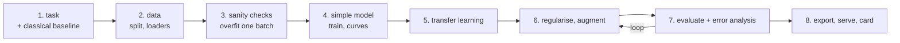

# Project 4 — Train a Network That Earns Its Cost

**Do this after the thirteen lessons.**

You take a problem where deep learning is genuinely the right tool — images,
text, or audio — and you train, debug, evaluate and ship a network. Then you
prove it was worth it.

Project 3 asked whether you can be trusted with a model. This one asks whether
you can be trusted with an **expensive** one: a network that takes hours to
train, fails silently, and must beat a cheaper alternative to justify itself.

---

## The pipeline



Step 1 and step 3 are the two that separate this from a tutorial. **A classical
baseline** tells you whether the network is worth its cost. **Overfitting one
batch** tells you your code works before you spend three hours discovering it
does not.

---

## Requirements

### 1. The task, and the baseline

Write in the README:

- The task, and why it needs a network rather than gradient boosting.
- The cost of each kind of error, as in Project 3.
- **A classical baseline you actually ran.** For images: raw pixels or HOG
  features into logistic regression. For text: TF-IDF into logistic
  regression. Report its score.

If your network cannot beat TF-IDF + logistic regression, that is your
headline result and you report it as such.

### 2. Data

Real data, **at least 2,000 labelled samples**, one of:

- **Images** — a folder per class, or a public dataset that is not MNIST
- **Text** — reviews, tickets, tweets, news; Arabic is welcome and interesting
- **Audio** — spectrograms as images

Deliver a `Dataset` class and `DataLoader`s with a proper train/validation/test
split, seeded. Document the class balance.

### 3. Sanity checks, before real training

Show all three in the notebook, with output:

- **One batch overfit to near-zero loss** (lesson 03)
- **A shape trace** — print the tensor shape after each stage once
- **Ten samples visualised or printed with their labels**, to prove your
  loading and labelling line up

Every experienced practitioner has lost a day to a label misalignment that
these three checks catch in five minutes.

### 4. Models — at least three

| Required | Notes |
|---|---|
| A small model trained from scratch | Your deep-learning baseline |
| A pretrained model, frozen | Feature extraction (lesson 08 / 12) |
| The same pretrained model, fine-tuned | Two learning rates, body and head |

Report for each: parameter count, trainable parameter count, training time,
and the validation metric. In a table.

### 5. Training, done properly

- Validation every epoch, with both curves plotted
- Early stopping that **restores the best weights**
- At least two regularisation techniques, each measured on and off
- Augmentation added **one transform at a time**, each measured
  (lesson 09 showed a stacked pipeline losing 3.6 points)
- `random_state` / `manual_seed` set everywhere; the run reproduces

### 6. Evaluation — the test set, once

- The metric your cost analysis chose
- Confusion matrix, and per-class precision and recall
- For classification: a threshold sweep and the threshold you chose
- The comparison table: classical baseline, scratch, frozen, fine-tuned

### 7. Error analysis

- The **20 most confident wrong predictions**, displayed. What do they share?
- Per-class error rates. Which class is worst, and why?
- At least one **fixable** cause identified — mislabelled data, a missing
  augmentation, an under-represented class — with a proposed fix.

Three findings, each with a number.

### 8. Ship it

- `state_dict` plus a metadata JSON: architecture, input size, normalisation,
  **class order**, metrics, threshold
- A `Predictor` class: load once, validate input, batch, return probabilities
- A TorchScript or ONNX export, verified to match the PyTorch output
- A latency benchmark at batch sizes 1, 8 and 64
- A model card (ML lesson 13's template), with **NOT for** and **Known limits**

---

## Deliverables

```text
project-4/
├── README.md              task, results, error analysis, limits
├── MODEL_CARD.md
├── notebooks/
│   ├── 01-explore.ipynb
│   └── 02-train.ipynb     runs top to bottom
├── src/
│   ├── data.py            Dataset, transforms, loaders
│   ├── model.py           architectures
│   ├── train.py           the loop, early stopping, checkpointing
│   └── predict.py         Predictor, validation, batching
├── tests/                 at least 8 pytest tests
├── models/
│   ├── best.pt
│   ├── model.onnx
│   └── metadata.json
└── data/
    ├── raw/               read-only
    └── processed/
```

---

## Marking

| Weight | Criterion |
|---|---|
| 15% | Task framing, and a classical baseline actually run |
| 15% | Data pipeline: Dataset, loaders, seeded splits, sanity checks |
| 20% | Three models compared fairly, with cost as well as score |
| 15% | Training done properly: curves, early stopping, measured regularisation |
| 15% | Evaluation on the test set, once, with the right metric |
| 10% | Error analysis with concrete, numbered findings |
| 10% | Export, `Predictor`, latency benchmark, model card |

Automatic deductions: no classical baseline; the one-batch check missing; the
test set used during tuning; augmentation stacked without measurement; a
notebook that does not run end to end; the class order not recorded with the
weights.

---

## Milestones

| Day | Done by end of day |
|---|---|
| 1 | Task, data loaded, classical baseline scored |
| 2 | Dataset and loaders, all three sanity checks passing |
| 3 | Scratch model trained, curves plotted |
| 4 | Frozen and fine-tuned pretrained models |
| 5 | Regularisation and augmentation, each measured |
| 6 | Test evaluation and error analysis |
| 7 | Export, Predictor, benchmark, model card, README |

---

## Before you submit

- [ ] Restart the kernel, run all — no errors
- [ ] The classical baseline score is in the results table
- [ ] The one-batch overfit check is visible in the notebook
- [ ] Early stopping restores the best weights
- [ ] Every augmentation was measured separately
- [ ] The test set was touched once
- [ ] Three error-analysis findings, each with a number
- [ ] The exported model's output matches PyTorch's
- [ ] Class order is recorded next to the weights
- [ ] The model card states what this must **not** be used for
