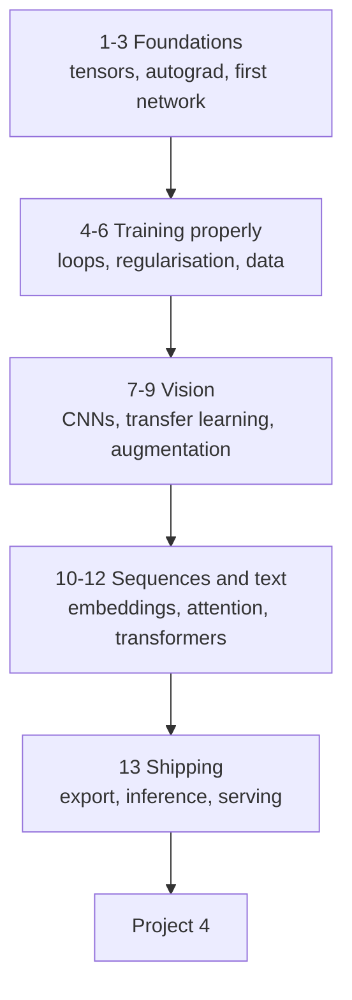

# Deep Learning — Tayel AI Labs

The third course. You arrive able to train and evaluate a classical model; you
leave able to build, train and debug neural networks — and to tell when one is
not the right answer.

Everything is PyTorch. Every lesson exists twice: a **`.md`** to read on
GitHub, and a **`.ipynb`** with the same code to run.

**Prerequisites**

- [`../Python`](../Python) — both tracks, especially
  [PyTorch](../Python/Basic-Python/libraries/08-pytorch.md)
- [`../Machine-Learning`](../Machine-Learning) — splitting, overfitting,
  metrics, pipelines. This course assumes all of it.

---

## The road



---

## Lessons

| # | Lesson | You will be able to |
|---|---|---|
| 01 | [What Deep Learning Is](lessons/01-what-is-deep-learning.md) | Say when a network is worth its cost |
| 02 | [Tensors and Autograd](lessons/02-tensors-and-autograd.md) | Compute gradients and use a device |
| 03 | [Your First Network](lessons/03-your-first-network.md) | Train a model end to end |
| 04 | [The Training Loop](lessons/04-the-training-loop.md) | Choose loss, optimiser, batch size |
| 05 | [Overfitting and Regularisation](lessons/05-regularisation.md) | Use dropout, weight decay, early stopping |
| 06 | [Data Loading](lessons/06-data-loading.md) | Write Datasets and DataLoaders that do not stall |
| 07 | [Convolutional Networks](lessons/07-cnns.md) | Build a CNN for images |
| 08 | [Transfer Learning](lessons/08-transfer-learning.md) | Fine-tune a pretrained model |
| 09 | [Augmentation and Imbalance](lessons/09-augmentation-and-imbalance.md) | Squeeze more from a small dataset |
| 10 | [Sequences and Embeddings](lessons/10-sequences-and-embeddings.md) | Represent text and series |
| 11 | [Attention and Transformers](lessons/11-attention-and-transformers.md) | Explain attention, and use it |
| 12 | [Fine-Tuning a Language Model](lessons/12-finetuning-a-language-model.md) | Adapt a pretrained model to your task |
| 13 | [Deploying a Network](lessons/13-deploying-a-network.md) | Export, serve, and keep it correct |

## Then

- [`Project-4/`](Project-4/) — train, evaluate and ship a deep model

---

## Setup

```bash
python3 -m venv .venv
source .venv/bin/activate
pip install -r requirements.txt
```

A GPU helps and is not required. Every example here runs on a laptop CPU in
minutes; where something would be slow, the lesson says so and keeps the
example small.

```python
import torch

device = "cuda" if torch.cuda.is_available() else "mps" if torch.backends.mps.is_available() else "cpu"
print(device)
```

Apple Silicon reports `mps`. Write that line once and never hard-code a device
again.

---

## Three things to carry through every lesson

1. **Shapes first.** Almost every error you will hit is a shape error. Print
   `.shape` before you think.
2. **Overfit one batch before training on everything.** If your model cannot
   reach near-zero loss on eight samples, the bug is in your code, not your
   data.
3. **The baseline still applies.** A network that does not beat gradient
   boosting on your tabular data is a network you should not ship.
