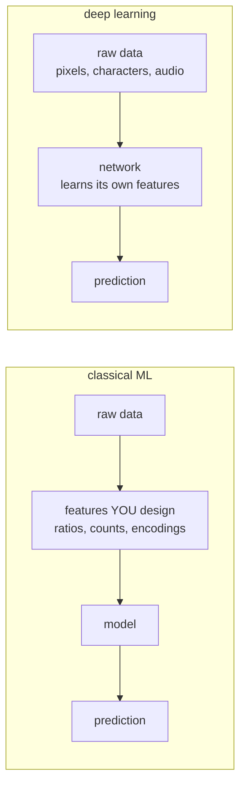
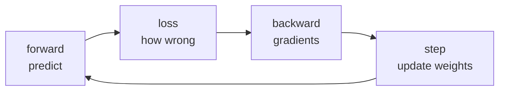

# Lesson 01 — What Deep Learning Is

**Goal:** know what a network buys you, and what it costs.

## What you will learn

- Learned features versus hand-made features
- Why depth
- Where deep learning wins, and where it loses
- The honest checklist before you start

---

## The difference in one picture



In lesson 02 of the ML course you built features by hand: `spend / visits`,
one-hot cities, a missing-value flag. That work is where the accuracy came
from.

A deep network replaces that step. Give it pixels and it learns edges, then
shapes, then objects — nobody wrote "look for an edge". That is the entire
proposition, and it is worth taking only when hand-made features are
impractical.

**Which is the case exactly when the input is raw and high-dimensional.** A
224×224 colour image is 150,528 numbers with meaning in how they sit next to
each other. No human writes features for that. A table of thirty columns is
the opposite case — the features are already there, already named.

---

## Why depth

Each layer transforms the output of the one below, so features compose:

```text
pixels -> edges -> corners and textures -> parts -> objects
characters -> word pieces -> phrases -> meaning
```

One wide layer can in theory approximate any function. In practice depth does
it with far fewer parameters, because composition reuses what earlier layers
found. That is the whole reason "deep" is in the name.

```python
import torch.nn as nn

shallow = nn.Sequential(nn.Linear(784, 2048), nn.ReLU(), nn.Linear(2048, 10))
deep = nn.Sequential(
    nn.Linear(784, 256), nn.ReLU(),
    nn.Linear(256, 128), nn.ReLU(),
    nn.Linear(128, 64), nn.ReLU(),
    nn.Linear(64, 10),
)

def count(model):
    return sum(p.numel() for p in model.parameters())

print(f"shallow: {count(shallow):,} parameters")
print(f"deep:    {count(deep):,} parameters")
```

```text
shallow: 1,628,170 parameters
deep:    242,762 parameters
```

Six times fewer parameters, and on image data the deep one will win. Capacity
is not the point; structure is.

---

## Where deep learning wins

| Data | Why a network wins |
|---|---|
| Images | Spatial structure — a pixel means something relative to its neighbours |
| Text | Order and context change meaning |
| Audio, video | Both of the above, over time |
| Very large datasets | Networks keep improving with data where trees plateau |
| Generation | Producing an image, a sentence, a sound |

## Where it loses

| Situation | Use instead |
|---|---|
| Tabular data | Gradient boosting — ML lesson 09 |
| Under a few thousand examples | Any classical model |
| Every decision must be explained | Logistic regression, a shallow tree |
| A rule exists | Write the rule |
| Tiny latency or cost budget | A smaller model, or distillation |

Lesson 12 of the ML course measured this: on California housing, gradient
boosting beat an MLP on both error and training time, by a wide margin. That
result is the norm for tables, not an accident.

---

## What it costs

Be explicit about this before you start, because all four are real:

1. **Data.** Tens of thousands of examples, or a pretrained model to start
   from. Usually the latter — see lesson 08.
2. **Compute.** Minutes on a laptop for the examples here; hours or days on a
   GPU for real work.
3. **Time to debug.** A broken network does not raise an error. It trains and
   produces a loss that does not fall, and you have to know why.
4. **Opacity.** You will not be able to explain an individual prediction
   without extra tooling, and sometimes not even then.

---

## The one thing that is always true

Everything in this course is the same four steps, repeated:



A convolutional network for images, a transformer for text and a two-layer
network for a toy problem differ only in what happens inside "forward". The
loop is identical. Learn it once in lesson 03 and the rest is architecture.

---

## Before you start a deep learning project

- [ ] A classical baseline exists, and I know its score
- [ ] The input is genuinely raw and high-dimensional
- [ ] I have enough labelled data, or a pretrained model to fine-tune
- [ ] I can afford the compute, and the latency at inference
- [ ] I do not need to explain individual predictions — or I have a plan for it
- [ ] Someone will maintain it after I move on

Fewer than four ticks and you should not be using a neural network.

---

## Common mistakes

| Mistake | What happens |
|---|---|
| A network on tabular data, by default | More work, worse score than boosting |
| Deep learning without a baseline | You cannot tell whether it helped |
| Training from scratch when a pretrained model exists | Weeks wasted, worse result |
| Underestimating debugging time | A model that trains and learns nothing |

---

## Exercises

1. Name three problems at your work. For each: classical or deep, and why?
2. Count the parameters in two architectures of your own design.
3. Find a pretrained model on huggingface.co for a task you care about. Read
   its model card: what data, what licence, what languages?
4. Run the checklist above against a project you want to build.
