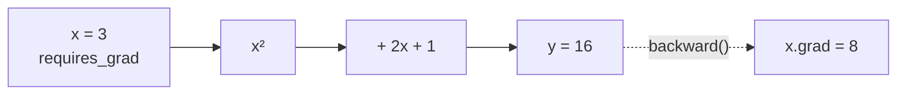

# Lesson 02 — Tensors and Autograd

**Goal:** the two mechanics everything else rests on.

## What you will learn

- Tensors, shapes, and devices
- `requires_grad` and `backward()`
- Why gradients accumulate
- `no_grad`, `detach`, and `item`

---

## A tensor

NumPy arrays that can live on a GPU and remember their own history.

```python
import torch

x = torch.tensor([[1.0, 2.0], [3.0, 4.0]])

print(x)
print(x.shape, x.dtype, x.device)
print(x @ x)
print(x.mean(), x.sum(dim=0))
```

```text
tensor([[1., 2.],
        [3., 4.]])
torch.Size([2, 2]) torch.float32 cpu
tensor([[ 7., 10.],
        [15., 22.]])
tensor(2.5000) tensor([4., 6.])
```

Creation, the way you will actually use it:

```python
import torch

print(torch.zeros(2, 3).shape)
print(torch.randn(2, 3).shape)
print(torch.arange(6).reshape(2, 3))
print(torch.zeros(2, 3).dtype, torch.arange(6).dtype)
```

```text
torch.Size([2, 3])
torch.Size([2, 3])
tensor([[0, 1, 2],
        [3, 4, 5]])
torch.float32 torch.int64
```

**Dtypes matter.** Networks want `float32`. An integer tensor passed into a
layer raises an error; a `float64` tensor silently doubles your memory and
slows everything down.

---

## Shapes are the whole job

```python
import torch

batch = torch.randn(32, 3, 64, 64)        # batch, channels, height, width

print("batch:", batch.shape)
print("flattened:", batch.flatten(1).shape)
print("one image:", batch[0].shape)
print("unsqueezed:", batch[0].unsqueeze(0).shape)
print("permuted:", batch.permute(0, 2, 3, 1).shape)
```

```text
batch: torch.Size([32, 3, 64, 64])
flattened: torch.Size([32, 12288])
one image: torch.Size([3, 64, 64])
unsqueezed: torch.Size([1, 3, 64, 64])
permuted: torch.Size([32, 64, 64, 3])
```

Four operations you will use constantly:

| Operation | Does |
|---|---|
| `view` / `reshape` | Change shape, same data |
| `flatten(start_dim)` | Collapse trailing dimensions |
| `unsqueeze(d)` / `squeeze(d)` | Add or remove a dimension of size 1 |
| `permute(...)` | Reorder dimensions |

PyTorch expects images as `(batch, channels, height, width)`. Matplotlib and
PIL expect `(height, width, channels)`. `permute` is the bridge, and forgetting
it is a rite of passage.

---

## Devices

```python
import torch

device = ("cuda" if torch.cuda.is_available()
          else "mps" if torch.backends.mps.is_available() else "cpu")

x = torch.randn(3, 3).to(device)
print(device, x.device)
```

```text
mps mps:0
```

Write that `device` line once per project, pass it everywhere, and never write
`.cuda()`. **Model and data must be on the same device** — the mismatch is one
of the two most common runtime errors in PyTorch, and the message says so
clearly.

---

## Autograd

Mark a tensor with `requires_grad=True` and PyTorch records every operation
that touches it, so it can compute derivatives backwards through the whole
chain.

```python
import torch

x = torch.tensor(3.0, requires_grad=True)

y = x ** 2 + 2 * x + 1        # dy/dx = 2x + 2 = 8 at x=3
y.backward()

print("y:", y.item())
print("dy/dx:", x.grad.item())
```

```text
y: 16.0
dy/dx: 8.0
```



The same thing with a weight, which is what training is:

```python
import torch

w = torch.tensor([2.0], requires_grad=True)
x = torch.tensor([3.0])
target = torch.tensor([10.0])

prediction = w * x
loss = (prediction - target) ** 2
loss.backward()

print("loss:", loss.item())
print("dloss/dw:", w.grad.item())
```

```text
loss: 16.0
dloss/dw: -24.0
```

Negative gradient means: increasing `w` decreases the loss. An optimiser does
`w -= learning_rate * w.grad`, and that single line is all of training.

---

## Gradients accumulate — on purpose

```python
import torch

w = torch.tensor([1.0], requires_grad=True)

for step in range(3):
    loss = (w * 2) ** 2
    loss.backward()
    print(f"step {step}: grad = {w.grad.item()}")
```

```text
step 0: grad = 8.0
step 1: grad = 16.0
step 2: grad = 24.0
```

The same computation three times, and the gradient grows each time. PyTorch
**adds** new gradients to whatever is already in `.grad`.

This is deliberate — it is how gradient accumulation across mini-batches works
— and it is why every training loop starts with `optimiser.zero_grad()`.
Forget it and your updates grow without bound until the loss becomes `nan`.

```python
import torch

w = torch.tensor([1.0], requires_grad=True)

for step in range(3):
    if w.grad is not None:
        w.grad.zero_()
    loss = (w * 2) ** 2
    loss.backward()
    print(f"step {step}: grad = {w.grad.item()}")
```

```text
step 0: grad = 8.0
step 1: grad = 8.0
step 2: grad = 8.0
```

---

## no_grad, detach, item

```python
import torch

x = torch.tensor([2.0], requires_grad=True)

with torch.no_grad():                 # do not record anything in here
    y = x * 3
print("inside no_grad:", y.requires_grad)

z = (x * 3).detach()                  # cut this tensor out of the graph
print("detached:", z.requires_grad)

value = (x * 3).item()                # a Python float, nothing attached
print("item:", value, type(value))
```

```text
inside no_grad: False
detached: False
item: 6.0 <class 'float'>
```

| Use | When |
|---|---|
| `torch.no_grad()` | Evaluation and inference — faster, far less memory |
| `.detach()` | You need the values but not the history |
| `.item()` | Pulling one number out to print or log |

The classic memory leak is accumulating losses for a log without detaching:

```python
# WRONG — keeps the whole computation graph of every batch alive
total_loss += loss

# RIGHT
total_loss += loss.item()
```

On a long epoch the first version exhausts memory, and the traceback points at
whatever ran last rather than at the real cause.

---

## From NumPy and back

```python
import torch
import numpy as np

array = np.array([1.0, 2.0, 3.0])
tensor = torch.from_numpy(array)
back = tensor.numpy()

array[0] = 99.0
print(tensor)
```

```text
tensor([99.,  2.,  3.], dtype=torch.float64)
```

`from_numpy` **shares memory** — changing the array changed the tensor. Use
`torch.tensor(array)` to copy, and note the `float64` that came along with it:
pass `dtype=torch.float32` unless you meant otherwise.

---

## Common mistakes

| Mistake | What happens |
|---|---|
| Model on GPU, data on CPU | `RuntimeError: expected all tensors on the same device` |
| Forgetting `zero_grad()` | Gradients accumulate, loss diverges to `nan` |
| `total += loss` without `.item()` | Memory grows every batch |
| No `no_grad()` at evaluation | Slow, and memory climbs |
| `float64` tensors from NumPy | Silent slowdown, sometimes a dtype error |
| Not printing shapes | Every debugging session takes twice as long |

---

## Exercises

1. Differentiate `y = 3x³ + 2x` at `x = 2` by hand and with autograd.
2. Take a `(8, 3, 32, 32)` tensor and produce `(8, 3072)`, `(3, 8, 32, 32)`
   and `(8, 32, 32, 3)`.
3. Show gradient accumulation, then fix it with `zero_()`.
4. Time an evaluation loop with and without `torch.no_grad()`.
