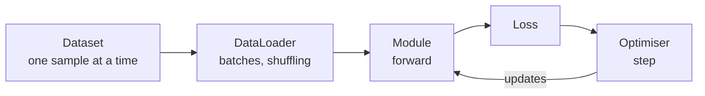

# Lesson 03 — Your First Network

**Goal:** train a model end to end, and understand every line.

## What you will learn

- `nn.Module` — defining a model
- The five-line training loop
- Evaluating properly
- Overfitting one batch, the first thing you should always do

---

## The model

```python
import torch
import torch.nn as nn

class Classifier(nn.Module):
    """A two-hidden-layer network for tabular input."""

    def __init__(self, n_features, n_classes, hidden=64):
        super().__init__()
        self.net = nn.Sequential(
            nn.Linear(n_features, hidden),
            nn.ReLU(),
            nn.Linear(hidden, hidden // 2),
            nn.ReLU(),
            nn.Linear(hidden // 2, n_classes),
        )

    def forward(self, x):
        return self.net(x)

model = Classifier(n_features=30, n_classes=2)
print(model)
print("parameters:", sum(p.numel() for p in model.parameters()))
```

```text
Classifier(
  (net): Sequential(
    (0): Linear(in_features=30, out_features=64, bias=True)
    (1): ReLU()
    (2): Linear(in_features=64, out_features=32, bias=True)
    (3): ReLU()
    (4): Linear(in_features=32, out_features=2, bias=True)
  )
)
parameters: 4130
```

Three rules for `nn.Module`:

1. Call `super().__init__()` first, or nothing registers.
2. Create layers in `__init__`, use them in `forward`.
3. **Never call `forward` directly.** Call `model(x)` — that runs hooks
   PyTorch needs for things like gradient clipping and quantisation.

The final layer outputs **2 raw numbers, not probabilities**. Those are
logits, and `CrossEntropyLoss` expects exactly that — it applies the softmax
itself. Adding your own softmax before it trains a worse model with no error.

---

## Data

```python
import torch
from torch.utils.data import TensorDataset, DataLoader
from sklearn.datasets import load_breast_cancer
from sklearn.model_selection import train_test_split
from sklearn.preprocessing import StandardScaler

X, y = load_breast_cancer(return_X_y=True)
X_train, X_test, y_train, y_test = train_test_split(
    X, y, test_size=0.2, random_state=42, stratify=y
)

scaler = StandardScaler().fit(X_train)          # fit on train only
X_train = scaler.transform(X_train)
X_test = scaler.transform(X_test)

train_ds = TensorDataset(torch.tensor(X_train, dtype=torch.float32),
                         torch.tensor(y_train, dtype=torch.long))
test_ds = TensorDataset(torch.tensor(X_test, dtype=torch.float32),
                        torch.tensor(y_test, dtype=torch.long))

train_loader = DataLoader(train_ds, batch_size=32, shuffle=True)
test_loader = DataLoader(test_ds, batch_size=64)

features, labels = next(iter(train_loader))
print(features.shape, features.dtype)
print(labels.shape, labels.dtype)
```

```text
torch.Size([32, 30]) torch.float32
torch.Size([32]) torch.int64
```

Three details that are not optional:

- **Features `float32`, labels `long`.** `CrossEntropyLoss` requires integer
  class indices, and the error it gives otherwise is not obvious.
- **`shuffle=True` for training, `False` for evaluation.** Without shuffling,
  batches arrive in dataset order and the gradients correlate.
- **Scale, fitted on train only.** Same rule as the ML course; networks need it
  more than trees do.

---

## The training loop

```python
import torch
import torch.nn as nn

device = ("cuda" if torch.cuda.is_available()
          else "mps" if torch.backends.mps.is_available() else "cpu")

torch.manual_seed(42)
model = Classifier(n_features=30, n_classes=2).to(device)
loss_fn = nn.CrossEntropyLoss()
optimiser = torch.optim.Adam(model.parameters(), lr=1e-3)

for epoch in range(1, 11):
    model.train()
    running = 0.0
    for batch_X, batch_y in train_loader:
        batch_X, batch_y = batch_X.to(device), batch_y.to(device)

        optimiser.zero_grad()                 # 1. clear old gradients
        logits = model(batch_X)               # 2. forward
        loss = loss_fn(logits, batch_y)       # 3. how wrong
        loss.backward()                       # 4. gradients
        optimiser.step()                      # 5. update

        running += loss.item() * batch_X.size(0)

    if epoch % 2 == 0:
        print(f"epoch {epoch:>2}  loss {running / len(train_ds):.4f}")
```

```text
epoch  2  loss 0.4528
epoch  4  loss 0.1494
epoch  6  loss 0.0847
epoch  8  loss 0.0641
epoch 10  loss 0.0525
```

Those five numbered lines are the whole of deep learning. Every training
script you will ever read — a CNN, a transformer, a diffusion model — is a
variation on them.

Two details in the bookkeeping:

- `loss.item()` detaches the number. Summing `loss` directly keeps every
  batch's graph alive and exhausts memory.
- Multiplying by `batch_X.size(0)` and dividing by the dataset size gives a
  correct average when the last batch is smaller.

---

## Evaluating

```python
import torch

@torch.no_grad()
def evaluate(model, loader, device):
    """Return accuracy over a loader."""
    model.eval()
    correct = total = 0
    for batch_X, batch_y in loader:
        batch_X, batch_y = batch_X.to(device), batch_y.to(device)
        predictions = model(batch_X).argmax(dim=1)
        correct += (predictions == batch_y).sum().item()
        total += batch_y.size(0)
    return correct / total

print("train accuracy:", round(evaluate(model, train_loader, device), 4))
print("test accuracy: ", round(evaluate(model, test_loader, device), 4))
```

```text
train accuracy: 0.989
test accuracy:  0.9737
```

`model.eval()` switches dropout and batch norm into inference behaviour;
`@torch.no_grad()` stops the graph being built. Both are required, and
forgetting either gives you a quietly wrong or quietly slow evaluation.

Always put `model.train()` back at the top of the next training epoch — the
loop above does.

---

## Overfit one batch first

Before training on a whole dataset, prove your code can learn at all:

```python
import torch
import torch.nn as nn

torch.manual_seed(0)
small_X, small_y = next(iter(train_loader))
small_X, small_y = small_X[:8].to(device), small_y[:8].to(device)

model = Classifier(30, 2).to(device)
optimiser = torch.optim.Adam(model.parameters(), lr=1e-2)
loss_fn = nn.CrossEntropyLoss()

for step in range(1, 201):
    optimiser.zero_grad()
    loss = loss_fn(model(small_X), small_y)
    loss.backward()
    optimiser.step()
    if step % 50 == 0:
        print(f"step {step:>3}  loss {loss.item():.6f}")
```

```text
step  50  loss 0.000000
step 100  loss 0.000000
step 150  loss 0.000000
step 200  loss 0.000000
```

Eight samples, and the loss is zero to six decimal places within fifty steps.
That proves the forward pass, the loss, the backward pass and the optimiser
are all wired correctly.

**If this does not reach near-zero, stop.** Training longer on more data will
not help, because the bug is in your code — a wrong loss for the task, labels
that do not line up with inputs, a learning rate of zero, or a layer that
detaches the graph. This five-minute check saves entire days, and almost
nobody does it.

---

## The pieces, named



| Piece | Job |
|---|---|
| `Dataset` | Returns one `(x, y)` by index |
| `DataLoader` | Batches, shuffles, and loads in parallel |
| `nn.Module` | Holds parameters, defines `forward` |
| Loss function | Turns predictions and targets into one number |
| Optimiser | Applies the gradients to the parameters |

---

## Common mistakes

| Mistake | What happens |
|---|---|
| Missing `optimiser.zero_grad()` | Gradients accumulate; loss diverges |
| Softmax before `CrossEntropyLoss` | Silently worse training |
| Labels as `float` | `RuntimeError` from the loss |
| No `model.eval()` at test time | Dropout still on, scores drop |
| `shuffle=True` on the test loader | Harmless, but your logs stop lining up |
| Skipping the one-batch test | Hours lost to a bug you could have found in five minutes |

---

## Exercises

1. Change `hidden` to 8 and to 512; compare test accuracy and parameter count.
2. Remove `optimiser.zero_grad()` and watch the loss. Explain what happened.
3. Add a third hidden layer. Does the test score improve?
4. Overfit a single batch of four samples deliberately, then explain why that
   is a *good* result in this one case.
