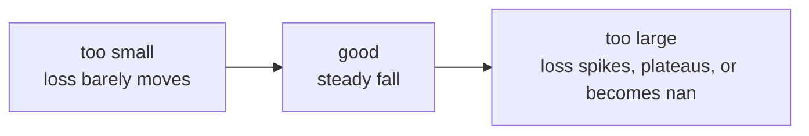

# Lesson 04 — The Training Loop

**Goal:** choose the loss, the optimiser, the batch size and the learning rate
on purpose.

## What you will learn

- Which loss for which task
- SGD, momentum, Adam, AdamW
- Learning rate — the parameter that matters most
- Batch size, epochs, and what a loss curve tells you

---

## Losses

```python
import torch
import torch.nn as nn

logits = torch.tensor([[2.0, 1.0, 0.1]])
target = torch.tensor([0])
print("cross entropy:", nn.CrossEntropyLoss()(logits, target).item())

binary_logit = torch.tensor([0.8])
binary_target = torch.tensor([1.0])
print("bce with logits:", nn.BCEWithLogitsLoss()(binary_logit, binary_target).item())

prediction = torch.tensor([2.5, 0.0])
truth = torch.tensor([3.0, -0.5])
print("mse:", nn.MSELoss()(prediction, truth).item())
print("l1: ", nn.L1Loss()(prediction, truth).item())
```

```text
cross entropy: 0.4170299470424652
bce with logits: 0.37110066413879395
mse: 0.25
l1:  0.5
```

| Task | Final layer | Loss |
|---|---|---|
| Binary classification | 1 output, no sigmoid | `BCEWithLogitsLoss` |
| Multi-class | `n_classes` outputs, no softmax | `CrossEntropyLoss` |
| Multi-label | `n_labels` outputs, no sigmoid | `BCEWithLogitsLoss` |
| Regression | 1 output | `MSELoss`, or `L1Loss` with outliers |
| Regression, some outliers | 1 output | `SmoothL1Loss` (Huber) |

Both `CrossEntropyLoss` and `BCEWithLogitsLoss` apply their own activation,
for numerical stability. **Never add a softmax or sigmoid before them** — it is
not an error, it just trains worse, which is the hardest kind of bug to find.

Class imbalance, handled in the loss:

```python
import torch
import torch.nn as nn

weights = torch.tensor([1.0, 10.0])        # class 1 is ten times rarer
loss_fn = nn.CrossEntropyLoss(weight=weights)

logits = torch.tensor([[2.0, -1.0], [2.0, -1.0]])
print("true class 0:", loss_fn(logits[:1], torch.tensor([0])).item())
print("true class 1:", loss_fn(logits[1:], torch.tensor([1])).item())
```

```text
true class 0: 0.04858732968568802
true class 1: 3.0485873222351074
```

The same wrong-ish prediction costs sixty times more when the rare class is the
truth. This is `class_weight="balanced"` from the ML course, in PyTorch form.

---

## Optimisers

```python
import torch
import torch.nn as nn

def train_briefly(optimiser_name, steps=60):
    torch.manual_seed(0)
    model = nn.Sequential(nn.Linear(20, 32), nn.ReLU(), nn.Linear(32, 2))
    X = torch.randn(256, 20)
    y = (X[:, 0] + X[:, 1] > 0).long()

    optimisers = {
        "SGD":          torch.optim.SGD(model.parameters(), lr=0.1),
        "SGD+momentum": torch.optim.SGD(model.parameters(), lr=0.1, momentum=0.9),
        "Adam":         torch.optim.Adam(model.parameters(), lr=0.01),
        "AdamW":        torch.optim.AdamW(model.parameters(), lr=0.01, weight_decay=0.01),
    }
    optimiser = optimisers[optimiser_name]
    loss_fn = nn.CrossEntropyLoss()

    for _ in range(steps):
        optimiser.zero_grad()
        loss = loss_fn(model(X), y)
        loss.backward()
        optimiser.step()
    return loss.item()

for name in ["SGD", "SGD+momentum", "Adam", "AdamW"]:
    print(f"{name:<13} final loss {train_briefly(name):.4f}")
```

```text
SGD           final loss 0.3293
SGD+momentum  final loss 0.0125
Adam          final loss 0.0072
AdamW         final loss 0.0073
```

| Optimiser | Use it when |
|---|---|
| `SGD` | Rarely alone — it needs a good learning rate and patience |
| `SGD` + momentum | Vision, with a schedule; often the best final accuracy |
| `Adam` | The default. Works without tuning |
| `AdamW` | Adam with correct weight decay — the default for transformers |

Start with `AdamW` at `lr=1e-3` (or `3e-5` when fine-tuning a pretrained
model). Move to SGD + momentum only when you are chasing the last point on a
vision benchmark.

---

## The learning rate

More than any other number, this decides whether training works.

```python
import torch
import torch.nn as nn

def final_loss(lr, steps=60):
    torch.manual_seed(0)
    model = nn.Sequential(nn.Linear(20, 32), nn.ReLU(), nn.Linear(32, 2))
    X = torch.randn(256, 20)
    y = (X[:, 0] + X[:, 1] > 0).long()
    optimiser = torch.optim.Adam(model.parameters(), lr=lr)
    loss_fn = nn.CrossEntropyLoss()
    for _ in range(steps):
        optimiser.zero_grad()
        loss = loss_fn(model(X), y)
        loss.backward()
        optimiser.step()
    return loss.item()

for lr in [1e-5, 1e-3, 1e-2, 10.0]:
    print(f"lr={lr:<8} final loss {final_loss(lr):.4f}")
```

```text
lr=1e-05   final loss 0.6983
lr=0.001   final loss 0.5038
lr=0.01    final loss 0.0072
lr=10.0    final loss 24.9762
```

Read the two ends. At `1e-5` the model has barely moved from its starting loss
of about 0.69 — which is `ln(2)`, exactly what a model that answers 50/50 to
everything scores. At `10.0` the loss is **24.98**: the steps are so large that
the weights are thrown past any useful value, and the model is now far worse
than random. Three orders of magnitude between them decide everything.



Diagnosis from the loss curve:

| What you see | Do |
|---|---|
| Loss flat from the start | Raise the learning rate 10× |
| Loss falls then explodes or goes `nan` | Lower it 10×; add gradient clipping |
| Loss falls then plateaus high | Add a schedule, or more capacity |
| Train falls, validation rises | Overfitting — lesson 05 |

Tune it by powers of ten first. Refining `3e-4` versus `4e-4` before you know
the right order of magnitude is wasted effort.

---

## Batch size

```python
import torch
import torch.nn as nn
from torch.utils.data import TensorDataset, DataLoader
import time

torch.manual_seed(0)
X = torch.randn(4096, 20)
y = (X[:, 0] + X[:, 1] > 0).long()
dataset = TensorDataset(X, y)

for batch_size in [8, 64, 512]:
    torch.manual_seed(0)
    model = nn.Sequential(nn.Linear(20, 32), nn.ReLU(), nn.Linear(32, 2))
    optimiser = torch.optim.Adam(model.parameters(), lr=1e-2)
    loader = DataLoader(dataset, batch_size=batch_size, shuffle=True)
    loss_fn = nn.CrossEntropyLoss()

    start = time.perf_counter()
    for _ in range(3):
        for batch_X, batch_y in loader:
            optimiser.zero_grad()
            loss = loss_fn(model(batch_X), batch_y)
            loss.backward()
            optimiser.step()
    elapsed = time.perf_counter() - start
    print(f"batch={batch_size:<4} steps/epoch {len(loader):<4} "
          f"3 epochs in {elapsed:.2f}s  final loss {loss.item():.4f}")
```

```text
batch=8    steps/epoch 512  3 epochs in 0.27s  final loss 0.0021
batch=64   steps/epoch 64   3 epochs in 0.05s  final loss 0.0149
batch=512  steps/epoch 8    3 epochs in 0.02s  final loss 0.1897
```

The same three epochs, the same data. Batch 8 takes 13× longer than batch 512
and reaches a loss 90× lower — because it took 512 update steps per epoch
instead of 8. "Three epochs" is not a fixed amount of learning.

The trade:

- **Small batches** — more updates, noisier gradients (which regularises), less
  memory, slower per epoch.
- **Large batches** — fewer, smoother updates, faster per epoch, more memory,
  and they usually need a higher learning rate to compensate.

Start at 32 or 64. Raise it until you run out of memory only if throughput is
your problem, and raise the learning rate roughly with it.

---

## Reading a loss curve

```python
import torch
import torch.nn as nn
from torch.utils.data import TensorDataset, DataLoader

torch.manual_seed(0)
X = torch.randn(600, 20)
y = (X[:, 0] + X[:, 1] > 0).long()
train_ds = TensorDataset(X[:400], y[:400])
val_X, val_y = X[400:], y[400:]
loader = DataLoader(train_ds, batch_size=32, shuffle=True)

model = nn.Sequential(nn.Linear(20, 128), nn.ReLU(), nn.Linear(128, 2))
optimiser = torch.optim.Adam(model.parameters(), lr=1e-2)
loss_fn = nn.CrossEntropyLoss()

for epoch in range(1, 21):
    model.train()
    for batch_X, batch_y in loader:
        optimiser.zero_grad()
        loss_fn(model(batch_X), batch_y).backward()
        optimiser.step()

    if epoch % 5 == 0:
        model.eval()
        with torch.no_grad():
            train_loss = loss_fn(model(X[:400]), y[:400]).item()
            val_loss = loss_fn(model(val_X), val_y).item()
        print(f"epoch {epoch:>2}  train {train_loss:.4f}  val {val_loss:.4f}")
```

```text
epoch  5  train 0.0160  val 0.0937
epoch 10  train 0.0039  val 0.0951
epoch 15  train 0.0019  val 0.0984
epoch 20  train 0.0012  val 0.0979
```

Look at the two columns separately. Training loss keeps falling — 0.016 to
0.0012 — while validation stops improving after epoch 5 and drifts slightly
up. Everything after epoch 5 was memorisation.

The training column alone would have told you the model was still improving.
It was not. **Track validation loss every epoch, from the first project
onward**, and stop when it stops falling — which is what early stopping, in
the loop below, does for you.

---

## A complete loop worth copying

```python
def train(model, train_loader, val_loader, epochs, lr, device, patience=5):
    """Train with validation tracking and early stopping. Returns the history."""
    import copy
    import torch
    import torch.nn as nn

    model = model.to(device)
    loss_fn = nn.CrossEntropyLoss()
    optimiser = torch.optim.AdamW(model.parameters(), lr=lr)

    best_loss, best_state, waited = float("inf"), None, 0
    history = []

    for epoch in range(1, epochs + 1):
        model.train()
        train_loss = 0.0
        for batch_X, batch_y in train_loader:
            batch_X, batch_y = batch_X.to(device), batch_y.to(device)
            optimiser.zero_grad()
            loss = loss_fn(model(batch_X), batch_y)
            loss.backward()
            torch.nn.utils.clip_grad_norm_(model.parameters(), max_norm=1.0)
            optimiser.step()
            train_loss += loss.item() * batch_X.size(0)
        train_loss /= len(train_loader.dataset)

        model.eval()
        val_loss = 0.0
        with torch.no_grad():
            for batch_X, batch_y in val_loader:
                batch_X, batch_y = batch_X.to(device), batch_y.to(device)
                val_loss += loss_fn(model(batch_X), batch_y).item() * batch_X.size(0)
        val_loss /= len(val_loader.dataset)

        history.append({"epoch": epoch, "train": train_loss, "val": val_loss})

        if val_loss < best_loss:
            best_loss, waited = val_loss, 0
            best_state = copy.deepcopy(model.state_dict())
        else:
            waited += 1
            if waited >= patience:
                print(f"early stop at epoch {epoch}")
                break

    model.load_state_dict(best_state)        # return the BEST model, not the last
    return history
```

Four things in there that beginners leave out and later regret: validation
every epoch, gradient clipping, early stopping, and **restoring the best
weights** rather than keeping whatever the final epoch produced.

---

## Common mistakes

| Mistake | What happens |
|---|---|
| Learning rate off by 100× | The model does not learn, and it looks like a data problem |
| Softmax before `CrossEntropyLoss` | Quietly worse training |
| Watching only the training loss | You miss overfitting entirely |
| Keeping the last epoch's weights | You ship a worse model than you trained |
| Changing batch size without the learning rate | Confusing, inconsistent results |
| No gradient clipping on RNNs or transformers | Exploding gradients, `nan` |

---

## Exercises

1. Sweep the learning rate over `[1e-5, 1e-4, 1e-3, 1e-2, 1e-1]` and plot the
   loss curves on one chart.
2. Train the same model with SGD, SGD+momentum and AdamW; compare.
3. Break it on purpose: add a softmax before `CrossEntropyLoss` and measure the
   damage.
4. Add early stopping to a loop of yours and confirm it restores the best
   weights.
