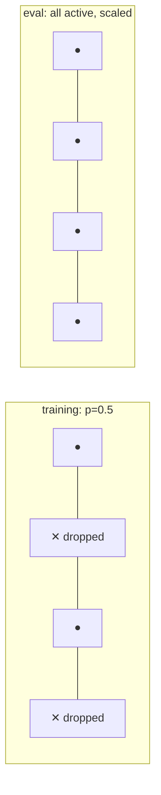
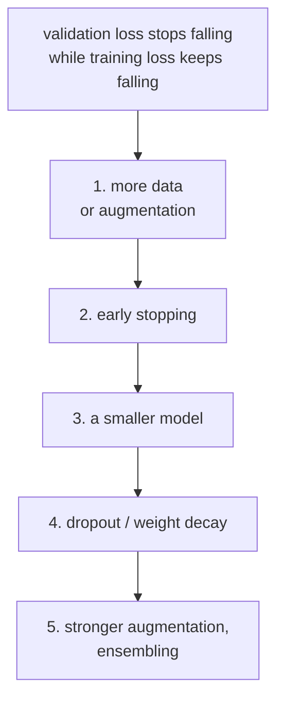

# Lesson 05 — Overfitting and Regularisation

**Goal:** stop a network memorising, without crippling it.

## What you will learn

- What overfitting looks like in a loss curve
- Dropout, weight decay, batch norm
- Early stopping and model size
- Which to reach for, in order

---

## The shape of the problem

A network with 100,000 parameters and 400 training rows can memorise every one
of them. It will score perfectly on training data and poorly on anything else.

```python
import torch
import torch.nn as nn
from torch.utils.data import TensorDataset, DataLoader

def run(model, epochs=60, lr=1e-3, seed=0):
    """Train on a small noisy dataset; return final train and validation loss."""
    torch.manual_seed(seed)
    X = torch.randn(500, 20)
    y = (X[:, 0] + X[:, 1] + 0.5 * torch.randn(500) > 0).long()
    train_X, train_y, val_X, val_y = X[:200], y[:200], X[200:], y[200:]
    loader = DataLoader(TensorDataset(train_X, train_y), batch_size=32, shuffle=True)

    optimiser = torch.optim.AdamW(model.parameters(), lr=lr)
    loss_fn = nn.CrossEntropyLoss()

    for _ in range(epochs):
        model.train()
        for batch_X, batch_y in loader:
            optimiser.zero_grad()
            loss_fn(model(batch_X), batch_y).backward()
            optimiser.step()

    model.eval()
    with torch.no_grad():
        return (loss_fn(model(train_X), train_y).item(),
                loss_fn(model(val_X), val_y).item())

torch.manual_seed(0)
big = nn.Sequential(nn.Linear(20, 256), nn.ReLU(),
                    nn.Linear(256, 256), nn.ReLU(),
                    nn.Linear(256, 2))

train_loss, val_loss = run(big)
print(f"train {train_loss:.4f}   val {val_loss:.4f}   gap {val_loss - train_loss:.4f}")
```

```text
train 0.0007   val 0.5347   gap 0.5340
```

Training loss essentially zero, validation loss 0.53 — a gap of 0.53. The
network memorised 200 rows, noise included, and learned little that transfers.
The labels here carry deliberate noise, so some gap is unavoidable; this much
is not.

**The gap between train and validation is the measurement.** Everything below
is a way to shrink it.

---

## Dropout

During training, randomly zero a fraction of activations. No neuron can rely
on any other being present, so the network spreads its bets.



```python
import torch
import torch.nn as nn

torch.manual_seed(0)
with_dropout = nn.Sequential(
    nn.Linear(20, 256), nn.ReLU(), nn.Dropout(0.5),
    nn.Linear(256, 256), nn.ReLU(), nn.Dropout(0.5),
    nn.Linear(256, 2),
)

train_loss, val_loss = run(with_dropout)
print(f"train {train_loss:.4f}   val {val_loss:.4f}   gap {val_loss - train_loss:.4f}")
```

```text
train 0.0063   val 0.4712   gap 0.4649
```

Validation improved from 0.535 to 0.471 and the gap shrank by 0.07. A real
gain, and a modest one — dropout is not magic, and on 200 rows with a 70,000
parameter model it cannot be.

Note the training loss barely moved (0.0007 → 0.0063): with enough epochs the
network memorises *through* dropout. That is a sign the model is still far too
large for this data, which is the fix further down.

`model.eval()` turns dropout off and rescales, which is why the evaluation in
`run()` is correct. Forget `eval()` and your validation numbers are randomly
degraded every time you measure.

Start at `p=0.2` for small networks, `0.5` for large fully-connected layers,
and lower for convolutional ones.

---

## Weight decay

A penalty on large weights — Ridge regression from ML lesson 04, applied to
every parameter.

```python
import torch
import torch.nn as nn

for decay in [0.0, 0.01, 0.1, 1.0]:
    torch.manual_seed(0)
    model = nn.Sequential(nn.Linear(20, 256), nn.ReLU(),
                          nn.Linear(256, 256), nn.ReLU(),
                          nn.Linear(256, 2))
    torch.manual_seed(0)
    X = torch.randn(500, 20)
    y = (X[:, 0] + X[:, 1] + 0.5 * torch.randn(500) > 0).long()
    optimiser = torch.optim.AdamW(model.parameters(), lr=1e-3, weight_decay=decay)
    loss_fn = nn.CrossEntropyLoss()

    for _ in range(60):
        optimiser.zero_grad()
        loss_fn(model(X[:200]), y[:200]).backward()
        optimiser.step()

    model.eval()
    with torch.no_grad():
        train_loss = loss_fn(model(X[:200]), y[:200]).item()
        val_loss = loss_fn(model(X[200:]), y[200:]).item()
    print(f"weight_decay={decay:<5} train {train_loss:.4f}  val {val_loss:.4f}")
```

```text
weight_decay=0.0   train 0.0044  val 0.4418
weight_decay=0.01  train 0.0044  val 0.4414
weight_decay=0.1   train 0.0045  val 0.4400
weight_decay=1.0   train 0.0057  val 0.4229
```

Four settings spanning a factor of a hundred, and the validation loss moves by
0.019. Weight decay is a refinement, not a rescue — worth setting, never worth
a week.

Use `AdamW`, not `Adam`, when you set this. In plain `Adam` the decay
interacts badly with the adaptive step sizes; `AdamW` decouples them, and that
one letter is why every transformer recipe specifies it.

Typical values: `0.01` for transformers, `1e-4` for vision, `0` when your model
is already too small to overfit.

---

## Batch normalisation

Normalises each layer's inputs across the batch, which stabilises training,
allows higher learning rates, and regularises slightly as a side effect.

```python
import torch
import torch.nn as nn

torch.manual_seed(0)
with_batchnorm = nn.Sequential(
    nn.Linear(20, 256), nn.BatchNorm1d(256), nn.ReLU(),
    nn.Linear(256, 256), nn.BatchNorm1d(256), nn.ReLU(),
    nn.Linear(256, 2),
)

train_loss, val_loss = run(with_batchnorm)
print(f"train {train_loss:.4f}   val {val_loss:.4f}   gap {val_loss - train_loss:.4f}")
```

```text
train 0.0056   val 0.6609   gap 0.6553
```

It made this model **worse** — validation 0.66 against the baseline's 0.53.
That is not a mistake in the code, and it is worth seeing: batch norm is a
training stabiliser first and a regulariser a distant second. On a three-layer
network over 200 rows there is nothing to stabilise, and the batch statistics
of a 32-row batch are themselves noisy.

Its real value shows in deep convolutional networks, where without it the
deeper layers barely train at all.

Order: `Linear → BatchNorm → ReLU`. And batch norm behaves differently in
`train()` and `eval()` — it uses batch statistics while training and running
averages afterwards — which is the second reason `model.eval()` is not
optional.

---

## Early stopping

The cheapest regulariser: stop when validation stops improving.

```python
import copy
import torch
import torch.nn as nn
from torch.utils.data import TensorDataset, DataLoader

torch.manual_seed(0)
X = torch.randn(500, 20)
y = (X[:, 0] + X[:, 1] + 0.5 * torch.randn(500) > 0).long()
loader = DataLoader(TensorDataset(X[:200], y[:200]), batch_size=32, shuffle=True)

torch.manual_seed(0)
model = nn.Sequential(nn.Linear(20, 256), nn.ReLU(), nn.Linear(256, 2))
optimiser = torch.optim.AdamW(model.parameters(), lr=1e-3)
loss_fn = nn.CrossEntropyLoss()

best_loss, best_epoch, best_state, waited = float("inf"), 0, None, 0

for epoch in range(1, 101):
    model.train()
    for batch_X, batch_y in loader:
        optimiser.zero_grad()
        loss_fn(model(batch_X), batch_y).backward()
        optimiser.step()

    model.eval()
    with torch.no_grad():
        val_loss = loss_fn(model(X[200:]), y[200:]).item()

    if val_loss < best_loss:
        best_loss, best_epoch, waited = val_loss, epoch, 0
        best_state = copy.deepcopy(model.state_dict())
    else:
        waited += 1
        if waited >= 10:
            break

model.load_state_dict(best_state)
print(f"stopped at epoch {epoch}, best was epoch {best_epoch} with val {best_loss:.4f}")
```

```text
stopped at epoch 47, best was epoch 37 with val 0.2821
```

Validation 0.282 — better than dropout (0.471), better than weight decay
(0.423), better than batch norm (0.661), and roughly half the baseline's 0.535.

Two things produced that, and both matter: the loop stopped at the best epoch
instead of the last, **and** this model has one hidden layer instead of two.
Early stopping and a smaller model, the two cheapest items on the list below,
beat every clever technique above them.

---

## The order to reach for them



More data beats every technique on this list. When you cannot get more,
augmentation (lesson 09) manufactures some. Early stopping is free. A smaller
model is often the honest answer — if 400 rows overfit a 100k-parameter
network, the network is the problem.

| Technique | Cost | Typical value |
|---|---|---|
| Early stopping | None | `patience=5–10` |
| Smaller model | Capacity | Halve the width and re-measure |
| Dropout | Slower convergence | 0.2–0.5 |
| Weight decay | One number to tune | 0.01 (AdamW) |
| Batch norm | Slight compute | After every linear/conv layer |
| Augmentation | Preprocessing work | Lesson 09 |

---

## Common mistakes

| Mistake | What happens |
|---|---|
| No `model.eval()` | Dropout active at test time; results look random |
| Dropout on a tiny model | Underfits — it never learns in the first place |
| `weight_decay` with plain `Adam` | Weaker than expected; use `AdamW` |
| Early stopping without restoring the best weights | You keep the worse model |
| Regularising before checking for a bug | You hide a data problem |
| Batch norm with batch size 1 or 2 | Unstable statistics; use `GroupNorm` |

---

## Exercises

1. Train a deliberately oversized model on 200 rows and plot both losses until
   the gap is obvious.
2. Add dropout at 0.2, 0.5 and 0.8. Which is best, and where does it start to
   underfit?
3. Compare `Adam` and `AdamW` at `weight_decay=0.1`.
4. Implement early stopping with patience 5 and report the epoch it keeps.
