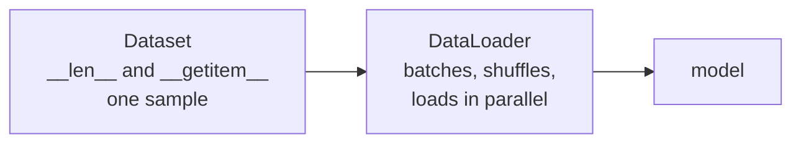

# Lesson 06 — Data Loading

**Goal:** feed the model without becoming the bottleneck.

## What you will learn

- `Dataset` and `DataLoader`
- Writing your own dataset
- Transforms, and where they belong
- `num_workers`, and why your GPU is idle

---

## The two objects



A `Dataset` answers two questions: how many samples are there, and give me
number `i`. The `DataLoader` does everything else.

```python
import torch
from torch.utils.data import TensorDataset, DataLoader

X = torch.randn(100, 10)
y = torch.randint(0, 2, (100,))

dataset = TensorDataset(X, y)
loader = DataLoader(dataset, batch_size=16, shuffle=True, drop_last=False)

print("samples:", len(dataset))
print("batches:", len(loader))
features, labels = next(iter(loader))
print("batch:", features.shape, labels.shape)
```

```text
samples: 100
batches: 7
batch: torch.Size([16, 10]) torch.Size([16])
```

Seven batches: six of 16 and one of 4. `drop_last=True` discards that short
last batch — worth setting when a layer needs a fixed batch size, or when a
batch of 1 would break `BatchNorm`.

---

## Your own dataset

Three methods. This is the whole interface:

```python
import torch
from torch.utils.data import Dataset, DataLoader

class ReviewDataset(Dataset):
    """Rows of (text, label) turned into fixed-length integer sequences."""

    def __init__(self, texts, labels, vocab, max_length=8):
        self.texts = texts
        self.labels = labels
        self.vocab = vocab
        self.max_length = max_length

    def __len__(self):
        return len(self.texts)

    def __getitem__(self, index):
        tokens = self.texts[index].lower().split()[: self.max_length]
        ids = [self.vocab.get(token, 0) for token in tokens]
        ids += [0] * (self.max_length - len(ids))          # pad
        return torch.tensor(ids), torch.tensor(self.labels[index])

texts = ["good coffee", "terrible service", "the coffee was excellent"]
labels = [1, 0, 1]
vocab = {"good": 1, "coffee": 2, "terrible": 3, "service": 4, "excellent": 5}

dataset = ReviewDataset(texts, labels, vocab)
loader = DataLoader(dataset, batch_size=2, shuffle=False)

ids, label = dataset[0]
print("one sample:", ids.tolist(), label.item())
batch_ids, batch_labels = next(iter(loader))
print("batch:", batch_ids.shape, batch_labels.tolist())
```

```text
one sample: [1, 2, 0, 0, 0, 0, 0, 0] 1
batch: torch.Size([2, 8]) [1, 0]
```

Rules that will save you hours:

- `__getitem__` returns **one** sample, as tensors. The `DataLoader` stacks
  them.
- Every sample must have the **same shape**, or the default collation fails.
  Pad, crop, or write a custom `collate_fn`.
- Do the **expensive work here**, not in `__init__`, if the dataset does not
  fit in memory — load the file, decode the image, then return.

---

## Transforms

```python
import torch
from torchvision import datasets, transforms

train_transform = transforms.Compose([
    transforms.RandomHorizontalFlip(),
    transforms.RandomCrop(28, padding=2),
    transforms.ToTensor(),
    transforms.Normalize((0.2860,), (0.3530,)),
])

eval_transform = transforms.Compose([
    transforms.ToTensor(),
    transforms.Normalize((0.2860,), (0.3530,)),
])

train_ds = datasets.FashionMNIST("./data", train=True, download=True,
                                 transform=train_transform)
test_ds = datasets.FashionMNIST("./data", train=False, download=True,
                                transform=eval_transform)

image, label = test_ds[0]          # the eval transform: no randomness
print(image.shape, image.dtype)
print(f"mean {image.mean():.3f}  std {image.std():.3f}")
print("classes:", len(test_ds.classes))
```

```text
torch.Size([1, 28, 28]) torch.float32
mean -0.336  std 0.764
classes: 10
```

That printout comes from `test_ds`, not `train_ds`, deliberately: the training
transform crops and flips at random, so printing one training image gives a
different number every run.

**Two transforms, not one.** Random flips and crops belong to training only;
evaluating on randomly altered images makes your validation number noise.
`ToTensor` and `Normalize` belong to both.

The normalisation constants are the training set's own mean and standard
deviation. Computing them from the test set is the leakage of lesson 02 in a
new costume.

---

## num_workers — measure it, do not assume it

```python
import time
import torch
from torch.utils.data import DataLoader
from torchvision import datasets, transforms

dataset = datasets.FashionMNIST("./data", train=True, download=True,
                                transform=transforms.ToTensor())

for workers in [0, 4]:
    loader = DataLoader(dataset, batch_size=256, shuffle=True, num_workers=workers)
    start = time.perf_counter()
    for i, (images, labels) in enumerate(loader):
        if i == 40:
            break
    print(f"num_workers={workers}  40 batches in {time.perf_counter() - start:.2f}s")
```

```text
num_workers=0  40 batches in 0.18s
num_workers=4  40 batches in 2.27s
```

Four workers are **twelve times slower**. That is not a typo, and it is the
most useful thing in this lesson.

FashionMNIST is already decoded in memory, so `__getitem__` is almost free.
The only thing four workers add is four process spawns and the cost of
pickling batches back to the parent. There was no work to overlap.

Workers pay off when loading a sample is genuinely expensive: JPEG files read
from disk, audio decoded, large augmentation pipelines. Then, with
`num_workers=0`, the GPU sits idle while the CPU decodes, and the workers
overlap the two.

**Measure both on your own data before setting it.** Copying `num_workers=8`
from a tutorial is how people make their training slower and conclude that
PyTorch is slow.

Guidance:

| Setting | Use |
|---|---|
| `num_workers` | 4, or roughly the number of physical cores; measure, do not guess |
| `pin_memory=True` | With a CUDA GPU — makes the host-to-device copy faster |
| `persistent_workers=True` | When epochs are short, so workers are not restarted |
| `prefetch_factor` | Batches each worker prepares ahead; the default of 2 is usually fine |

On macOS and Windows, workers use spawn: your training code must be under
`if __name__ == "__main__":` or each worker re-imports the module and spawns
its own.

---

## Splitting

```python
import torch
from torch.utils.data import random_split, DataLoader
from torchvision import datasets, transforms

full = datasets.FashionMNIST("./data", train=True, download=True,
                             transform=transforms.ToTensor())

generator = torch.Generator().manual_seed(42)
train_ds, val_ds = random_split(full, [54_000, 6_000], generator=generator)

print(len(train_ds), len(val_ds))

train_loader = DataLoader(train_ds, batch_size=128, shuffle=True, num_workers=2)
val_loader = DataLoader(val_ds, batch_size=256, shuffle=False, num_workers=2)
print(len(train_loader), len(val_loader))
```

```text
54000 6000
422 24
```

Pass the generator, or your split changes on every run and your validation
numbers are not comparable between experiments.

One caveat: `random_split` gives both halves the *same* transform object, so a
validation split inherits your training augmentation. When that matters, build
two datasets with two transforms and split by index.

---

## Imbalanced data

```python
import torch
from torch.utils.data import TensorDataset, DataLoader, WeightedRandomSampler

X = torch.randn(1000, 5)
y = torch.cat([torch.zeros(950), torch.ones(50)]).long()      # 5% positive

counts = torch.bincount(y)
weights = (1.0 / counts.float())[y]
sampler = WeightedRandomSampler(weights, num_samples=len(y), replacement=True)

loader = DataLoader(TensorDataset(X, y), batch_size=64, sampler=sampler)

batch_X, batch_y = next(iter(loader))
print("class counts in the dataset:", counts.tolist())
print("positive share in one batch:", round(batch_y.float().mean().item(), 3))
```

```text
class counts in the dataset: [950, 50]
positive share in one batch: 0.484
```

A 5% class becomes roughly 50% of each batch. Note `sampler` and `shuffle` are
mutually exclusive — passing both raises an error, because the sampler decides
the order.

The alternative is class weights in the loss (lesson 04). Sampling changes what
the model sees; weighting changes what it pays for a mistake. Try the loss
weights first — they do not distort your epoch size.

---

## Common mistakes

| Mistake | What happens |
|---|---|
| Augmenting the validation set | Noisy, pessimistic validation scores |
| `num_workers=0` on image data | The GPU idles most of the time |
| Workers without `if __name__ == "__main__"` | Process explosion on macOS/Windows |
| `shuffle=True` on the validation loader | Harmless, but logs stop lining up |
| Variable-length samples, no `collate_fn` | `RuntimeError` stacking the batch |
| `random_split` without a generator | A different split every run |

---

## Exercises

1. Write a `Dataset` over a folder of CSV files; load one row per `__getitem__`.
2. Measure epoch time at `num_workers` 0, 2, 4 and 8. Where does it stop
   helping?
3. Build two transform pipelines and confirm the validation one is
   deterministic across two runs.
4. Use `WeightedRandomSampler` on an imbalanced set and print the class balance
   of five batches.
