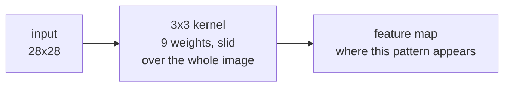
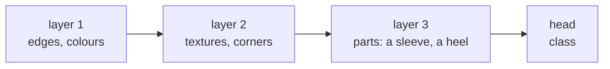

# Lesson 07 — Convolutional Networks

**Goal:** the architecture that made deep learning work on images.

## What you will learn

- Convolution, and why it beats a fully-connected layer on images
- Kernels, stride, padding, pooling
- Building and training a CNN
- Computing output shapes

---

## Why not a linear layer

A 28×28 image flattened is 784 numbers. Connect that to 256 neurons and you
have 200,000 parameters — for a tiny greyscale image. At 224×224 in colour it
is 38 million, for one layer.

Worse, flattening destroys the structure. Pixel 0 and pixel 28 are vertical
neighbours in the image and 28 positions apart in the vector, and the layer has
no way to know that.

A convolution fixes both:



The same nine weights are applied everywhere. That is **parameter sharing**,
and it encodes a true fact about images: an edge is an edge wherever it
appears.

```python
import torch
import torch.nn as nn

linear = nn.Linear(28 * 28, 256)
conv = nn.Conv2d(in_channels=1, out_channels=32, kernel_size=3)

print("linear:", sum(p.numel() for p in linear.parameters()), "parameters")
print("conv:  ", sum(p.numel() for p in conv.parameters()), "parameters")
```

```text
linear: 200960 parameters
conv:   320 parameters
```

Six hundred times fewer parameters, and the convolution is the one that works
better on images.

---

## The mechanics

```python
import torch
import torch.nn as nn

x = torch.randn(8, 1, 28, 28)          # batch, channels, height, width

print("input:        ", x.shape)
print("conv 3x3:     ", nn.Conv2d(1, 32, 3)(x).shape)
print("conv padding=1:", nn.Conv2d(1, 32, 3, padding=1)(x).shape)
print("conv stride=2: ", nn.Conv2d(1, 32, 3, stride=2, padding=1)(x).shape)
print("maxpool 2x2:  ", nn.MaxPool2d(2)(x).shape)
```

```text
input:         torch.Size([8, 1, 28, 28])
conv 3x3:      torch.Size([8, 32, 26, 26])
conv padding=1: torch.Size([8, 32, 28, 28])
conv stride=2:  torch.Size([8, 32, 14, 14])
maxpool 2x2:   torch.Size([8, 1, 14, 14])
```

The formula, which you should be able to apply in your head:

```text
out = floor((in + 2*padding - kernel) / stride) + 1
```

| Setting | Effect |
|---|---|
| `kernel_size=3` | The standard. Two stacked 3×3 see as much as one 5×5, with fewer parameters |
| `padding=1` with `kernel=3` | Keeps the size — "same" padding |
| `stride=2` | Halves the size |
| `MaxPool2d(2)` | Halves the size, no parameters, keeps the strongest response |
| `out_channels` | How many different patterns this layer looks for |

The usual rhythm: **spatial size down, channels up**. 28×28×1 becomes
14×14×32 becomes 7×7×64 — less space, more meaning.

---

## A CNN

```python
import torch
import torch.nn as nn

class SmallCNN(nn.Module):
    """Two convolutional blocks, then a classifier head."""

    def __init__(self, n_classes=10):
        super().__init__()
        self.features = nn.Sequential(
            nn.Conv2d(1, 32, 3, padding=1),    # 28x28x32
            nn.BatchNorm2d(32),
            nn.ReLU(),
            nn.MaxPool2d(2),                   # 14x14x32

            nn.Conv2d(32, 64, 3, padding=1),   # 14x14x64
            nn.BatchNorm2d(64),
            nn.ReLU(),
            nn.MaxPool2d(2),                   # 7x7x64
        )
        self.classifier = nn.Sequential(
            nn.Flatten(),
            nn.Dropout(0.25),
            nn.Linear(64 * 7 * 7, 128),
            nn.ReLU(),
            nn.Linear(128, n_classes),
        )

    def forward(self, x):
        return self.classifier(self.features(x))

model = SmallCNN()
print("parameters:", sum(p.numel() for p in model.parameters()))
print("output:", model(torch.randn(4, 1, 28, 28)).shape)
```

```text
parameters: 421834
output: torch.Size([4, 10])
```

`Conv → BatchNorm → ReLU → Pool` is the block you will see everywhere. Stack
two or three, then flatten into a small classifier.

**The `64 * 7 * 7` is the line that breaks.** Work it out — two poolings take
28 to 14 to 7, and the last convolution left 64 channels. Get it wrong and you
get a shape error, which is at least loud. To avoid the arithmetic entirely,
use `nn.AdaptiveAvgPool2d((1, 1))` before the flatten: it produces a fixed size
whatever the input, which is what modern architectures do.

---

## Training it

```python
import torch
import torch.nn as nn
from torch.utils.data import DataLoader, Subset
from torchvision import datasets, transforms

device = ("cuda" if torch.cuda.is_available()
          else "mps" if torch.backends.mps.is_available() else "cpu")

transform = transforms.Compose([
    transforms.ToTensor(),
    transforms.Normalize((0.2860,), (0.3530,)),
])
train_full = datasets.FashionMNIST("./data", train=True, download=True, transform=transform)
test_ds = datasets.FashionMNIST("./data", train=False, download=True, transform=transform)

# A subset, so the lesson runs in a minute on a laptop.
train_ds = Subset(train_full, range(12_000))
train_loader = DataLoader(train_ds, batch_size=128, shuffle=True)
test_loader = DataLoader(test_ds, batch_size=512)

torch.manual_seed(42)
model = SmallCNN().to(device)
optimiser = torch.optim.AdamW(model.parameters(), lr=1e-3)
loss_fn = nn.CrossEntropyLoss()

for epoch in range(1, 4):
    model.train()
    for images, labels in train_loader:
        images, labels = images.to(device), labels.to(device)
        optimiser.zero_grad()
        loss = loss_fn(model(images), labels)
        loss.backward()
        optimiser.step()

    model.eval()
    correct = 0
    with torch.no_grad():
        for images, labels in test_loader:
            images, labels = images.to(device), labels.to(device)
            correct += (model(images).argmax(1) == labels).sum().item()
    print(f"epoch {epoch}  test accuracy {correct / len(test_ds):.4f}")
```

```text
epoch 1  test accuracy 0.8301
epoch 2  test accuracy 0.8557
epoch 3  test accuracy 0.8742
```

Three epochs on a fifth of the data, and 87% on ten clothing classes. The full
dataset and twenty epochs reach about 93%.

---

## Compare against a fully-connected network

```python
import torch
import torch.nn as nn

mlp = nn.Sequential(
    nn.Flatten(),
    nn.Linear(28 * 28, 256), nn.ReLU(),
    nn.Linear(256, 128), nn.ReLU(),
    nn.Linear(128, 10),
).to(device)

torch.manual_seed(42)
optimiser = torch.optim.AdamW(mlp.parameters(), lr=1e-3)
loss_fn = nn.CrossEntropyLoss()

for epoch in range(3):
    mlp.train()
    for images, labels in train_loader:
        images, labels = images.to(device), labels.to(device)
        optimiser.zero_grad()
        loss_fn(mlp(images), labels).backward()
        optimiser.step()

mlp.eval()
correct = 0
with torch.no_grad():
    for images, labels in test_loader:
        images, labels = images.to(device), labels.to(device)
        correct += (mlp(images).argmax(1) == labels).sum().item()

print("MLP parameters:", sum(p.numel() for p in mlp.parameters()))
print("MLP test accuracy:", round(correct / len(test_ds), 4))
```

```text
MLP parameters: 235146
MLP test accuracy: 0.8387
```

The MLP has 56% of the CNN's parameters and scores 3.5 points lower on the
same data over the same three epochs. On 28×28 greyscale the gap is modest; on
224×224 colour photographs it is the difference between working and not.

---

## What the layers learn



This is the composition from lesson 01, made concrete — and it is why transfer
learning works. The early layers of a network trained on millions of photos
have learned edges and textures that are useful for *your* images too, whatever
they contain. Lesson 08 uses exactly that.

---

## Common mistakes

| Mistake | What happens |
|---|---|
| Wrong flattened size | `RuntimeError: mat1 and mat2 shapes cannot be multiplied` |
| Images as `(batch, H, W, C)` | PyTorch wants channels first — use `permute` |
| Forgetting to normalise | Trains, but slower and worse |
| No padding in a deep stack | The image shrinks to nothing |
| Augmenting the test set | Noisy validation numbers |
| Training a CNN from scratch on 500 images | Fine-tune a pretrained one instead |

---

## Exercises

1. Compute the output shape of `Conv2d(3, 16, 5, stride=2, padding=2)` on a
   `(1, 3, 64, 64)` input by hand, then check.
2. Add a third convolutional block. What happens to the parameter count and
   the accuracy?
3. Replace the flatten with `AdaptiveAvgPool2d((1, 1))` and confirm the model
   still trains.
4. Train on the full 60,000 images for 10 epochs and report the accuracy.
