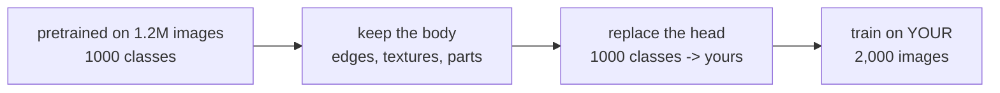

# Lesson 08 — Transfer Learning

**Goal:** get a strong model from a small dataset, in minutes.

## What you will learn

- Why a model trained on other people's images helps with yours
- Feature extraction versus fine-tuning
- Freezing layers and choosing the learning rate
- The preprocessing that must match

---

## The idea

Training a vision model from scratch needs millions of images. But the early
layers of any such model learn edges, textures and shapes — and those are the
same for your images as for ImageNet's.



The rule that follows: **start from pretrained weights, not from scratch.** It
is faster, it needs far less data, and it usually scores higher.

"Usually" is doing real work in that sentence, and the measurement further down
shows a case where the naive version of this advice loses. Keep a from-scratch
baseline; it costs six lines.

---

## Loading a pretrained model

```python
import torch
from torchvision import models

weights = models.ResNet18_Weights.DEFAULT
model = models.resnet18(weights=weights)

print("parameters:", sum(p.numel() for p in model.parameters()))
print("final layer:", model.fc)
```

```text
parameters: 11689512
final layer: Linear(in_features=512, out_features=1000, bias=True)
```

The `fc` layer outputs 1,000 classes — ImageNet's. You will replace it.

`weights=None` gives you the same architecture with random weights. That is
the "from scratch" you are avoiding.

---

## The preprocessing must match

```python
from torchvision import models

weights = models.ResNet18_Weights.DEFAULT
preprocess = weights.transforms()
print(preprocess)
```

```text
ImageClassification(
    crop_size=[224]
    resize_size=[256]
    mean=[0.485, 0.456, 0.406]
    std=[0.229, 0.224, 0.225]
    interpolation=InterpolationMode.BILINEAR
)
```

Those mean and standard deviation numbers are ImageNet's, and the pretrained
weights expect inputs normalised with them. Use your own dataset's statistics
instead and every feature the model learned is shifted — it still trains, and
it scores worse for a reason you will not find.

`weights.transforms()` hands you the exact pipeline. Use it, and add your
augmentation around it.

---

## Strategy 1 — feature extraction

Freeze the body, train only a new head. Use this when your dataset is small
(under a few thousand images) or similar to ImageNet.

```python
import torch
import torch.nn as nn
from torchvision import models

model = models.resnet18(weights=models.ResNet18_Weights.DEFAULT)

for parameter in model.parameters():          # freeze everything
    parameter.requires_grad = False

model.fc = nn.Linear(model.fc.in_features, 10)   # a new head, trainable by default

trainable = sum(p.numel() for p in model.parameters() if p.requires_grad)
total = sum(p.numel() for p in model.parameters())
print(f"trainable {trainable:,} of {total:,} ({100 * trainable / total:.2f}%)")
```

```text
trainable 5,130 of 11,181,642 (0.05%)
```

Five thousand parameters instead of eleven million. Training is fast, memory
is small, and with a frozen body you cannot overfit the features — only the
head.

**Pass only the trainable parameters to the optimiser:**

```python
optimiser = torch.optim.AdamW(
    [p for p in model.parameters() if p.requires_grad], lr=1e-3
)
```

Passing everything works but wastes memory on optimiser state for parameters
that never move.

---

## Strategy 2 — fine-tuning

Unfreeze some or all of the body and train it too, at a **much smaller**
learning rate. Use this when you have more data, or when your images look
nothing like ImageNet (medical scans, satellite images, documents).

```python
import torch
import torch.nn as nn
from torchvision import models

model = models.resnet18(weights=models.ResNet18_Weights.DEFAULT)

for parameter in model.parameters():
    parameter.requires_grad = False
for parameter in model.layer4.parameters():     # the last block only
    parameter.requires_grad = True

model.fc = nn.Linear(model.fc.in_features, 10)

optimiser = torch.optim.AdamW([
    {"params": model.layer4.parameters(), "lr": 1e-4},   # gentle on pretrained weights
    {"params": model.fc.parameters(), "lr": 1e-3},       # the new head can move faster
])

trainable = sum(p.numel() for p in model.parameters() if p.requires_grad)
print(f"trainable {trainable:,}")
```

```text
trainable 8,398,858
```

Two parameter groups with two learning rates. The head is random and needs to
move; the pretrained block already knows something and a large step would
destroy it. That destruction has a name — catastrophic forgetting — and it
looks exactly like a broken script.

| Your data | Strategy | Head lr | Body lr |
|---|---|---|---|
| < 1,000 images, similar to ImageNet | Freeze all, train head | 1e-3 | — |
| A few thousand, similar | Unfreeze the last block | 1e-3 | 1e-4 |
| Large, or very different | Unfreeze everything | 1e-3 | 1e-5 – 1e-4 |

---

## Measuring it — including when it fails

Fashion-MNIST is greyscale 28×28: about as far from ImageNet photographs as an
image dataset gets. That makes it a good stress test of the advice above.
Three models, the same 2,000 training images, the same three epochs:

```python
import torch
import torch.nn as nn
from torch.utils.data import DataLoader, Subset
from torchvision import datasets, transforms, models

device = ("cuda" if torch.cuda.is_available()
          else "mps" if torch.backends.mps.is_available() else "cpu")

transform = transforms.Compose([
    transforms.Grayscale(num_output_channels=3),       # 1 channel -> 3
    transforms.Resize(64),                             # small, for speed
    transforms.ToTensor(),
    transforms.Normalize([0.485, 0.456, 0.406], [0.229, 0.224, 0.225]),
])

train_ds = Subset(datasets.FashionMNIST("./data", train=True, download=True,
                                        transform=transform), range(2_000))
test_ds = Subset(datasets.FashionMNIST("./data", train=False, download=True,
                                       transform=transform), range(2_000))
train_loader = DataLoader(train_ds, batch_size=64, shuffle=True)
test_loader = DataLoader(test_ds, batch_size=256)

def train_and_score(model, lr, epochs=3):
    model = model.to(device)
    optimiser = torch.optim.AdamW(
        [p for p in model.parameters() if p.requires_grad], lr=lr)
    loss_fn = nn.CrossEntropyLoss()
    for _ in range(epochs):
        model.train()
        for images, labels in train_loader:
            images, labels = images.to(device), labels.to(device)
            optimiser.zero_grad()
            loss_fn(model(images), labels).backward()
            optimiser.step()
    model.eval()
    correct = 0
    with torch.no_grad():
        for images, labels in test_loader:
            images, labels = images.to(device), labels.to(device)
            correct += (model(images).argmax(1) == labels).sum().item()
    return correct / len(test_ds)

torch.manual_seed(42)
scratch = nn.Sequential(
    nn.Conv2d(3, 32, 3, padding=1), nn.ReLU(), nn.MaxPool2d(2),
    nn.Conv2d(32, 64, 3, padding=1), nn.ReLU(), nn.MaxPool2d(2),
    nn.Flatten(), nn.Linear(64 * 16 * 16, 10),
)

torch.manual_seed(42)
frozen = models.resnet18(weights=models.ResNet18_Weights.DEFAULT)
for parameter in frozen.parameters():
    parameter.requires_grad = False
frozen.fc = nn.Linear(frozen.fc.in_features, 10)

torch.manual_seed(42)
finetuned = models.resnet18(weights=models.ResNet18_Weights.DEFAULT)
for parameter in finetuned.parameters():
    parameter.requires_grad = False
for parameter in finetuned.layer4.parameters():
    parameter.requires_grad = True
finetuned.fc = nn.Linear(finetuned.fc.in_features, 10)

print("from scratch:      ", round(train_and_score(scratch, 1e-3), 4))
print("frozen pretrained: ", round(train_and_score(frozen, 1e-3), 4))
print("fine-tuned layer4: ", round(train_and_score(finetuned, 1e-4), 4))
```

```text
from scratch:       0.8225
frozen pretrained:  0.706
fine-tuned layer4:  0.847
```

Read the middle row before the others. **The frozen pretrained model lost** —
by twelve points — to a 183,000-parameter CNN built in six lines.

That is not a bug, and it is the most useful result in this lesson. A frozen
body can only report the features ImageNet taught it: textures of fur, grass
and brick, at photographic resolution. Upscaled 28×28 greyscale clothing has
almost none of them, and the head has 5,130 parameters with which to make the
best of what it gets.

Now the third row. Unfreeze one block, train it gently at `1e-4`, and the same
pretrained model goes to **0.847** — the best of the three. Given permission to
adjust its last block, it adapts the general features to this domain and keeps
everything useful from before.

The lesson is not "transfer learning always wins". It is:

- **Similar domain, little data** → freeze. Cheap and strong.
- **Different domain** → freezing can lose outright. Fine-tune, gently.
- **Always measure against a from-scratch baseline.** It is six lines, and here
  it beat one of the two transfer strategies.

On a realistic dataset — photographs, a few thousand of them — the frozen row
usually wins comfortably. This dataset was chosen to show you the case where
it does not.

---

## Which model to start from

| Model | When |
|---|---|
| `resnet18` / `resnet50` | The dependable default; well understood |
| `efficientnet_b0` | Better accuracy per parameter; good on mobile |
| `convnext_tiny` | Modern, strong, heavier |
| `vit_b_16` | Vision transformer; wants more data and more compute |
| `mobilenet_v3_small` | When the latency budget is tight |

Start with `resnet18`. Change it only after you have a working pipeline and a
measured reason.

For text, the same idea and the same rules live in
[lesson 12](12-finetuning-a-language-model.md).

---

## Common mistakes

| Mistake | What happens |
|---|---|
| Your own normalisation instead of the weights' | Quietly worse; hard to trace |
| Fine-tuning the body at 1e-3 | Catastrophic forgetting — worse than frozen |
| Forgetting to replace the head | 1,000 outputs and a shape error |
| Training from scratch on 2,000 images | Weeks of work for a worse model |
| Not freezing, on a tiny dataset | Overfits immediately |
| Greyscale images into a 3-channel model | Shape error — use `Grayscale(3)` |

---

## Exercises

1. Load `resnet18`, freeze it, replace the head, and print the trainable share.
2. Compare frozen against fine-tuning `layer4` on the same small dataset.
3. Fine-tune the body at 1e-3 and at 1e-5. Show catastrophic forgetting.
4. Swap `resnet18` for `efficientnet_b0` — note that its head is called
   `classifier`, not `fc`.
