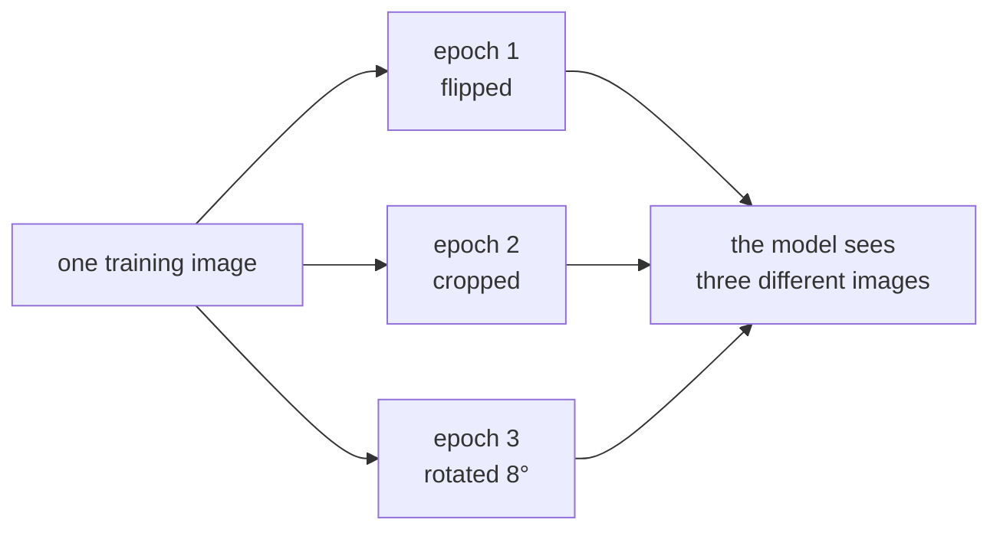

# Lesson 09 — Augmentation and Imbalance

**Goal:** get more out of the data you already have.

## What you will learn

- Augmentation as free training data
- Which transforms are safe for which task
- Handling class imbalance in a network
- Measuring whether any of it helped

---

## Augmentation

One image, transformed slightly differently on every epoch, is many images.
The model sees a shoe shifted, flipped and cropped, and learns "shoe" rather
than "these exact pixels".



It costs nothing but CPU, and on small datasets **the right** augmentation is
the most effective regulariser there is — ahead of dropout and weight decay,
both of which you met in lesson 05. The measurement further down shows what
the wrong one does.

```python
from torchvision import transforms

train_transform = transforms.Compose([
    transforms.RandomHorizontalFlip(p=0.5),
    transforms.RandomCrop(28, padding=4),
    transforms.RandomRotation(10),
    transforms.ToTensor(),
    transforms.Normalize((0.2860,), (0.3530,)),
])

eval_transform = transforms.Compose([
    transforms.ToTensor(),
    transforms.Normalize((0.2860,), (0.3530,)),
])
```

Two pipelines, always. Augmenting evaluation data makes your validation number
noisy and pessimistic, and you will chase the noise.

---

## Which transforms are safe

The question to ask of every transform: **does this change the label?**

| Transform | Safe for | Dangerous for |
|---|---|---|
| Horizontal flip | Most objects, clothing, animals | Text, digits (2 ≠ flipped 2), left/right medical scans |
| Vertical flip | Satellite, microscopy | Almost everything else |
| Rotation ±10° | Most images | Digits at large angles (6 ↔ 9) |
| Random crop | Most images | When the object may sit at the edge |
| Colour jitter | Natural photographs | Medical imaging, anything where colour *is* the signal |
| Gaussian noise | Most images | Already-noisy sensor data |
| `RandomErasing` | Occlusion robustness | Small objects that may be erased entirely |

The strongest recent methods go further — `RandAugment` and `TrivialAugment`
pick random operations for you, and `MixUp`/`CutMix` blend two images and their
labels:

```python
from torchvision import transforms

strong = transforms.Compose([
    transforms.RandAugment(num_ops=2, magnitude=9),
    transforms.ToTensor(),
    transforms.Normalize((0.2860,), (0.3530,)),
    transforms.RandomErasing(p=0.25),
])
```

`RandomErasing` goes **after** `ToTensor` — it operates on tensors, not PIL
images. Ordering errors here raise a confusing type error.

---

## Does it help? Measure

```python
import torch
import torch.nn as nn
from torch.utils.data import DataLoader, Subset
from torchvision import datasets, transforms

device = ("cuda" if torch.cuda.is_available()
          else "mps" if torch.backends.mps.is_available() else "cpu")

eval_transform = transforms.Compose([
    transforms.ToTensor(), transforms.Normalize((0.2860,), (0.3530,))])
augment_transform = transforms.Compose([
    transforms.RandomHorizontalFlip(),
    transforms.RandomCrop(28, padding=4),
    transforms.RandomRotation(10),
    transforms.ToTensor(), transforms.Normalize((0.2860,), (0.3530,))])

test_ds = Subset(datasets.FashionMNIST("./data", train=False, download=True,
                                       transform=eval_transform), range(2_000))
test_loader = DataLoader(test_ds, batch_size=512)

def build_model():
    torch.manual_seed(42)
    return nn.Sequential(
        nn.Conv2d(1, 32, 3, padding=1), nn.ReLU(), nn.MaxPool2d(2),
        nn.Conv2d(32, 64, 3, padding=1), nn.ReLU(), nn.MaxPool2d(2),
        nn.Flatten(), nn.Dropout(0.25), nn.Linear(64 * 7 * 7, 10),
    ).to(device)

def run(transform, epochs=8):
    train_ds = Subset(datasets.FashionMNIST("./data", train=True, download=True,
                                            transform=transform), range(1_000))
    loader = DataLoader(train_ds, batch_size=64, shuffle=True)
    model = build_model()
    optimiser = torch.optim.AdamW(model.parameters(), lr=1e-3)
    loss_fn = nn.CrossEntropyLoss()
    for _ in range(epochs):
        model.train()
        for images, labels in loader:
            images, labels = images.to(device), labels.to(device)
            optimiser.zero_grad()
            loss_fn(model(images), labels).backward()
            optimiser.step()
    model.eval()
    correct = 0
    with torch.no_grad():
        for images, labels in test_loader:
            images, labels = images.to(device), labels.to(device)
            correct += (model(images).argmax(1) == labels).sum().item()
    return correct / len(test_ds)

flip_only = transforms.Compose([
    transforms.RandomHorizontalFlip(),
    transforms.ToTensor(), transforms.Normalize((0.2860,), (0.3530,))])
crop_only = transforms.Compose([
    transforms.RandomCrop(28, padding=2),
    transforms.ToTensor(), transforms.Normalize((0.2860,), (0.3530,))])

for name, transform in [("none", eval_transform), ("flip only", flip_only),
                        ("crop only", crop_only), ("flip+crop+rotate", augment_transform)]:
    print(f"{name:<18} {run(transform, epochs=30):.4f}")
```

```text
none               0.8215
flip only          0.8320
crop only          0.8360
flip+crop+rotate   0.7855
```

Each transform on its own helps by about a point. All three together lose
**3.6 points** — worse than no augmentation at all.

Nothing is broken. The combined pipeline crops with 4 pixels of padding *and*
rotates by up to 10° *and* flips, on a 28×28 image where the garment fills the
frame. Too much of the object leaves the frame, and the model spends its
capacity on distortions it will never meet at test time.

(At 8 epochs instead of 30, the combined pipeline scores 0.736. Augmented
training always converges more slowly, because every epoch shows different
images — so give it more epochs before judging it.)

**Augmentation should imitate the variation you expect in production.** If your
images arrive rotated and badly cropped, rotate and crop. If they come from a
fixed camera in a fixed position, heavy augmentation only makes training
harder for nothing.

Add transforms **one at a time, measuring each**, exactly as above. A stacked
pipeline copied from a tutorial is how people quietly lose points.

---

## Class imbalance

Two tools, both from earlier lessons, now in their PyTorch form.

### 1. Weight the loss

```python
import torch
import torch.nn as nn

labels = torch.cat([torch.zeros(950), torch.ones(50)]).long()
counts = torch.bincount(labels)
weights = len(labels) / (len(counts) * counts.float())

print("counts:", counts.tolist())
print("weights:", weights.round(decimals=3).tolist())

loss_fn = nn.CrossEntropyLoss(weight=weights)
```

```text
counts: [950, 50]
weights: [0.5260000228881836, 10.0]
```

That formula is scikit-learn's `class_weight="balanced"`, reimplemented in two
lines. The rare class now costs 19× more to get wrong.

### 2. Sample more of the rare class

```python
import torch
from torch.utils.data import TensorDataset, DataLoader, WeightedRandomSampler

X = torch.randn(1000, 5)
y = torch.cat([torch.zeros(950), torch.ones(50)]).long()

sample_weights = (1.0 / torch.bincount(y).float())[y]
sampler = WeightedRandomSampler(sample_weights, num_samples=len(y), replacement=True)
loader = DataLoader(TensorDataset(X, y), batch_size=128, sampler=sampler)

shares = [batch_y.float().mean().item() for _, batch_y in loader]
print("positive share per batch:", [round(s, 2) for s in shares[:5]])
```

```text
positive share per batch: [0.47, 0.43, 0.48, 0.56, 0.55]
```

5% becomes roughly 50%.

| Approach | Effect | Watch out for |
|---|---|---|
| Loss weights | The rare class costs more | Probabilities become miscalibrated |
| Weighted sampling | The rare class appears more | The rare rows repeat, and can be memorised |
| Augmenting the rare class only | More genuine variety | Only helps if the augmentation is realistic |
| Collecting more rare examples | The real fix | Slow, expensive, worth it |

And the point that outlives all four: **judge the result with the right
metric.** Accuracy on a 5% class is meaningless — use recall on the rare class,
or average precision, as ML lesson 06 argued at length.

---

## Test-time augmentation

A trick for the last fraction of a point: predict several augmented copies of
each test image and average.

```python
import torch

@torch.no_grad()
def predict_tta(model, image, transform, n=5):
    """Average the probabilities over n augmented copies."""
    model.eval()
    probabilities = []
    for _ in range(n):
        augmented = transform(image).unsqueeze(0).to(device)
        probabilities.append(model(augmented).softmax(dim=1))
    return torch.stack(probabilities).mean(dim=0)
```

It costs `n` forward passes per prediction. Worth it in a competition, rarely
worth it in a service with a latency budget.

---

## Common mistakes

| Mistake | What happens |
|---|---|
| Augmenting the validation or test set | Noisy, pessimistic numbers |
| Horizontal flip on digits or text | You taught the model wrong labels |
| Augmentation that production never sees | Harder training, no benefit |
| `RandomErasing` before `ToTensor` | Type error |
| Sampler *and* `shuffle=True` | `ValueError` |
| Oversampling before splitting | The same row lands in train and validation |

---

## Exercises

1. Show five augmented copies of one image side by side and check each label
   still holds.
2. Train with and without augmentation on 1,000 images; report both scores.
3. Build an imbalanced dataset and compare loss weighting with weighted
   sampling, reporting rare-class recall.
4. Deliberately apply a label-breaking transform (vertical flip on digits) and
   measure the damage.
