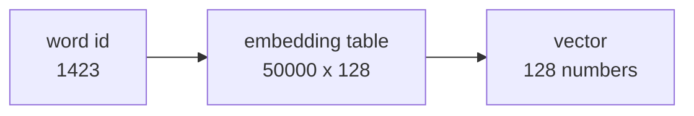

# Lesson 10 — Sequences and Embeddings

**Goal:** represent text and ordered data so a network can use it.

## What you will learn

- Why one-hot fails for words
- `nn.Embedding`
- Padding, masks, and variable lengths
- A working text classifier

---

## The problem with one-hot

A vocabulary of 50,000 words, one-hot encoded, is a 50,000-long vector per
word, almost all zeros. Worse, every pair of words is equally distant: "coffee"
is exactly as far from "espresso" as from "bicycle".

An embedding is a lookup table of dense vectors, **learned during training**:



```python
import torch
import torch.nn as nn

embedding = nn.Embedding(num_embeddings=1000, embedding_dim=16)

ids = torch.tensor([[5, 42, 7], [8, 0, 0]])     # batch of 2, length 3
vectors = embedding(ids)

print("ids:", ids.shape)
print("vectors:", vectors.shape)
print("table:", embedding.weight.shape)
```

```text
ids: torch.Size([2, 3])
vectors: torch.Size([2, 3, 16])
table: torch.Size([1000, 16])
```

Each id becomes a 16-number vector. The table is a parameter like any other:
gradients flow into it, and words that play similar roles drift towards
similar vectors.

Sizing: 50–300 dimensions for a small vocabulary, 300–1024 for a large one.
Starting point — roughly the fourth root of the vocabulary size, times four.

---

## Padding

Sentences have different lengths; tensors are rectangular. Pad to a fixed
length, and tell the model which positions are real.

```python
import torch
import torch.nn as nn

PAD = 0
sequences = [[5, 42, 7, 3], [8, 12], [9]]
max_length = max(len(s) for s in sequences)

padded = torch.tensor([s + [PAD] * (max_length - len(s)) for s in sequences])
mask = (padded != PAD).float()

print(padded)
print(mask)
print("real tokens per row:", mask.sum(dim=1).tolist())
```

```text
tensor([[ 5, 42,  7,  3],
        [ 8, 12,  0,  0],
        [ 9,  0,  0,  0]])
tensor([[1., 1., 1., 1.],
        [1., 1., 0., 0.],
        [1., 0., 0., 0.]])
real tokens per row: [4.0, 2.0, 1.0]
```

`padding_idx=0` tells the embedding that id 0 means "nothing":

```python
import torch
import torch.nn as nn

embedding = nn.Embedding(1000, 8, padding_idx=0)
print("pad vector is all zeros:", bool((embedding.weight[0] == 0).all()))
print("and stays zero after training — it gets no gradient")
```

```text
pad vector is all zeros: True
and stays zero after training — it gets no gradient
```

**Without a mask, padding pollutes your averages.** A mean over a padded
sequence divides by the padded length, so a two-word review gets its meaning
halved. This is the most common bug in hand-written text models.

---

## Pooling, correctly

```python
import torch

vectors = torch.randn(3, 4, 8)                  # batch, length, dim
mask = torch.tensor([[1., 1., 1., 1.],
                     [1., 1., 0., 0.],
                     [1., 0., 0., 0.]])

naive = vectors.mean(dim=1)                                     # wrong
masked = (vectors * mask.unsqueeze(-1)).sum(1) / mask.sum(1, keepdim=True)

print("naive:", naive.shape, "masked:", masked.shape)
print("difference on the shortest row:",
      round((naive[2] - masked[2]).abs().max().item(), 3))
```

```text
naive: torch.Size([3, 8]) masked: torch.Size([3, 8])
difference on the shortest row: 1.986
```

On the one-token row the two vectors differ by nearly 2.0 in places — the
naive version averaged one real vector with three of pure padding.

---

## A text classifier

```python
import torch
import torch.nn as nn
from torch.utils.data import TensorDataset, DataLoader

class TextClassifier(nn.Module):
    """Embedding, masked mean pooling, then a small head."""

    def __init__(self, vocab_size, embedding_dim=32, n_classes=2):
        super().__init__()
        self.embedding = nn.Embedding(vocab_size, embedding_dim, padding_idx=0)
        self.head = nn.Sequential(
            nn.Linear(embedding_dim, 32), nn.ReLU(), nn.Dropout(0.2),
            nn.Linear(32, n_classes),
        )

    def forward(self, ids):
        mask = (ids != 0).float().unsqueeze(-1)
        vectors = self.embedding(ids) * mask
        pooled = vectors.sum(dim=1) / mask.sum(dim=1).clamp(min=1e-9)
        return self.head(pooled)

torch.manual_seed(0)
vocab_size, length = 500, 12
ids = torch.randint(1, vocab_size, (2_000, length))
labels = (ids[:, 0] % 2 == 0).long()          # a learnable rule: first token parity

train_ids, train_y = ids[:1_600], labels[:1_600]
val_ids, val_y = ids[1_600:], labels[1_600:]
loader = DataLoader(TensorDataset(train_ids, train_y), batch_size=64, shuffle=True)

model = TextClassifier(vocab_size)
optimiser = torch.optim.AdamW(model.parameters(), lr=3e-3)
loss_fn = nn.CrossEntropyLoss()

for epoch in range(1, 21):
    model.train()
    for batch_ids, batch_y in loader:
        optimiser.zero_grad()
        loss_fn(model(batch_ids), batch_y).backward()
        optimiser.step()
    if epoch % 5 == 0:
        model.eval()
        with torch.no_grad():
            accuracy = (model(val_ids).argmax(1) == val_y).float().mean().item()
        print(f"epoch {epoch:>2}  val accuracy {accuracy:.4f}")
```

```text
epoch  5  val accuracy 0.5425
epoch 10  val accuracy 0.5400
epoch 15  val accuracy 0.5475
epoch 20  val accuracy 0.5375
```

Twenty epochs, and it is at 0.54 — four points above a coin toss, going
nowhere. The rule it has to learn is trivially simple: *is the first token
even?* A single `if` statement would score 1.000.

The reason it cannot is worth understanding, because it motivates the next
lesson.

**Mean pooling throws away order.** "the coffee was good, not bad" and "the
coffee was bad, not good" pool to exactly the same vector. Here the label
depends only on the *first* token, and the average buries it under eleven
irrelevant ones — the signal survives at one twelfth strength, and the model
never recovers it.

No amount of tuning fixes this. The architecture cannot represent the answer.

Three ways out, in historical order:

| Approach | Handles order by |
|---|---|
| RNN / LSTM / GRU | Reading left to right, carrying a hidden state |
| 1-D convolution | Sliding a window over positions |
| **Attention** | Letting every position look at every other — lesson 11 |

---

## RNNs, briefly

```python
import torch
import torch.nn as nn

rnn = nn.LSTM(input_size=32, hidden_size=64, batch_first=True)
vectors = torch.randn(4, 10, 32)              # batch, length, dim

output, (hidden, cell) = rnn(vectors)
print("output:", output.shape)                # one vector per position
print("final hidden:", hidden.shape)          # the summary of the sequence
```

```text
output: torch.Size([4, 10, 64])
final hidden: torch.Size([1, 4, 64])
```

LSTMs dominated sequence modelling until about 2018. They still work, they are
small, and they are reasonable for short series on limited hardware. But they
process positions **one at a time**, which cannot be parallelised, and they
struggle to connect words far apart.

Transformers fixed both problems. That is lesson 11.

---

## Common mistakes

| Mistake | What happens |
|---|---|
| No mask when pooling | Padding drags every short sequence towards zero |
| `padding_idx` not set | The pad token learns a meaning it should not have |
| Mean pooling where order matters | An accuracy ceiling you cannot tune past |
| Embedding dimension too large for the data | Overfits immediately |
| Ids outside `num_embeddings` | `IndexError` — build the vocabulary from train only |
| Padding to the dataset maximum | Wasted compute; pad per batch instead |

---

## Exercises

1. Build a vocabulary from 100 sentences and encode them with padding and a
   mask.
2. Show that masked pooling and naive pooling differ, on a short sequence.
3. Train the classifier above with `nn.LSTM` instead of mean pooling. Does the
   accuracy ceiling move?
4. Change the label rule to depend on the **last** token and explain what
   happens to mean pooling.
