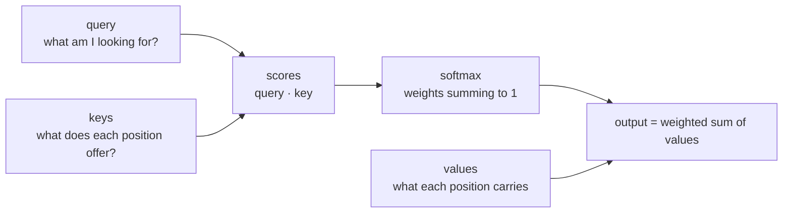
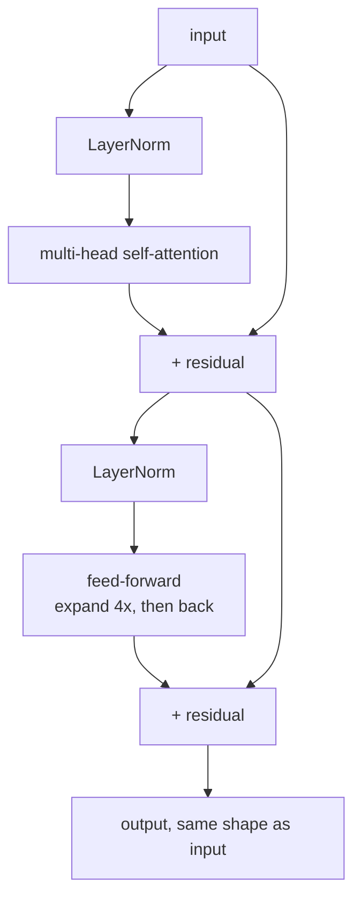

# Lesson 11 — Attention and Transformers

**Goal:** understand attention well enough to debug it, and use the block.

## What you will learn

- What attention computes
- Queries, keys, values
- Multi-head attention and the transformer block
- Positional encoding, and why it is needed

---

## The idea

Lesson 10 ended stuck: mean pooling treats every position identically, so a
signal in one position drowns. Attention lets each position **choose** what to
read from every other position.



The whole operation is one formula:

```text
attention(Q, K, V) = softmax(Q Kᵀ / √d) V
```

Three tensors derived from the input by three linear layers. The dot product
of a query with each key says "how relevant is that position to this one";
softmax turns those into weights; the output is the weighted average of the
values.

The `√d` divisor keeps the dot products from growing with dimension — without
it the softmax saturates and gradients vanish.

---

## By hand, once

```python
import torch
import torch.nn.functional as F

torch.manual_seed(0)
length, dim = 4, 8
x = torch.randn(1, length, dim)

W_q, W_k, W_v = (torch.randn(dim, dim) * 0.1 for _ in range(3))
Q, K, V = x @ W_q, x @ W_k, x @ W_v

scores = (Q @ K.transpose(-2, -1)) / (dim ** 0.5)
weights = F.softmax(scores, dim=-1)
output = weights @ V

print("scores:", scores.shape)
print("weights (row 0):", weights[0, 0].round(decimals=3).tolist())
print("rows sum to 1:", bool(torch.allclose(weights.sum(-1), torch.ones(1, length))))
print("output:", output.shape)
```

```text
scores: torch.Size([1, 4, 4])
weights (row 0): [0.23499999940395355, 0.25699999928474426, 0.2639999985694885, 0.24400000274181366]
rows sum to 1: True
output: torch.Size([1, 4, 8])
```

Each row of `weights` is a probability distribution over the four positions:
how much position `i` attends to each position `j`. With random weights it is
nearly uniform — training is what makes it selective.

The cost to notice: `scores` is `length × length`. Double the sequence and the
memory quadruples. **That quadratic cost is the defining constraint of every
transformer**, and the reason context windows are finite and expensive.

---

## Multi-head attention

One attention operation learns one notion of relevance. Run several in
parallel on slices of the dimensions and each head can specialise — one on
syntax, one on the subject of the sentence, one on nearby words.

```python
import torch
import torch.nn as nn

attention = nn.MultiheadAttention(embed_dim=64, num_heads=8, batch_first=True)
x = torch.randn(2, 10, 64)

output, weights = attention(x, x, x)          # self-attention: Q = K = V = x
print("output:", output.shape)
print("attention weights:", weights.shape)
```

```text
output: torch.Size([2, 10, 64])
attention weights: torch.Size([2, 10, 10])
```

`embed_dim` must divide by `num_heads` — here 64 / 8 = 8 dimensions per head.

Masking, for padding and for causal (left-to-right) generation:

```python
import torch
import torch.nn as nn

attention = nn.MultiheadAttention(embed_dim=16, num_heads=2, batch_first=True)
x = torch.randn(1, 5, 16)

padding_mask = torch.tensor([[False, False, False, True, True]])   # True = ignore
output, weights = attention(x, x, x, key_padding_mask=padding_mask)
print("padded positions get weight:",
      round(weights[0, 0, 3:].sum().item(), 6))

causal = nn.Transformer.generate_square_subsequent_mask(5)
print(causal.round(decimals=1))
```

```text
padded positions get weight: 0.0
tensor([[0., -inf, -inf, -inf, -inf],
        [0., 0., -inf, -inf, -inf],
        [0., 0., 0., -inf, -inf],
        [0., 0., 0., 0., -inf],
        [0., 0., 0., 0., 0.]])
```

The causal mask is `-inf` above the diagonal: after softmax those become zero,
so position 2 can see positions 0, 1 and 2 but nothing later. That single
matrix is what makes a language model generate left to right instead of
cheating by reading ahead.

---

## Position

Attention has no idea what order things are in — swap two tokens and the
weighted sums are the same. Order has to be added to the input.

```python
import torch
import math

def sinusoidal_encoding(length, dim):
    """The original transformer's fixed positional encoding."""
    position = torch.arange(length).unsqueeze(1).float()
    div = torch.exp(torch.arange(0, dim, 2).float() * (-math.log(10000.0) / dim))
    encoding = torch.zeros(length, dim)
    encoding[:, 0::2] = torch.sin(position * div)
    encoding[:, 1::2] = torch.cos(position * div)
    return encoding

encoding = sinusoidal_encoding(6, 8)
print(encoding.shape)
print(encoding[0].round(decimals=2).tolist())
print(encoding[1].round(decimals=2).tolist())
```

```text
torch.Size([6, 8])
[0.0, 1.0, 0.0, 1.0, 0.0, 1.0, 0.0, 1.0]
[0.8399999737739563, 0.5400000214576721, 0.10000000149011612, 1.0, 0.009999999776482582, 1.0, 0.0, 1.0]
```

Add that to your embeddings and every position carries a distinct signature.
Modern models use learned positional embeddings or rotary encodings (RoPE)
instead, but the purpose is identical.

---

## The transformer block



```python
import torch
import torch.nn as nn

layer = nn.TransformerEncoderLayer(
    d_model=64, nhead=8, dim_feedforward=256,
    dropout=0.1, batch_first=True, norm_first=True,
)
encoder = nn.TransformerEncoder(layer, num_layers=4)

x = torch.randn(2, 10, 64)
print("in:", x.shape, "-> out:", encoder(x).shape)
print("parameters:", sum(p.numel() for p in encoder.parameters()))
```

```text
in: torch.Size([2, 10, 64]) -> out: torch.Size([2, 10, 64])
parameters: 199936
```

Input shape equals output shape, which is why blocks stack freely — GPT-3 is
96 of these.

Three details that make deep stacks trainable:

- **Residual connections** (`+ input`) give gradients a path straight to the
  bottom. Without them, 96 layers do not train.
- **Layer normalisation** stabilises each sub-layer. `norm_first=True`
  (pre-norm) is the modern default and needs less learning-rate warmup.
- **The feed-forward expands 4×** and comes back, typically holding two thirds
  of the parameters.

---

## Solving lesson 10's problem

The task that mean pooling could not learn — *is the first token even?* — with
attention instead:

```python
import torch
import torch.nn as nn
from torch.utils.data import TensorDataset, DataLoader

class AttentionClassifier(nn.Module):
    def __init__(self, vocab_size, dim=32, n_classes=2, length=12):
        super().__init__()
        self.embedding = nn.Embedding(vocab_size, dim, padding_idx=0)
        self.position = nn.Parameter(torch.randn(1, length, dim) * 0.02)
        layer = nn.TransformerEncoderLayer(dim, nhead=4, dim_feedforward=64,
                                           batch_first=True, norm_first=True)
        self.encoder = nn.TransformerEncoder(layer, num_layers=2)
        self.head = nn.Linear(dim, n_classes)

    def forward(self, ids):
        x = self.embedding(ids) + self.position[:, : ids.size(1)]
        x = self.encoder(x)
        return self.head(x[:, 0])              # read position 0 directly

torch.manual_seed(0)
vocab_size, length = 500, 12
ids = torch.randint(1, vocab_size, (2_000, length))
labels = (ids[:, 0] % 2 == 0).long()

train_ids, train_y = ids[:1_600], labels[:1_600]
val_ids, val_y = ids[1_600:], labels[1_600:]
loader = DataLoader(TensorDataset(train_ids, train_y), batch_size=64, shuffle=True)

model = AttentionClassifier(vocab_size, length=length)
optimiser = torch.optim.AdamW(model.parameters(), lr=3e-3)
loss_fn = nn.CrossEntropyLoss()

for epoch in range(1, 21):
    model.train()
    for batch_ids, batch_y in loader:
        optimiser.zero_grad()
        loss_fn(model(batch_ids), batch_y).backward()
        optimiser.step()
    if epoch % 5 == 0:
        model.eval()
        with torch.no_grad():
            accuracy = (model(val_ids).argmax(1) == val_y).float().mean().item()
        print(f"epoch {epoch:>2}  val accuracy {accuracy:.4f}")
```

```text
epoch  5  val accuracy 0.9000
epoch 10  val accuracy 0.9325
epoch 15  val accuracy 0.9275
epoch 20  val accuracy 0.9425
```

From 0.54 to 0.94 on identical data, and 0.90 of it within five epochs. Mean
pooling averaged the signal away; attention keeps every position addressable,
and the head reads the one it needs.

(It stops short of 1.000 because the model must still learn parity of a
500-word vocabulary from 1,600 examples — the architecture is no longer the
limit, the data is.)

That is the architectural change that made modern NLP possible — and the
reason you should reach for a transformer whenever position and context
matter.

---

## Cost

| Property | Attention | RNN |
|---|---|---|
| Parallel over positions | Yes — the reason it trains fast | No |
| Path between distant positions | 1 step | n steps |
| Compute in sequence length | **O(n²)** | O(n) |
| Memory in sequence length | **O(n²)** | O(n) |

Doubling context quadruples cost. Everything you hear about long-context
models — FlashAttention, sliding windows, linear attention — is an attack on
that square.

---

## Common mistakes

| Mistake | What happens |
|---|---|
| No positional information | The model is order-blind; scrambled text scores the same |
| `embed_dim` not divisible by `num_heads` | `AssertionError` at construction |
| Forgetting `key_padding_mask` | The model attends to padding |
| Confusing `attn_mask` and `key_padding_mask` | Silent wrong masking |
| A transformer on 500 examples | Badly overfits; fine-tune a pretrained one |
| Ignoring the O(n²) cost | Out of memory at a longer sequence length |

---

## Exercises

1. Implement scaled dot-product attention by hand and check each row of the
   weights sums to 1.
2. Build a causal mask and show position 2 cannot see position 3.
3. Train the attention classifier above with the positional encoding removed.
   What happens, and why?
4. Measure attention memory at sequence lengths 128, 256 and 512, and confirm
   the quadratic growth.
