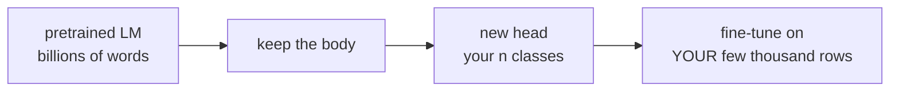

# Lesson 12 — Fine-Tuning a Language Model

**Goal:** adapt a pretrained text model to your own task.

## What you will learn

- Tokenizers, and why the model's own one is required
- A fine-tuning loop in plain PyTorch
- Learning rates for pretrained weights
- When a frozen model plus a classical head is enough

---

## The same idea as lesson 08

A model pretrained on billions of words already knows grammar, word meaning
and a great deal of world knowledge. You attach a small head and adjust it to
your labels.



Training a language model from scratch costs millions. Fine-tuning one costs
minutes, and this is the normal way text problems are solved.

---

## Tokenizers

```python
from transformers import AutoTokenizer

tokenizer = AutoTokenizer.from_pretrained("prajjwal1/bert-tiny")

encoded = tokenizer("The coffee here is excellent", return_tensors="pt")
print(encoded["input_ids"])
print(tokenizer.convert_ids_to_tokens(encoded["input_ids"][0]))
```

```text
tensor([[ 101,  100, 4157, 2182, 2003, 6581,  102]])
['[CLS]', '[UNK]', 'coffee', 'here', 'is', 'excellent', '[SEP]']
```

`[CLS]` opens every sequence and `[SEP]` closes it. The classification head
reads the `[CLS]` position, which is why it exists.

Now look at the second token. **"The" became `[UNK]`** — unknown. This
checkpoint's tokenizer does not lowercase, and its vocabulary contains `the`
but not `The`. A word your model never sees is a word it cannot use, and
nothing warned you.

Check your tokenizer on your own text before trusting any result. One
`[UNK]` per sentence is a silent accuracy tax.

Subword tokenisation handles words the vocabulary has never seen:

```python
from transformers import AutoTokenizer

tokenizer = AutoTokenizer.from_pretrained("prajjwal1/bert-tiny")
print(tokenizer.tokenize("unbelievably overpriced macchiato"))
```

```text
['un', '##bel', '##ie', '##va', '##bly', 'over', '##pr', '##ice', '##d', 'mac', '##chia', '##to']
```

`##` marks a continuation. Nothing is ever out-of-vocabulary — a rare word
simply costs more tokens, which matters when you pay per token and when you
hit a length limit.

**The tokenizer must come from the same checkpoint as the model.** Mismatched,
the ids mean different words and you get confident nonsense with no error.

Batching:

```python
from transformers import AutoTokenizer

tokenizer = AutoTokenizer.from_pretrained("prajjwal1/bert-tiny")
batch = tokenizer(
    ["Great espresso", "The service was slow and the coffee arrived cold"],
    padding=True, truncation=True, max_length=64, return_tensors="pt",
)
print(batch["input_ids"].shape)
print(batch["attention_mask"])
```

```text
torch.Size([2, 11])
tensor([[1, 1, 1, 1, 1, 1, 0, 0, 0, 0, 0],
        [1, 1, 1, 1, 1, 1, 1, 1, 1, 1, 1]])
```

Always pass `attention_mask` through to the model, or it attends to padding —
the same bug as lesson 10, one level up.

---

## Fine-tuning, in plain PyTorch

No `Trainer`, so that nothing is hidden:

```python
import torch
import torch.nn as nn
from torch.utils.data import TensorDataset, DataLoader
from transformers import AutoTokenizer, AutoModelForSequenceClassification

device = ("cuda" if torch.cuda.is_available()
          else "mps" if torch.backends.mps.is_available() else "cpu")
checkpoint = "prajjwal1/bert-tiny"

positive = ["great coffee", "excellent service", "loved the espresso",
            "friendly staff and good prices", "the best latte in town",
            "fast delivery and hot food", "amazing atmosphere", "will come again"]
negative = ["terrible service", "cold coffee", "overpriced and slow",
            "rude staff", "the worst latte I have had", "waited forty minutes",
            "dirty tables", "never coming back"]

texts = (positive + negative) * 8              # 128 rows
labels = ([1] * len(positive) + [0] * len(negative)) * 8

tokenizer = AutoTokenizer.from_pretrained(checkpoint)
encoded = tokenizer(texts, padding=True, truncation=True, max_length=32,
                    return_tensors="pt")

dataset = TensorDataset(encoded["input_ids"], encoded["attention_mask"],
                        torch.tensor(labels))
loader = DataLoader(dataset, batch_size=16, shuffle=True)

torch.manual_seed(0)
model = AutoModelForSequenceClassification.from_pretrained(
    checkpoint, num_labels=2).to(device)
optimiser = torch.optim.AdamW(model.parameters(), lr=5e-5)

for epoch in range(1, 6):
    model.train()
    total = 0.0
    for input_ids, attention_mask, batch_labels in loader:
        input_ids = input_ids.to(device)
        attention_mask = attention_mask.to(device)
        batch_labels = batch_labels.to(device)

        optimiser.zero_grad()
        output = model(input_ids=input_ids, attention_mask=attention_mask,
                       labels=batch_labels)
        output.loss.backward()
        optimiser.step()
        total += output.loss.item()
    print(f"epoch {epoch}  loss {total / len(loader):.4f}")
```

```text
epoch 1  loss 0.6861
epoch 2  loss 0.6774
epoch 3  loss 0.6629
epoch 4  loss 0.6443
epoch 5  loss 0.6259
```

Two things differ from a plain PyTorch model:

- You pass `labels=` **into** the model and it returns the loss on
  `output.loss`. The loss for the task is part of the architecture.
- The learning rate is `5e-5`, not `1e-3`. Twenty times smaller, on purpose.

---

## Why the learning rate is tiny

```python
import torch
from torch.utils.data import DataLoader
from transformers import AutoModelForSequenceClassification

def finetune(lr, epochs=5, seed=0):
    torch.manual_seed(seed)
    model = AutoModelForSequenceClassification.from_pretrained(
        checkpoint, num_labels=2).to(device)
    optimiser = torch.optim.AdamW(model.parameters(), lr=lr)
    for _ in range(epochs):
        model.train()
        for input_ids, attention_mask, batch_labels in loader:
            optimiser.zero_grad()
            output = model(input_ids=input_ids.to(device),
                           attention_mask=attention_mask.to(device),
                           labels=batch_labels.to(device))
            output.loss.backward()
            optimiser.step()
    model.eval()
    with torch.no_grad():
        logits = model(input_ids=encoded["input_ids"].to(device),
                       attention_mask=encoded["attention_mask"].to(device)).logits
    return (logits.argmax(1).cpu() == torch.tensor(labels)).float().mean().item()

for lr in [5e-5, 1e-3, 1e-1]:
    print(f"lr={lr:<8} accuracy {finetune(lr):.4f}")
```

```text
lr=5e-05  accuracy 0.9375
lr=0.001  accuracy 1.0000
lr=0.1    accuracy 0.5000
```

Three orders of magnitude, three different outcomes:

- `5e-5` — the standard fine-tuning rate. Five epochs on 128 rows gets to
  0.94; more epochs close the gap.
- `1e-3` — converges quickly here, because the model is tiny (4M parameters)
  and the task is trivially separable.
- `1e-1` — 0.5, exactly chance. The updates are so large that the pretrained
  weights are destroyed. **This is catastrophic forgetting**, and it looks
  identical to a broken script.

The usual range for fine-tuning a real model is `1e-5` to `5e-5`. Start at
`2e-5` for BERT-sized models and only go higher if the loss refuses to move.

---

## The cheaper alternative: frozen embeddings

Before fine-tuning anything, try the model as a frozen feature extractor with
a classical head on top. It is faster, it cannot forget, and on small datasets
it is often as good.

```python
import torch
from transformers import AutoTokenizer, AutoModel
from sklearn.linear_model import LogisticRegression
from sklearn.model_selection import cross_val_score

tokenizer = AutoTokenizer.from_pretrained(checkpoint)
encoder = AutoModel.from_pretrained(checkpoint).to(device).eval()

batch = tokenizer(texts, padding=True, truncation=True, max_length=32,
                  return_tensors="pt").to(device)

with torch.no_grad():
    hidden = encoder(**batch).last_hidden_state
    mask = batch["attention_mask"].unsqueeze(-1)
    embeddings = ((hidden * mask).sum(1) / mask.sum(1)).cpu().numpy()

scores = cross_val_score(LogisticRegression(max_iter=1000), embeddings, labels, cv=5)
print("embeddings:", embeddings.shape)
print(f"logistic regression on frozen embeddings: {scores.mean():.4f}")
```

```text
embeddings: (128, 128)
logistic regression on frozen embeddings: 1.0000
```

One forward pass, no training, no learning rate — and a perfect score on this
toy task. No gradient descent on the language model at all.

The order to try things, cheapest first:

1. **A prompt to an existing instruction model** — zero training.
2. **Frozen embeddings + logistic regression** — minutes, and a real baseline.
3. **Fine-tune the head only** — the body stays frozen.
4. **Full fine-tuning** — when you have thousands of labelled rows.
5. **LoRA / parameter-efficient fine-tuning** — full-quality adaptation at a
   fraction of the memory; the Optimization course covers it.

Most teams jump to 4. Steps 1 and 2 answer the question for a fraction of the
cost, and they tell you whether the problem is learnable at all.

---

## Choosing a checkpoint

| Model | Use |
|---|---|
| `distilbert-base-uncased` | Fast English baseline |
| `bert-base-uncased` | The standard reference |
| `roberta-base` | Usually better than BERT at the same size |
| `xlm-roberta-base` | Multilingual, including Arabic |
| `aubmindlab/bert-base-arabertv2` | Arabic specifically |
| `sentence-transformers/all-MiniLM-L6-v2` | Embeddings for search and similarity |

For Arabic, do not assume an English model transfers. Try AraBERT or
CAMeLBERT, and **measure on your own data** — the model card's benchmark is not
your dataset.

---

## Common mistakes

| Mistake | What happens |
|---|---|
| Tokenizer and model from different checkpoints | Confident nonsense, no error |
| Fine-tuning at `1e-3` on a large model | Catastrophic forgetting |
| Dropping `attention_mask` | The model attends to padding |
| No `truncation=True` | Crash on the first long document |
| Fine-tuning before trying frozen embeddings | Hours spent for no gain |
| `model.eval()` forgotten at inference | Dropout active; unstable outputs |

---

## Exercises

1. Tokenise five sentences and inspect the subword splits. Which words break
   up, and why?
2. Fine-tune `prajjwal1/bert-tiny` on a small labelled set of your own.
3. Sweep the learning rate over `[1e-5, 5e-5, 1e-3, 1e-1]` and plot the final
   accuracy.
4. Compare frozen embeddings + logistic regression against full fine-tuning on
   the same data. Which wins, and at what cost?
