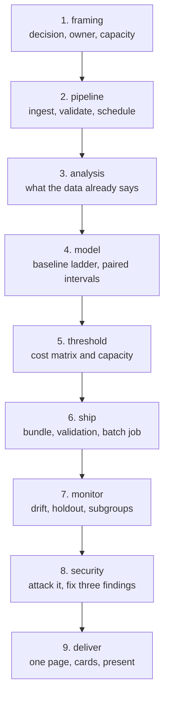

# Capstone A — The Decision System

**A model that changes what an organisation does every week, and keeps working.**

Pulls from: Python, Machine-Learning, Data-Engineering, Data-Analysis,
Data-Science, Data-Security, AI-System-Design, Communication, Optimization,
HPC-and-Cloud, Research-and-Review, Advanced-Practical-AI.

Read [`README.md`](README.md) first — the shared requirements apply in full.

---

## The shape



---

## The technical core (the 20%)

### 1. A pipeline, not a notebook
- Ingestion that runs **unattended on a schedule**, with a lock and a heartbeat
- **Validation on the training rows**, not only on inference inputs
  (Data-Security lesson 04)
- Idempotent: running it twice produces the same result
- Provenance on every row: where it came from, when, through what path

### 2. Analysis before modelling
- The exploration profile, and a **cleaning log with its effect on the headline
  number**
- At least one group comparison **checked for Simpson's paradox**
- A time trend, seasonally adjusted or compared like-for-like
- **Three observations you made by reading rows** that no statistic showed you

### 3. The model
- The three baselines: trivial, **the current process**, and a simple model
- At least four models through one pipeline, cross-validated, with fold spread
- A **paired interval** on the difference between the best two
- Feature engineering measured, and **deleted if inside the noise**

### 4. The decision
- A cost matrix, all four cells, with where each number came from
- A profit curve over at least six thresholds
- The threshold you use, and whether it came from cost or from **capacity**
- A calibration table and a Brier score
- A gains table by decile

### 5. Running it
- Four weekly runs (real or simulated, stated which)
- **A 10% holdout that is never acted on**, with its base rate beside the
  treated group's
- A monitoring row per run: PSI, unseen categories, mean prediction vs training
  base rate, flagged count
- **Three failures injected**, with which monitor caught each and which missed

### 6. If the data is a time series
Only if your rows are ordered in time — and check, because most business data
is, and most people split it wrong anyway:
- **The split is time-based**, and you report what a shuffled split would have
  scored beside it ([Time-Series 02](../Time-Series-and-Forecasting/lessons/02-evaluating.md)
  measured MAE 85.3 against 107.7 for exactly this)
- A **backtest over at least 5 folds**, not one holdout, with the fold-by-fold
  win rate against the baseline
- If you forecast more than one step ahead, **direct and recursive compared**
  (73.1 against 124.9 at h=28 in that course)

### 7. If the decision is "which items to show"
Only if your system ranks or selects from a catalogue:
- The **popularity baseline**, reported first
  ([Recommender-Systems 01](../Recommender-Systems/lessons/01-what-a-recommender-is.md): 0.2324 for free)
- Recall@k, NDCG@k **and coverage** in one table
- **The cold share**: what fraction of users *and of events* your model cannot
  serve, and what each fallback branch scores separately
  ([Recommender-Systems 05](../Recommender-Systems/lessons/05-cold-start.md))
- The three **exposure bands**, and the tail's share of recommendations

### 8. Ship it like MLOps says
- Environment pinned, image built twice a week apart, **same model hash**
  ([MLOps 02](../MLOps/lessons/02-packaging.md))
- The pipeline **re-runs from scratch** in an empty directory
  ([MLOps 03](../MLOps/lessons/03-pipeline-as-code.md))
- An **eval gate in CI** with a tolerance, that fails a PR making the model
  worse, **including on a subgroup** ([MLOps 04](../MLOps/lessons/04-ci-gate.md))
- All five deployment strategies **priced on your traffic**; say which you chose
  and why ([MLOps 05](../MLOps/lessons/05-deployment.md))
- **Rollback timed with a stopwatch, by someone who did not build it**
- Alert thresholds from `sqrt(p(1-p)/n)`, not chosen by eye
  ([MLOps 07](../MLOps/lessons/07-monitoring.md))
- **Three of lesson 07's six serving skews injected.** Which does your
  monitoring catch? Most people find it catches two.

### 9. What it owes
- Risk tier, with the seven questions answered
  ([AI-Governance 02](../AI-Governance/lessons/02-classifying-risk.md))
- The four-fifths ratio at **five** thresholds, plus one other fairness
  definition, and which you chose
  ([lesson 04](../AI-Governance/lessons/04-fairness-obligations.md))
- The **four oversight numbers** if a human reviews anything: override rate,
  override accuracy, time per review, outcome delta
  ([lesson 05](../AI-Governance/lessons/05-human-oversight.md))
- **Explanation fidelity** as a number, and whether it agrees with the model's
  own feature importance ([lesson 06](../AI-Governance/lessons/06-transparency.md))
- **k** for your quasi-identifiers, and the retention policy
  ([lesson 07](../AI-Governance/lessons/07-data-obligations.md))

### 10. Attack it
- Membership inference AUC, beside the train/test gap
- A backdoor installed at 1%, and your attempt to detect it
- Extraction measured under three output policies
- **Three findings fixed, with after-numbers**

---

## Extra deliverables

Beyond the shared list:

```text
capstone-a/
├── pipeline/          scheduled ingestion, validation, provenance
├── analysis/          the cleaning log and the three hand-read findings
├── models/            the ladder, the paired interval
├── decision/          cost matrix, profit curve, calibration, gains
├── runs/              four runs, monitoring rows, the holdout
├── ops/               lockfile, Dockerfile, CI gate, rollback drill, thresholds
└── security/          attacks, findings, fixes with after-numbers
```

---

## Cutting it

Two weeks is not enough for all of this. Cut in this order, and **say what you
cut**:

| Cut first | Keep at all costs |
|---|---|
| The fourth model in the ladder | The current-process baseline |
| Two of the three injected failures | The holdout |
| The extraction measurement | The membership-inference number |
| Simulated runs instead of real ones | The cost matrix and the threshold derivation |
| The seasonal adjustment | The cleaning log's effect on the headline number |
| Pricing all five deployment strategies | The eval gate in CI, and the timed rollback |
| The direct-vs-recursive comparison | The time-based split, if your data is ordered |

A capstone that does six things properly beats one that does twelve badly, and
the cut list is part of the submission.
