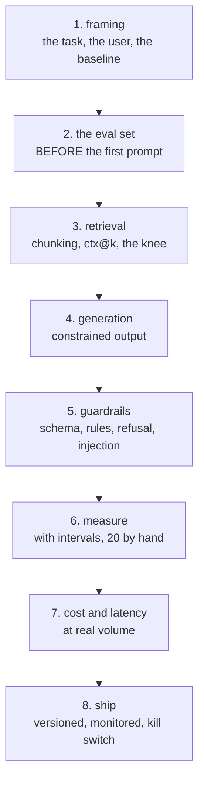

# Capstone B — The Assistant

**A text system people actually use, that knows when it does not know.**

Pulls from: Python, NLP, Deep-Learning, LLM-and-GenAI, AI-Agents, Data-Science,
Data-Security, AI-System-Design, Communication, Optimization, Research-and-Review.

Read [`README.md`](README.md) first — the shared requirements apply in full.

---

## The shape



---

## The technical core (the 20%)

### 1. The eval set, committed first
- **100+ examples** with correct answers, split dev/test
- **20+ unanswerable questions**, and a measured refusal rate
- A regression subset: every production failure becomes a permanent case
- The metric chosen by the **shape of the answer**, with a written reason
- The smallest difference it can detect, computed

Its git commit must predate your first prompt commit.

### 2. Stepwise, each step measured on dev
| Step | Report |
|---|---|
| Non-LLM baseline (keyword search, a rule, a template) | accuracy, cost, latency |
| Zero-shot | the same three |
| Few-shot, **balanced labels, 3+ example orders** | median and range |
| RAG | **ctx@k first**, then accuracy |
| Fine-tune, only if volume justifies it | the learning curve |

**Report the step at which you stopped improving, and stop there.**

### 3. Retrieval done properly
- **At least three chunking strategies compared**, with ctx@k for each
- The ctx@k curve, and **k chosen at the knee**, with its token cost
- Citations: every answer names its chunk, and you **verify the cited chunk
  contains the claim**
- The "retrieved nothing" path: no chunk above threshold means **do not call the
  model**

### 4. Guardrails
- Constrained or schema-validated output. Free-text parsing is not acceptable
- Schema validation **and two business rules the schema cannot express**
- A bounded retry loop, with the retry rate measured
- **Three injection payloads tested**: in retrieved data, in a user field, in a
  tool's return value — with the result of each
- A written statement of what an attacker who controls the input can do

### 5. Cost and latency at real volume
- Tokens in and out, **with the correct tokeniser**
- If your users write Arabic, **the Arabic multiplier on your own text**
- Cache hit rate from your **real traffic shape**, not assumed
- p50 and p95, and the latency budget with owners
- The route table: what fraction of requests avoid the expensive path

### 6. If it takes actions
Only if your assistant does anything beyond answering:
- The model returns a **decision**; your code maps it to the action
- Permissions scoped per step and per argument
- Idempotency keys on every write, with a retry-storm test
- Harm rate measured, not just success rate

---

## Extra deliverables

```text
capstone-b/
├── eval/              dev, test, unanswerable, regressions — committed first
├── retrieval/         chunking comparison, ctx@k curve, the chosen k
├── prompts/           versioned, hashed, referenced in every log line
├── guardrails/        schema, business rules, retry, injection tests
├── reports/
│   ├── steps.md       each step with its number
│   ├── errors.md      the 20 outputs read by hand
│   └── cost.md        tokens, Arabic multiplier, cache, monthly bill
└── tests/
    ├── test_guardrails.py
    └── test_injection.py
```

---

## Cutting it

| Cut first | Keep at all costs |
|---|---|
| The fine-tuning step | The eval set, committed first |
| Two of the three chunking strategies | The ctx@k curve and the chosen k |
| The route table | The unanswerable subset and its refusal rate |
| Streaming | Constrained output |
| The semantic cache | The injection tests |

The two things that cannot be cut are the **eval set committed before the first
prompt** and the **unanswerable subset**. Without them there is no evidence the
system works, only an impression.
