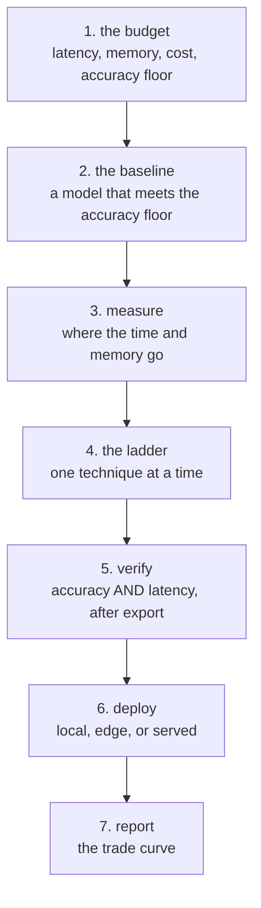

# Capstone C — The Efficient Model

**The same capability, at a fraction of the cost, proven.**

Pulls from: Python, Machine-Learning, Deep-Learning, Optimization,
Computer-Vision **or** NLP, HPC-and-Cloud, Data-Science, AI-System-Design,
Communication, Research-and-Review.

Read [`README.md`](README.md) first — the shared requirements apply in full.

---

## The shape



---

## The technical core (the 20%)

### 1. The budget, written first
Four numbers, agreed before you optimise anything:

```text
ACCURACY FLOOR   the metric and the value below which this is not shippable
LATENCY          p95, measured where the user experiences it
MEMORY           the device or GPU it must fit in
COST             per 1,000 requests, or per month at your volume
```

`MIN USEFUL` from the shared requirements, applied to efficiency.

### 2. The baseline, measured properly
- A model that **meets the accuracy floor**, with its interval over 5 seeds
- Its latency: synthetic and with the real loader, at three batch sizes
- Its memory: the four-term arithmetic (HPC lesson 01) and the **measured peak**
- Its cost per 1,000 requests

### 3. Where the time and memory actually go
- The bottleneck identified **by measurement**: compute, data loading, or
  communication
- If GPU utilisation is below 80%, what you did about it
- The dominant stage, and **what halving each stage would buy**
  (AI-System-Design lesson 04)

### 4. The ladder, one technique at a time
At least **four**, each measured independently and in combination:

| Technique | Report |
|---|---|
| Batch size / throughput | samples/sec at 3+ sizes |
| Mixed precision | memory, speed, accuracy |
| Quantisation (int8, or 4-bit) | size, latency, **accuracy after export** |
| Pruning | sparsity, **real speedup or the honest zero** |
| Distillation | student accuracy vs teacher, size, latency |
| PEFT / LoRA | trainable params, memory, accuracy |
| A smaller architecture | the whole table |
| Compilation / ONNX | latency, and whether accuracy moved |

**One must be a technique that did not work**, reported with its number. If
everything you tried helped, you did not try enough.

### 5. Verify after export, on the target
- Accuracy measured **through the exported artefact**, not the original
- Latency measured on the **target hardware**, warm and throttled
- Memory measured, not computed
- The parameter-count-is-not-latency check: does your ordering match FLOPs?

### 6. Serve it, and find out where the latency actually is
- p50, **p95 and p99** under load — not an average
- Your **utilisation**, and how much of p95 is queueing rather than the model
  ([MLOps 06](../MLOps/lessons/06-serving.md): a 40 ms model answers in 598 ms
  at 95% utilisation)
- Throughput at **batch 1, 8, 32, 128**, and where the curve flattens
- `max_batch_size` and `max_wait_ms` chosen from your **real arrival rate**
- A **fallback** that answers when the model is down, tested by killing it

If most of your p95 turns out to be queueing, **say so and report what one more
replica would do** — that is a more valuable finding than another 5% off the
model, and it is the one teams miss.

### 7. Deploy it somewhere real
One of:
- **Local**: an Ollama or llama.cpp deployment, with tokens/sec and the capacity
  ceiling (Optimization lesson 14)
- **Edge**: on a phone, a Pi or a Jetson, with the four budgets
- **Served**: an endpoint with a latency budget and a route table

### 8. The trade curve
The deliverable that makes this a capstone rather than a tuning exercise:

```text
a plot: accuracy on one axis, cost (or latency, or memory) on the other
one point per configuration you measured
the accuracy floor drawn as a line
the chosen point marked, with the reason
```

---

## Ship it like MLOps says

Three requirements, shared with the other two capstones:

- Environment **pinned**, and the exported artefact's hash recorded
  ([MLOps 02](../MLOps/lessons/02-packaging.md))
- An **eval gate in CI** that fails a change breaching the accuracy floor —
  and also one breaching the **latency** budget, since this capstone is about
  latency ([MLOps 04](../MLOps/lessons/04-ci-gate.md))
- **Rollback to the unoptimised model**, timed, by someone else

---

## Extra deliverables

```text
capstone-c/
├── budget.md          the four numbers, committed first
├── baseline/          model, 5 seeds, latency, memory, cost
├── ladder/
│   ├── 01-*.md        one file per technique, with its numbers
│   └── failed.md      the technique that did not work
├── export/            the artefact, and accuracy measured THROUGH it
├── deploy/            local, edge or served — with measurements on target
├── trade-curve.png    accuracy against cost, with the floor and the choice
└── REPORT.md          the recommendation
```

---

## Cutting it

| Cut first | Keep at all costs |
|---|---|
| Distillation (it is the most expensive) | The accuracy floor, written first |
| The compilation step | Accuracy measured **after export** |
| Two of the eight ladder techniques | The technique that did not work |
| Deploying to three targets | The trade curve |
| The 5-seed baseline, down to 3 | Latency measured on the **target**, not your laptop |
| The batch-size sweep | p95, and how much of it is queueing |
| The fallback's failover test | The fallback existing at all |

The one thing that cannot be cut is **accuracy measured through the exported
artefact on the target device**. An optimisation verified only in PyTorch on a
laptop has not been verified.
