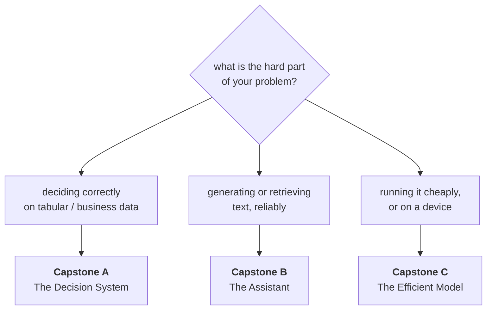

# Final Projects

Three capstones. Each one requires work from **most of the twenty-four
courses**, which is the point: the twenty-four numbered projects each test one
course, and these test whether you can hold the whole thing together at once.

Do **one**. They are alternatives, not a sequence.

| Capstone | For | Pulls from |
|---|---|---|
| **[A — The Decision System](A-decision-system.md)** | Anyone doing applied ML at a company | 15 courses |
| **[B — The Assistant](B-the-assistant.md)** | Anyone building with LLMs | 14 courses |
| **[C — The Efficient Model](C-efficient-model.md)** | Anyone who cares about cost, latency or devices | 12 courses |

---

## What makes these different

The numbered projects ask *"can you do X properly?"*. These ask three harder
questions:

1. **Can you decide what not to do?** Each capstone gives you more scope than
   the time allows. Cutting it correctly is graded.
2. **Does it survive contact with other people?** Every capstone requires a real
   reviewer, a real user, or a real decision-maker.
3. **Can you say what it is worth, and what would make you stop?** Every one
   ends in a recommendation where "do not ship this" is available.

---

## The rules, for all three

**Two weeks.** Roughly 60-80 hours. If you cannot finish, cut scope and say
what you cut and why — that is a better answer than an unfinished everything.

**A real problem.** Your work, a real organisation, or a public dataset with a
real decision attached. Not a Kaggle leaderboard.

**Every number carries its interval**, and every comparison names its baseline.
This is the standard from Data-Analysis lesson 08, Data-Science lesson 05 and
Communication lesson 03, and it is graded in all three capstones.

**Every artifact in one repository**, not a wiki or a drive
(Communication lesson 06).

**One MLOps requirement, in all three.** Whatever you build, it must have the
[MLOps](../MLOps/) minimum: a pinned environment, a pipeline that re-runs from
scratch, an eval gate that fails a worsening change, and a rollback someone
else has performed with a stopwatch. A capstone that works only on your laptop
on the day you submit it is not finished — and
[MLOps 04](../MLOps/lessons/04-ci-gate.md) prices exactly what the missing gate
costs.

**The handover test at the end.** A colleague who has never seen the project
gets the repository for one day. Every question they must ask you is a gap, and
you record all of them.

---

## Shared requirements

Whichever capstone you choose, these are required:

### The decision
- The decision it supports, its owner by name, its frequency, its value
- **A non-AI baseline, implemented and measured** on the same test set
- `MIN USEFUL`: the threshold below which you recommend not shipping, written
  before you see results

### The data
- The audit: rows, positives, duplicates, nulls, time range
- **The single-feature leak scan** (Data-Science lesson 03)
- A split that matches deployment — time-ordered, group-aware, or both
- A **data card**: source, purpose, legal basis, measured k, retention

### The evidence
- Every headline number with an interval
- Every comparison at equal budget, with the baseline named
- The smallest difference your evaluation can detect, stated
- **20 outputs read by hand**, with what you found

### The system
- The four diagrams (AI-System-Design lesson 02), including failure arrows
- The ten-line contract, if anything consumes it
- A latency budget with owners, if anything is synchronous
- Input validation at the boundary, with a test that feeds it malformed input

### The delivery
- A one-page answer, the six blocks (Communication lesson 02)
- Model card, data card, run records, decision records, README (7 sections)
- Presented to a real person, with the questions and the decision recorded
- The handover test, with every question written down

### The verdict
```text
RECOMMENDATION   Ship / Ship narrower / Keep the baseline / Stop
AGAINST BASELINE the baseline's number, same test set
VALUE            per period, with the range from your assumptions
WHERE IT FAILS   the worst subgroup or condition, with the number
COST             to build, to run, to maintain
WHAT WOULD CHANGE THIS
OWNER AND REVIEW DATE
```

---

## Marking, shared across all three

| Weight | Criterion |
|---|---|
| 15% | The decision, the measured baseline, and `MIN USEFUL` written first |
| 15% | Data: audit, leak scan, deployment-matching split, data card |
| 20% | The capstone's own technical core (see each brief) |
| 15% | Evidence: intervals, equal budgets, 20 outputs read by hand |
| 15% | The system: diagrams, contract, validation, failure handling |
| 10% | Delivery: one-pager, artifacts, presented to a real person |
| 10% | The verdict, and the handover test with gaps recorded |

**Automatic deductions**, in all three: a claimed improvement smaller than your
evaluation can detect; a comparison at unequal budgets; no non-AI baseline; a
number without an interval; `MIN USEFUL` written after the results; no failure
arrows on any diagram; a handover test with no questions recorded.

---

## Choosing



If two apply, choose the one whose **courses you have actually done**. A
capstone is not the place to learn a course.
