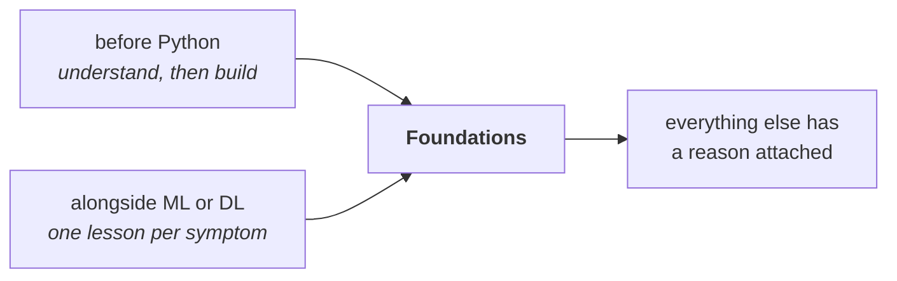

# Foundations — Maths for AI Engineering

The maths that explains the engineering, and none that does not.

**Four ideas, eight lessons, every one checked by code with real output.** No
proofs, no integration by hand, no measure theory — the goal is to recognise
these ideas when they appear disguised as a bug, a cost or a bad metric.

**Prerequisites: none.** Some NumPy helps, and
[`../Python/Basic-Python`](../Python/Basic-Python) lesson 01 is enough.

---

## When to do it



**The second route is the honest recommendation.** Maths learned in answer to a
problem you already have sticks; maths learned in advance mostly does not.
Lesson 01 has a symptom table that tells you which lesson you need today.

## Lessons

| # | Lesson | The measurement that makes it unavoidable |
|---|---|---|
| 01 | [What You Actually Need](lessons/01-what-you-need.md) | Four ideas, and a list of what you can safely skip |
| 02 | [Vectors and Matrices](lessons/02-vectors-and-matrices.md) | `det A` = 3.0 is the factor by which area changed |
| 03 | [Decomposition](lessons/03-decomposition.md) | **Rank 5 captures 98.7%** of a 40-column matrix |
| 04 | [Derivatives and Gradients](lessons/04-derivatives.md) | A gradient check agreeing to **3.9e-11** — the bug-finder |
| 05 | [Optimisation and Conditioning](lessons/05-optimisation.md) | Condition number 10,000: **76,746 steps instead of 64** |
| 06 | [Probability and Base Rates](lessons/06-probability.md) | A 99%/99% test on 1-in-1000 is **9% likely to be right** |
| 07 | [Sampling and the CLT](lessons/07-sampling.md) | An eval set of 100 cannot see an improvement under **27 points** |
| 08 | [Bias, Variance and Estimation](lessons/08-estimation.md) | Degree 15 has **270x** the variance of degree 3 |

## Then

- **[`Project-19/`](Project-19/)** — apply all four ideas to a model you already
  have, and find something you did not know about it

---

## Setup

```bash
python3 -m venv .venv
source .venv/bin/activate
pip install -r requirements.txt
```

Every lesson runs in under a second on a CPU.

---

## What this course argues

1. **You need four ideas, not a degree.** Linear algebra, gradients, base rates,
   and `1/sqrt(n)` (lesson 01).
2. **A dot product is a similarity**, which is why one matrix multiply searches
   an entire corpus (lesson 02).
3. **Most matrices are smaller than they look.** Rank is a measurable property
   of your own feature table, and LoRA is this idea applied to a 7B model
   (lesson 03).
4. **The chain rule *is* backpropagation**, and vanishing gradients are a
   product of small numbers, not a mystery (lesson 04).
5. **Feature scaling is worth 1,200x the training steps**, which is the entire
   justification for a line everyone copies without knowing why (lesson 05).
6. **The base rate dominates.** This one calculation explains most bad decisions
   made with models (lesson 06).
7. **You cannot see an improvement smaller than your eval set allows**, and that
   number is computable (lessons 07, 08).

---

## Where each idea reappears

| Idea | Courses that depend on it |
|---|---|
| Dot product as similarity | [LLM 05](../LLM-and-GenAI/lessons/05-embeddings-and-search.md), NLP, Computer-Vision |
| Low rank | [Optimization 07](../Optimization/lessons/07-parameter-efficient-finetuning.md) (LoRA), [HPC 01](../HPC-and-Cloud/lessons/01-will-it-fit.md) |
| Chain rule | [Deep-Learning](../Deep-Learning), [Optimization 03](../Optimization/lessons/03-optimisers.md) |
| Conditioning | [Data-Science 04](../Data-Science/lessons/04-features-and-pipelines.md), [Optimization 03](../Optimization/lessons/03-optimisers.md) |
| Base rates | [Data-Science 01](../Data-Science/lessons/01-what-data-science-is.md), [06](../Data-Science/lessons/06-evaluating-the-decision.md) |
| `1/sqrt(n)` | [Data-Analysis Advanced](../Data-Analysis/Advanced), [LLM 07](../LLM-and-GenAI/lessons/07-evaluation.md), [RL 09](../Reinforcement-Learning/lessons/09-evaluating-agents.md) |
| Bias/variance | [Machine-Learning](../Machine-Learning), [Data-Science 05](../Data-Science/lessons/05-baselines-and-selection.md), [Data-Security 03](../Data-Security-for-AI/lessons/03-memorisation.md) |
