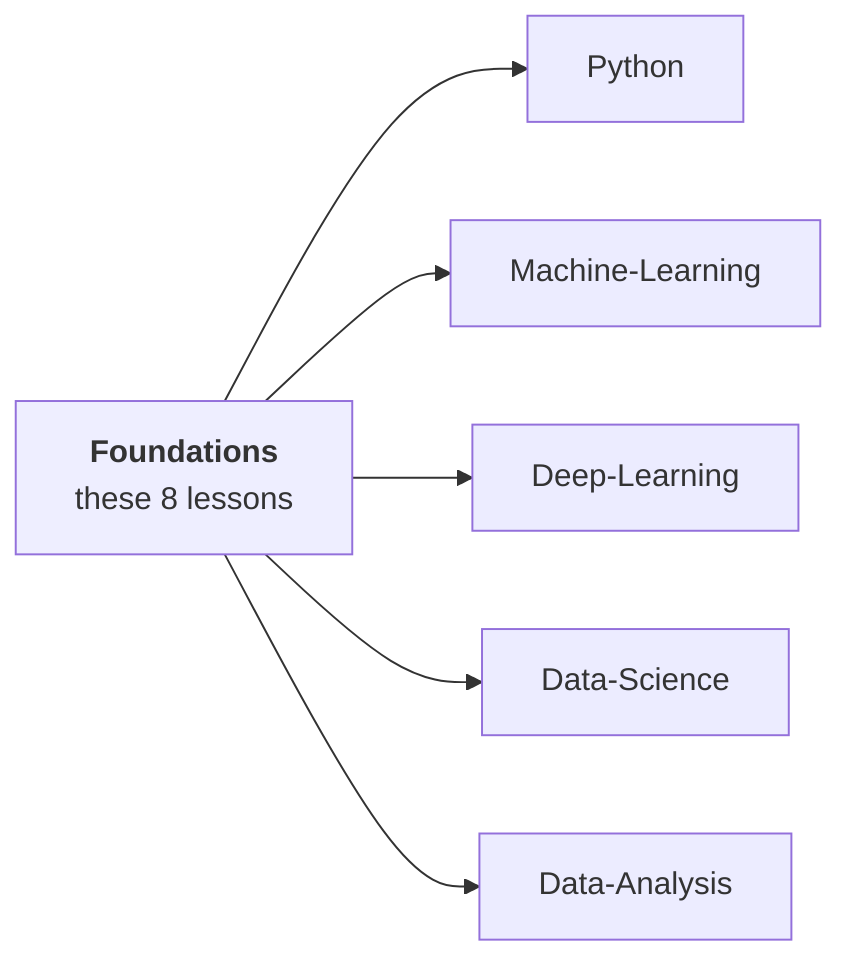

# Lesson 01 — What You Actually Need

**Goal:** know which maths matters for AI engineering, and — more usefully —
which does not.

## What you will learn

- The four areas, and what each one buys you
- What you can safely skip
- How to tell when a gap is really hurting you
- How this course is built

---

## The honest answer

You do not need a maths degree to be a good AI engineer. You need **four
specific ideas**, each of which explains a decision you will make every week.

| Area | The idea | Explains |
|---|---|---|
| **Linear algebra** | A matrix transforms space; a dot product is a similarity | Embeddings, every layer, why scaling matters, LoRA |
| **Calculus** | A gradient points uphill; the chain rule multiplies | Training, vanishing gradients, why you cannot optimise accuracy |
| **Probability** | The base rate dominates | Why a 99% accurate model is useless, precision vs recall |
| **Statistics** | `1/sqrt(n)`, and bias against variance | Every interval, every eval set, every "is this improvement real" |

That is this course. Eight lessons, and **every one of them is checked by code
with real output**, because the point is not to prove theorems — it is to
recognise the four ideas when they show up disguised as an engineering problem.

---

## What you can skip

Genuinely. For applied AI engineering, you will not miss these:

| Topic | Why you can skip it |
|---|---|
| Proofs | You are not publishing in a maths journal |
| Integration by hand | NumPy and autograd do it |
| Matrix inversion by hand | `np.linalg.solve`, and you should never invert anyway |
| Measure theory | Zero impact on any decision you will make |
| Most of multivariable calculus | You need the gradient; the rest is library code |
| Eigenvector computation by hand | `np.linalg.svd` |
| Closed-form solutions | Gradient descent made them optional |

**Knowing what a thing means beats being able to compute it.** You will never
compute an SVD by hand; you will frequently need to know that a small singular
value means a redundant direction.

---

## How to tell a gap is hurting you

These are the symptoms, and each one maps to a lesson:

| Symptom | Missing idea | Lesson |
|---|---|---|
| Shape errors you fix by trial and error | Matrices as transformations | [02](02-vectors-and-matrices.md) |
| You do not know why embeddings are compared with a dot product | Dot product as similarity | [02](02-vectors-and-matrices.md) |
| "40 features" feels different from "40 independent features" | Rank | [03](03-decomposition.md) |
| A custom loss trains badly and you blame the data | Gradient checking | [04](04-derivatives.md) |
| Training needs a tiny learning rate and you do not know why | Conditioning | [05](05-optimisation.md) |
| A 95% accurate model surprises you by being useless | Base rates | [06](06-probability.md) |
| You cannot say how big an eval set should be | `1/sqrt(n)` | [07](07-sampling.md) |
| "The model is bad" without knowing which direction to move | Bias vs variance | [08](08-estimation.md) |

If none of those have ever bitten you, skip this course and come back when one
does. If three or more have, this is eight hours well spent.

---

## Where this course sits



**You do not have to do it first.** Two routes work:

- **Before Python**, if you prefer to understand before you build. Eight hours,
  and everything afterwards has a reason attached.
- **Alongside Machine-Learning or Deep-Learning**, one lesson at a time, when
  the matching symptom appears. This is what most people should do.

The second is the honest recommendation. Maths learned in answer to a problem
you have sticks; maths learned in advance mostly does not.

---

## How each lesson works

Same shape as every course here:

```text
1. The idea, in two sentences
2. Code that demonstrates it, with its real output
3. The number that makes the idea unavoidable
4. Where it appears in the rest of the track, with links
5. Common mistakes, and exercises
```

Point 3 is the design. Every lesson in this course has one measurement that is
hard to argue with:

| Lesson | The measurement |
|---|---|
| 03 | Rank 5 captures 98.7% of a 40-column matrix |
| 05 | A condition number of 10,000 costs **76,746 steps instead of 64** |
| 06 | A 99%/99% test on a 1-in-1000 condition is **9% likely to be right** |
| 07 | An eval set of 100 cannot detect an improvement under **27 points** |
| 08 | Degree 15 has **270 times** the variance of degree 3 |

None of those are intuitions. They are arithmetic, and they decide real
engineering.

---

## Setup

```python
import numpy as np
from scipy import stats
print("numpy", np.__version__)
print("ready — everything in this course runs on a CPU in under a second")
```

```text
numpy 1.26.4
ready — everything in this course runs on a CPU in under a second
```

---

## Common mistakes

| Mistake | Why it hurts |
|---|---|
| Starting a maths textbook from page one | You will stop at chapter 3, every time |
| Skipping maths entirely | You debug by trial and error forever |
| Learning proofs instead of meanings | Nothing you will ever need |
| Believing you need a degree first | Four ideas, eight hours |
| Not revisiting it when a symptom appears | The symptom is the best teacher available |

---

## Exercises

1. Go through the symptom table. How many have bitten you in the last month?
2. Pick the lesson matching your worst symptom and do that one first.
3. Write down one thing you currently do by trial and error. Which lesson is it?
4. Explain to a colleague why a 99% accurate model can be useless. If you
   cannot, start at lesson 06.

---

**Next:** [Lesson 02 — Vectors and Matrices](02-vectors-and-matrices.md)
