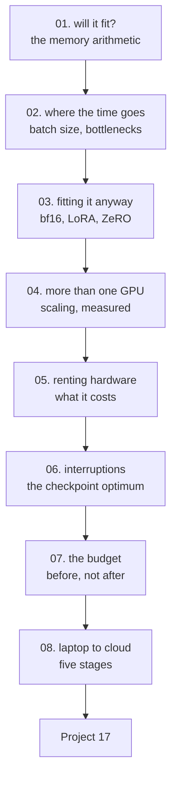

# HPC and Cloud — Tayel AI Labs

The seventeenth course. Everything here is arithmetic you can do before renting
anything, and the arithmetic routinely turns "we need a GPU cluster" into "we
need the cheapest card available".

**No cloud account required to learn it.** Every number in lessons 01, 03-07 is
computed on your own machine; lesson 08 is the workflow for the day you do rent
something.

**Prerequisites**

- [`../Deep-Learning`](../Deep-Learning) — you should have trained something
- [`../Optimization`](../Optimization) — lessons 07 (PEFT) and 08 (quantisation)
  are the two techniques this course leans on hardest
- [`../Data-Science`](../Data-Science) — lesson 07's run records, extended here
  with cost

---

## The path



## Lessons

| # | Lesson | The measured result |
|---|---|---|
| 01 | [Will It Fit?](lessons/01-will-it-fit.md) | A 7B fine-tune needs **84 GB**, and 56 of them are Adam's state |
| 02 | [Where the Time Goes](lessons/02-where-the-time-goes.md) | Batch 512 gives **194x** the throughput of batch 1 |
| 03 | [Fitting It Anyway](lessons/03-fitting-it-anyway.md) | Two one-line changes take 84 GB to **4.1 GB** |
| 04 | [More Than One GPU](lessons/04-more-than-one-gpu.md) | 64 GPUs give **22.1x** — and **2%** on 1 Gbps ethernet |
| 05 | [Renting Hardware](lessons/05-renting-hardware.md) | 23x price spread for the same 8 hours |
| 06 | [Interruptions and Checkpoints](lessons/06-interruptions.md) | Checkpointing only at the end wastes **48 hours of a 24-hour run** |
| 07 | [The Training Budget](lessons/07-the-training-budget.md) | The largest line is the instance nobody turned off |
| 08 | [From Laptop to Cloud](lessons/08-laptop-to-cloud.md) | Five stages, each 10x cheaper than the next |

## Then

- **[`Project-17/`](Project-17/)** — one real training job on rented hardware,
  inside a budget you set before you started

---

## Setup

```bash
python3 -m venv .venv
source .venv/bin/activate
pip install -r requirements.txt
```

Lesson 02 runs a small PyTorch model on your CPU. Everything else is arithmetic.

---

## What this course argues

1. **Do the memory arithmetic before the cloud quote.** A 7B model is "no single
   GPU" for a full fine-tune and "a T4" with LoRA (lessons 01, 03).
2. **Batch size is the largest free win in any training loop** — 194x here
   (lesson 02).
3. **N GPUs never give N times the speed**, and on slow networking they give
   almost nothing: 2% efficiency on 1 Gbps (lesson 04).
4. **Compare throughput per EGP, not price per hour.** The A10G was cheaper
   *and* ten times faster than the T4 (lessons 05, 07).
5. **Spot instances are right for training and wrong for serving** — and only
   with a tested resume path (lesson 06).
6. **Never debug on a rented GPU.** An hour on a T4 prevents an eight-hour
   failure on an A100 (lesson 08).
