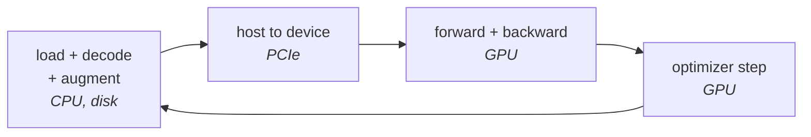

# Lesson 02 — Where the Time Goes

**Goal:** find the bottleneck in a training loop before buying a faster GPU for
a problem the GPU does not have.

## What you will learn

- Batch size and throughput, measured
- What gradient accumulation really costs
- The data-loading bottleneck
- Profiling before purchasing

---

## Batch size

```python
# skip-verify: timings are hardware-dependent; the RATIOS are the lesson
import time, torch, torch.nn as nn
torch.set_num_threads(4)
torch.manual_seed(0)

model = nn.Sequential(nn.Linear(512, 1024), nn.ReLU(),
                      nn.Linear(1024, 1024), nn.ReLU(), nn.Linear(1024, 10))
opt = torch.optim.Adam(model.parameters())
X = torch.randn(4096, 512)
y = torch.randint(0, 10, (4096,))

def train_steps(batch, steps=20):
    for _ in range(3):                      # warm up
        i = torch.randint(0, len(X) - batch, (1,)).item()
        loss = nn.functional.cross_entropy(model(X[i:i+batch]), y[i:i+batch])
        opt.zero_grad(); loss.backward(); opt.step()
    t0 = time.perf_counter()
    for s in range(steps):
        i = (s * batch) % (len(X) - batch)
        loss = nn.functional.cross_entropy(model(X[i:i+batch]), y[i:i+batch])
        opt.zero_grad(); loss.backward(); opt.step()
    dt = time.perf_counter() - t0
    return dt / steps, batch * steps / dt

print(f"{'batch':>7}{'ms/step':>10}{'samples/sec':>14}{'vs batch 1':>12}")
base = None
for b in (1, 8, 32, 128, 512):
    ms, thr = train_steps(b)
    base = thr if base is None else base
    print(f"{b:>7}{ms*1000:>10.1f}{thr:>14,.0f}{thr/base:>11.1f}x")
```

```text
  batch   ms/step   samples/sec  vs batch 1
      1       2.6           391        1.0x
      8       3.1         2,598        6.7x
     32       2.7        11,637       29.8x
    128       3.7        34,621       88.6x
    512       6.7        75,878      194.2x
```

**512 times the work per step costs 2.6 times the time.** Batch 1 processes 391
samples a second; batch 512 processes 75,878 — a **194x** throughput difference
from one parameter.

The reason is fixed overhead per step: kernel launches, Python, the optimizer's
own work. At batch 1 you pay all of it for one sample. This is
[LLM lesson 10's batching result](../../LLM-and-GenAI/lessons/10-cost-and-shipping.md)
seen from the training side, and it is the single largest free win in a training
loop.

The ceiling is memory (lesson 01) and, eventually, statistics: past some batch
size, larger batches need proportionally higher learning rates and stop
improving wall-clock time to a given loss. The rule of thumb is **the largest
batch that fits, then tune the learning rate** — see
[Optimization lesson 04](../../Optimization/lessons/04-learning-rate-schedules.md).

---

## Gradient accumulation is not free

When the batch you want does not fit, you split it and accumulate gradients
before stepping. The maths is identical. The throughput is not.

```python
# skip-verify: timings are hardware-dependent
def accumulate(micro, accum, steps=20):
    t0 = time.perf_counter()
    for s in range(steps):
        opt.zero_grad()
        for a in range(accum):
            i = ((s * accum + a) * micro) % (len(X) - micro)
            loss = nn.functional.cross_entropy(model(X[i:i+micro]), y[i:i+micro]) / accum
            loss.backward()
        opt.step()
    dt = time.perf_counter() - t0
    return dt / steps, micro * accum * steps / dt

print(f"{'effective batch':>16}{'how':>22}{'ms/step':>10}{'samples/sec':>14}")
ms, thr = train_steps(128)
print(f"{128:>16}{'one batch of 128':>22}{ms*1000:>10.1f}{thr:>14,.0f}")
for micro, accum in ((32, 4), (16, 8), (8, 16)):
    ms, thr = accumulate(micro, accum)
    print(f"{micro*accum:>16}{f'{accum} x {micro}':>22}{ms*1000:>10.1f}{thr:>14,.0f}")
```

```text
 effective batch                   how   ms/step   samples/sec
             128      one batch of 128       3.7        34,174
             128                4 x 32       7.1        18,018
             128                8 x 16      12.9         9,928
             128                16 x 8      27.6         4,638
```

**The same effective batch of 128, at half the throughput with 4 micro-batches
and a seventh of it with 16.**

Accumulation buys memory and pays in time, and the price is steeper than most
people expect because each micro-batch pays the fixed per-step overhead again.

So the order of preference is:

```text
1. A bigger batch that fits              free
2. Mixed precision, to make it fit       nearly free (lesson 03)
3. Gradient checkpointing                ~30% compute, large memory saving
4. Gradient accumulation                 expensive, but always works
5. More GPUs                             lesson 04
```

Reach for accumulation when 1-3 have run out, not first.

---

## The bottleneck is often not the GPU

A training step has three phases, and only one of them is what you rented the
GPU for:



If the GPU finishes before the next batch is ready, **you have bought an
expensive idle machine.** The symptom is low GPU utilisation with a busy CPU,
and it is extremely common with image pipelines, JPEG decoding and heavy
augmentation.

The checks, in order:

| Check | What it tells you |
|---|---|
| `nvidia-smi dmon` during training | GPU utilisation. Under ~80% means starvation |
| Time one epoch with a **synthetic** batch (no data loading) | The ceiling your GPU could reach |
| Count `num_workers` | Too few starves; too many thrashes |
| Watch disk read throughput | Random reads on network storage are fatal |
| Time the augmentation alone | Often the largest single cost |

The most common fixes, cheapest first: raise `num_workers`, enable
`pin_memory`, pre-decode and cache the dataset in a fast format, do augmentation
on the GPU, and move data to local NVMe rather than network storage.

**Deep-Learning lesson 05 measured a case where more workers made training
slower** — the honest reminder that this is a measurement, not a rule.

---

## Profile before you buy

```text
1. Run 100 steps with a synthetic batch, no data loading
      -> the GPU's ceiling for this model
2. Run 100 steps with the real loader
      -> the gap is your data pipeline
3. Raise batch size until memory or throughput stops improving
      -> the free win
4. Only now, compare GPUs
```

A team that skips steps 1-3 and rents an A100 to fix a dataloader problem pays
ten times the price for the same speed — and the dashboard shows an expensive
GPU at 30% utilisation, which is the most common sight in cloud ML.

---

## Common mistakes

| Mistake | Why it hurts |
|---|---|
| Training at batch 1 or 8 | 194x throughput left on the table |
| Gradient accumulation as a first resort | Half the throughput, or a seventh |
| Buying a faster GPU for a dataloader problem | 10x the price, same speed |
| Not checking GPU utilisation | The number that tells you which problem you have |
| Network storage for random reads | The GPU waits on the filesystem |
| Copying `num_workers` from a tutorial | It depends on your CPU and your augmentation |
| Benchmarking with augmentation off | You measured a pipeline you will not run |

---

## Exercises

1. Measure throughput against batch size for your own model. Where does it stop
   improving?
2. Run one epoch with synthetic data and one with your real loader. What is the
   gap, as a percentage?
3. Measure your augmentation alone. What share of a step is it?
4. Sweep `num_workers` from 0 to 2x your core count and plot throughput.
5. Compute what your current GPU utilisation costs you per month in wasted rent.

---

**Next:** [Lesson 03 — Fitting It Anyway](03-fitting-it-anyway.md)
