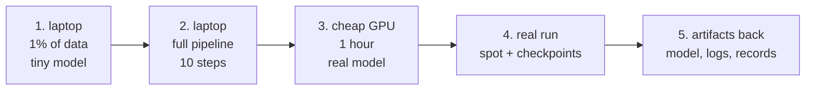

# Lesson 08 — From Laptop to Cloud

**Goal:** a workflow that moves a job from your machine to a rented GPU without
debugging at $3 an hour.

## What you will learn

- The five stages, and what each one catches
- Reproducing the environment
- Moving data without paying twice
- What comes back

---

## Five stages



Each stage catches a different class of bug, and each one is cheaper than the
next by roughly ten times.

**Stage 1 — 1% of the data, a tiny model, on your laptop.** Catches: shape
mismatches, label bugs, a broken dataloader, a config that does not parse. This
is 90% of all failures, and it costs nothing.

**Stage 2 — the full pipeline for 10 steps.** Catches: checkpoint writing,
resume, logging, the eval loop, artifact upload. **Run the resume path here**
(lesson 06), not at 3 a.m.

**Stage 3 — one hour on the cheapest GPU that fits.** Catches: out-of-memory at
the real batch size, throughput surprises, mixed-precision instability, driver
and CUDA mismatches. **Measure `samples_per_sec` here** — lesson 07's estimate
depends on it.

**Stage 4 — the real run**, on spot, with checkpoints and an auto-shutdown.

**Stage 5 — get everything back** before the instance dies.

**Never skip stage 3.** An hour on a T4 costs about 17 EGP and regularly
prevents a failed eight-hour A100 run at 1,152.

---

## Reproducing the environment

The failure is always the same: it works on your laptop and crashes on the GPU,
because the versions differ.

| Approach | Reproducible | Effort | Use when |
|---|---|---|---|
| `pip install -r requirements.txt` with **pinned** versions | Mostly | Low | Simple stacks |
| `pip-compile` / a lockfile | Yes, for Python | Low | **The default** |
| A provider's prebuilt ML image + a few pins | Mostly | Lowest | Getting started |
| **Docker** | Yes, including CUDA | Medium | Anything repeated |
| conda | Yes-ish | Medium | Scientific stacks |

Three pins that are not in `requirements.txt` and cause most of the pain:

```text
CUDA / driver version      a torch built for CUDA 12 will not run on a CUDA 11 driver
Python version             3.11 vs 3.12 changes wheel availability
The base image             "latest" is not a version
```

Record all three in the run record beside the library versions — Data-Science
lesson 07's environment block, extended for GPUs.

**Start from the provider's prebuilt image** and pin your own layer on top. It
already has a matched driver, CUDA and torch, which is the part that is
genuinely painful to assemble.

---

## Moving data

| Size | How | Note |
|---|---|---|
| < 1 GB | Copy it up with the code | Simplest |
| 1-100 GB | **Object storage in the same region**, download at start | The normal case |
| > 100 GB | Stream from object storage, or use a mounted volume | Do not copy it every run |
| Any size, many runs | A snapshot/volume you reattach | Pays for itself in three runs |

Two rules that save real money:

1. **Same region, same provider, always.** Egress is billed. Moving 200 GB out
   of one cloud and into another can cost more than the GPU hours.
2. **Pre-process once, store the result.** Decoding JPEGs or tokenising text on
   every run is paying a GPU to do CPU work — lesson 02's starvation problem,
   billed by the hour.

And the compliance question that comes first for an Egyptian team handling
customer data: **which region is the data allowed to be in?** That is
Data-Security lesson 08, and it constrains the provider list before price does.

---

## What comes back

The instance is about to be deleted. Everything you need must already be
elsewhere:

- [ ] **The model artefact** — the bundle from Data-Science lesson 08, not a bare
      `state_dict`
- [ ] **The final checkpoint**, including optimizer state, in case you resume
- [ ] **The run record** — params, metrics, versions, data hash, **gpu-hours and
      cost** (lesson 07)
- [ ] **The full training log**, not just the last screen
- [ ] **Eval results** on the held-out set, produced by the run itself
- [ ] **The exact config** that produced it
- [ ] **The environment**: `pip freeze`, CUDA version, image tag

Upload these **during** the run, not at the end. A job that writes everything in
its final minute and gets interrupted in minute 59 has produced nothing.

---

## A minimal job script

```bash
# no-run
set -euo pipefail
shutdown -h +480 &                       # lesson 07: never leave it running

aws s3 sync s3://my-bucket/data /local/data --quiet
python -c "import torch; print(torch.__version__, torch.cuda.is_available())"

python train.py \
  --config configs/run.yaml \
  --checkpoint-dir /local/ckpt \
  --resume-if-exists \
  --checkpoint-every-min 40 \
  2>&1 | tee /local/train.log

aws s3 sync /local/ckpt s3://my-bucket/runs/$RUN_ID/
aws s3 cp /local/train.log s3://my-bucket/runs/$RUN_ID/
shutdown -h now
```

Every line is one of this course's lessons: the shutdown timer (07), data in the
same region (08), the CUDA check (03), resume-if-exists and the 40-minute
interval (06), and artifacts uploaded before the machine dies.

`set -euo pipefail` is not decoration: without it, a failed `s3 sync` is
silently ignored and the job trains on nothing for eight hours.

---

## Common mistakes

| Mistake | Why it hurts |
|---|---|
| Skipping the 1-hour cheap-GPU stage | An 8-hour run fails at minute 3 |
| Debugging on the expensive instance | The same bug, at 20x the price |
| Unpinned CUDA or base image | Works locally, crashes on the GPU |
| Copying the dataset on every run | Paid for, repeatedly |
| Preprocessing on the GPU instance | A GPU doing CPU work, billed hourly |
| Uploading artifacts only at the end | An interruption at 95% yields nothing |
| No `set -euo pipefail` | A silent failure that trains on an empty directory |
| Forgetting egress | Sometimes larger than the compute bill |

---

## Exercises

1. Run your pipeline through stages 1 and 2 on your laptop. List every bug they
   caught.
2. Do stage 3 on the cheapest GPU that fits and record `samples_per_sec`.
3. Write the job script for your run, including shutdown, resume and upload.
4. Pin your environment — Python, CUDA, torch, base image — and record all four.
5. Compute your egress cost for one round trip of your dataset and artifacts.

---

**Done with the lessons.** Next: [Project 17](../Project-17/) — run one real
training job on rented hardware, within a budget you set in advance.
