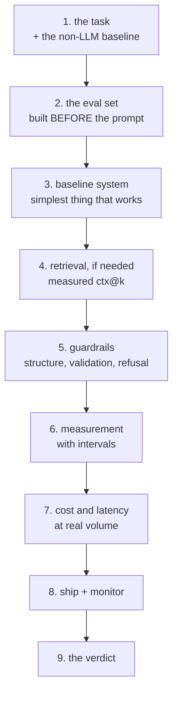

# Project 12 — Ship One LLM Feature

**Do this after the ten lessons.**

One feature, in production or production-shaped, with an evaluation set, a
guardrail layer and a monthly bill you can defend. Not a demo — a demo proves
the happy path, and this project is about everything else.

As in Projects 10 and 11, **"do not ship this" is a passing conclusion** if the
numbers say so.

---

## The shape



---

## Requirements

### 1. The task, and the baseline that is not an LLM

- One specific task with a user who wants it. "A chatbot" is not a task
- **The non-LLM baseline, implemented and measured**: keyword search, a rule, a
  template, a small classifier. This is Data-Science lesson 05's discipline and
  it is required
- The decision the output feeds, and what a wrong answer costs
- Expected volume: requests per day, and per month

### 2. The eval set, built first

- **At least 100 examples**, with correct answers, committed before the first
  prompt. 300 if you intend to claim a 5-point improvement
- **Split into dev and test.** Tune on dev, report on test, never mix
- **An unanswerable subset**: at least 20 questions your source cannot answer.
  Measure refusal, not just accuracy
- **A regression subset**: every production failure becomes a permanent case
- The metric, chosen by the shape of the answer (lesson 07), and a written
  reason for choosing it over the alternatives

An eval set that was written after the prompt is an eval set that measures the
prompt's strengths. Its git timestamp is part of the submission.

### 3. The system, built up in measurable steps

Each step reported with its number on the **dev** set:

| Step | Report |
|---|---|
| Non-LLM baseline | accuracy, cost, latency |
| Zero-shot prompt | the same three |
| Few-shot, with **balanced labels** and 3+ example orders | median and range |
| RAG, if the task needs facts | `ctx@k` first, then accuracy |
| Fine-tune, only if volume justifies it | the learning curve |

Report the step at which you stopped improving, and **stop there**. A project
that shows the fine-tune added 0.01 and was dropped is a better project than one
that shipped it.

### 4. Retrieval, if you use it

- A **chunking comparison**: at least three strategies, with `ctx@k` for each
- `ctx@k` curve, and the **k you chose from the knee**, with the token cost
- The "not in context" path, tested against the unanswerable subset
- Citations: every answer names the chunk it came from, and you verify the cited
  chunk contains the claim

### 5. Guardrails

- **Constrained or schema-validated output.** Free-text parsing is not
  acceptable
- Schema validation **and** at least two business rules the schema cannot
  express
- A bounded retry loop, with the retry rate measured
- An input length cap and a `max_new_tokens` cap
- A prompt-injection test case, and evidence of what happens
- A refusal path the user can act on

### 6. Measurement

- Test-set results **with an interval**, using lesson 07's table
- A statement of the smallest difference your eval set can detect
- **20 outputs read by hand**, with what you found written down. Every failure
  in lesson 07 was invisible in the metric
- Per-class or per-question-type breakdown — where does it fail?

### 7. Cost and latency at real volume

- Tokens in and out per request, **measured with the right tokeniser**
- If your users write Arabic, **the Arabic multiplier on your own text**
- Monthly cost at expected volume, with the cache hit rate you measured from
  real traffic shape
- p50 and p95 latency, and what the user sees beyond p95
- The route table (lesson 10): what fraction of requests can avoid the expensive
  path

### 8. Shipped and monitored

- Prompt version recorded with every response
- Model version pinned
- Inputs and outputs logged, PII redacted
- The eval set runs in CI
- A dashboard or a daily log line: volume, cost, retry rate, refusal rate, cache
  hit rate
- A kill switch to a non-AI fallback, tested

### 9. The verdict

```text
RECOMMENDATION   Ship / Ship narrower / Keep the baseline / Stop
AGAINST BASELINE The non-LLM number, on the same test set
QUALITY          Test accuracy with its interval
REFUSAL          How often it correctly says "I don't know"
COST             Per month at expected volume, and per request
LATENCY          p50 / p95, and the fallback beyond it
WHERE IT FAILS   The question type with the worst score, with the number
WHAT WOULD CHANGE THIS
OWNER AND REVIEW DATE
```

---

## Deliverables

```text
project-12/
├── VERDICT.md            the one page
├── README.md             how to reproduce
├── eval/
│   ├── dev.jsonl         committed before the first prompt
│   ├── test.jsonl
│   ├── unanswerable.jsonl
│   └── regressions.jsonl
├── src/
│   ├── baseline.py       the non-LLM system
│   ├── retrieve.py       chunking + index, if used
│   ├── generate.py       prompt, constrained output
│   ├── guardrails.py     schema, business rules, retry
│   └── evaluate.py       metrics with intervals
├── prompts/
│   └── v1.txt ...        versioned, hashed, referenced in logs
├── reports/
│   ├── steps.md          the table from requirement 3
│   ├── retrieval.md      chunking comparison and the ctx@k curve
│   ├── errors.md         the 20 hand-read outputs
│   └── cost.md           tokens, cache, monthly bill
└── tests/
    ├── test_guardrails.py
    └── test_injection.py
```

---

## Marking

| Weight | Criterion |
|---|---|
| 15% | Task definition and a **measured** non-LLM baseline |
| 20% | The eval set: 100+, split, unanswerable subset, committed first |
| 15% | Stepwise improvement, each step measured, stopped at the right step |
| 10% | Retrieval done properly, if used: chunking comparison and ctx@k |
| 15% | Guardrails: constrained output, validation, business rules, injection test |
| 10% | Results with intervals, plus 20 outputs read by hand |
| 10% | Cost and latency at real volume, with the Arabic multiplier if relevant |
| 5% | Shipped: prompt versioning, pinned model, CI eval, kill switch |

Automatic deductions: an eval set committed after the prompts; no non-LLM
baseline; free-text parsing instead of constrained output; a claimed
improvement smaller than the eval set can detect; no unanswerable subset; a
cost estimate made with the wrong tokeniser; `k` chosen without a ctx@k curve;
no prompt version in the logs.

---

## Milestones

| Day | Done by end of day |
|---|---|
| 1 | Task, users, volume. Non-LLM baseline implemented and measured |
| 2 | Eval set written and committed — dev, test, unanswerable |
| 3 | Zero-shot and few-shot, measured across example orders |
| 4 | Retrieval: chunking comparison, ctx@k, k chosen |
| 5 | Guardrails, schema, business rules, injection test |
| 6 | Test results with intervals, 20 outputs read by hand, cost table |
| 7 | Ship it behind a flag, monitoring, write the verdict, present it |

---

## Before you submit

- [ ] The eval set's commit is older than the first prompt's commit
- [ ] The non-LLM baseline has a number on the same test set
- [ ] Few-shot results are a median over at least 3 example orders
- [ ] Few-shot example labels are balanced
- [ ] If RAG: a ctx@k curve exists and k is at the knee
- [ ] Output is constrained or schema-validated, never regex-parsed
- [ ] Two business rules exist that the schema cannot express
- [ ] The unanswerable subset has a refusal rate, reported
- [ ] Every reported number has an interval
- [ ] 20 outputs were read by hand and the findings are written down
- [ ] Token counts use the tokeniser of the model you actually call
- [ ] Every response is logged with its prompt version and model version
- [ ] `VERDICT.md` opens with the recommendation, and "keep the baseline" was available
