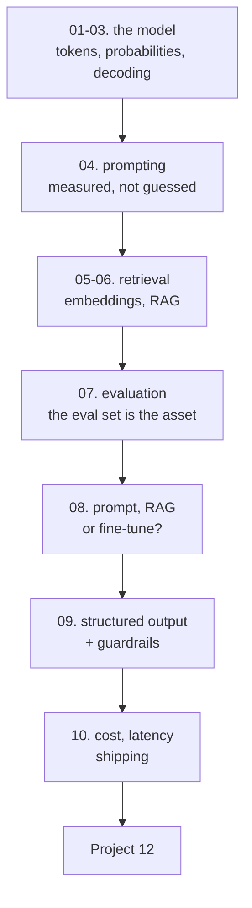

# LLMs and Generative AI — Tayel AI Labs

The twelfth course. Language models are the first tool in this track that will
produce a confident, fluent, well-formatted answer to a question it cannot
answer — so the discipline is not "how do I call the API", it is **how do I
know whether it worked, and what does it cost**.

**Prerequisites**

- [`../Python`](../Python) — both tracks
- [`../Deep-Learning`](../Deep-Learning) — you should know what a transformer is
- [`../NLP`](../NLP) — lessons 08 and 10 there are the background for this one
- [`../Data-Science`](../Data-Science) — evaluation, thresholds and monitoring
  carry over directly
- [`../Prompt-Engineering`](../Prompt-Engineering) — **optional but
  recommended before lesson 04.** It is the craft layer: the output contract,
  what goes in the context, what a prompt costs, and injection. Lesson 04 here
  is the measurement layer, and the two reach the same conclusion from opposite
  sides — there, free generation returns 0/12 usable answers; here, scoring the
  label words directly gets 0.90 from the same kind of prompt.

**No API keys, no accounts, no bills.** Everything runs on a laptop CPU with
`gpt2-medium` (355M), `all-MiniLM-L6-v2` and `bert-tiny`. The ideas are the same
at 355M and at 400B; where size changes the conclusion, the lesson says so.

---

## The path



## Lessons

| # | Lesson | The measured result |
|---|---|---|
| 01 | [What an LLM Actually Is](lessons/01-what-an-llm-is.md) | `2 + 2 =` gives `' 4'` a probability of 0.20 |
| 02 | [Tokens, Arabic, and Cost](lessons/02-tokens-and-cost.md) | The same meaning costs **2.61x more in Arabic** |
| 03 | [Decoding](lessons/03-decoding.md) | Greedy repeats 70% of its 3-grams; the best diversity score belongs to word salad |
| 04 | [Prompting, Measured](lessons/04-prompting.md) | 4-shot scored 0.50 where 2-shot scored 1.00; example order alone moves 15 points |
| 05 | [Embeddings and Search](lessons/05-embeddings-and-search.md) | Embeddings 0.79 recall@1 against TF-IDF's 0.33 — and hybrid loses |
| 06 | [RAG](lessons/06-rag.md) | Chunking on document boundaries: 1.00 recall at 102 tokens; fixed-size: 0.96 at 306 |
| 07 | [Evaluating LLM Output](lessons/07-evaluation.md) | An embedding judge ranks the **all-wrong** system above the correct one |
| 08 | [Prompt, RAG or Fine-tune](lessons/08-prompt-rag-or-finetune.md) | A 4.4M fine-tune matches a 355M prompt at **1/2357th the latency** |
| 09 | [Structured Output](lessons/09-structured-output.md) | "Return JSON": 0 of 8. Constrained decoding: 8 of 8 — and still wrong |
| 10 | [Cost, Latency and Shipping](lessons/10-cost-and-shipping.md) | 800 input tokens are cheaper than 100 output tokens |

## Then

- **[`Project-12/`](Project-12/)** — one LLM feature, shipped, with its eval set,
  its guardrails and its monthly bill

---

## Setup

```bash
python3 -m venv .venv
source .venv/bin/activate
pip install -r requirements.txt
```

The models download once (about 1.5 GB total) and are cached. Lessons 05 and 06
share a knowledge base written to `/tmp/kb.py` by lesson 05, so **run them in
order**.

---

## What this course argues

1. **A language model is a next-token distribution.** Everything that looks like
   reasoning is 500 independent choices with no plan (lesson 01).
2. **Prompt engineering is mostly unmeasured.** On 20 examples every difference
   is noise, and example order alone moves accuracy 15 points (lesson 04).
3. **RAG's accuracy is capped by retrieval**, so measure whether the answer is
   in the context before you touch the prompt (lesson 06).
4. **Every automatic metric can be gamed by a wrong system.** The eval set is
   the asset; the prompt is disposable (lesson 07).
5. **For a narrow, high-volume task, a tiny fine-tuned model wins on every axis
   except time-to-first-version** (lesson 08).
6. **Valid is not correct.** Constrained decoding guarantees the shape of the
   answer and nothing about its truth (lesson 09).

---

## A note for Arabic-language products

Lesson 02 measures the Arabic token tax — **2.61x** on this tokeniser — and it
propagates through every number in the course: cost, latency, context window and
the amount of retrieved text that fits. Any estimate made on English test
prompts is wrong by more than a factor of two for an Arabic user base. Measure
on your own text.
