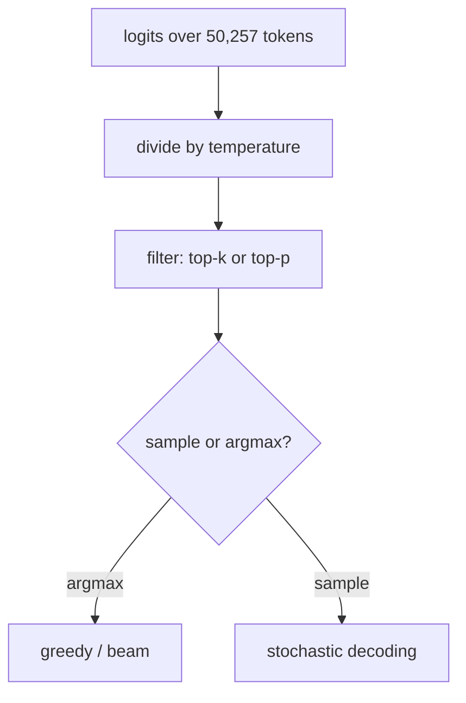

# Lesson 03 — Decoding

**Goal:** choose how tokens are picked from the distribution, which is the
single largest quality knob you control without touching the model.

## What you will learn

- Greedy, beam, temperature, top-k, top-p
- Degeneration, measured
- Why the best-looking diversity metric belongs to the worst output
- Which setting to use for which job

---

## Setup

```python
import os, warnings
os.environ.setdefault("TOKENIZERS_PARALLELISM", "false")
warnings.filterwarnings("ignore")
from transformers.utils import logging as hf_logging
hf_logging.set_verbosity_error()
hf_logging.disable_progress_bar()

import torch
import numpy as np
from transformers import AutoTokenizer, AutoModelForCausalLM

tok = AutoTokenizer.from_pretrained("gpt2-medium")
tok.pad_token = tok.eos_token
model = AutoModelForCausalLM.from_pretrained("gpt2-medium").eval()
PROMPT = "The best way to learn machine learning is"

def gen(**kw):
    ids = tok(PROMPT, return_tensors="pt")
    torch.manual_seed(0)
    with torch.no_grad():
        out = model.generate(**ids, max_new_tokens=40,
                             pad_token_id=tok.eos_token_id, **kw)
    return tok.decode(out[0], skip_special_tokens=True)

def repetition(text, n=3):
    words = text.split()
    grams = [tuple(words[i:i + n]) for i in range(len(words) - n + 1)]
    return 0.0 if not grams else 1 - len(set(grams)) / len(grams)

def distinct_words(text):
    w = text.split()
    return len(set(w)) / max(len(w), 1)

print("ready")
```

```text
ready
```

The model is identical in every run below. **Only the selection rule changes.**



---

## Seven decoders, one prompt

```python
# skip-verify: generated text depends on the transformers version
configs = [
    ("greedy", dict(do_sample=False)),
    ("beam (4)", dict(do_sample=False, num_beams=4)),
    ("sample T=0.7", dict(do_sample=True, temperature=0.7, top_k=0)),
    ("sample T=1.0", dict(do_sample=True, temperature=1.0, top_k=0)),
    ("sample T=1.5", dict(do_sample=True, temperature=1.5, top_k=0)),
    ("top-k 50", dict(do_sample=True, top_k=50)),
    ("top-p 0.9", dict(do_sample=True, top_p=0.9, top_k=0)),
]
texts = {}
for name, kw in configs:
    texts[name] = gen(**kw)
    print(f"\n--- {name} ---")
    print(texts[name][len(PROMPT):].strip()[:200])
```

```text

--- greedy ---
to use it.

The best way to learn machine learning is to use it.

The best way to learn machine learning is to use it.

The best way to learn machine

--- beam (4) ---
to do it yourself.

If you want to learn more about machine learning, check out the following resources:

If you want to learn more about machine learning, check out the following resources

--- sample T=0.7 ---
to study it. You can use the "tree" approach to learn how to classify and sort data, or you can use the "tree" approach to learn how to predict and analyze data.

--- sample T=1.0 ---
to study it with other people... is "tree shaping".

Tree shaping is the process of predicting a tree structure from the canoes logs in the Logdy sailboat. Log brood Sanskrit tree

--- sample T=1.5 ---
along gritty pilot paths like Girls Switch Goldbacks Skooter bipartisan candidates spill radical stories > Cathie Monroe pre-publicities Thiel decreases she raises a lot of MTV' sail swoop Countryines

--- top-k 50 ---
to study it with other people...

--- top-p 0.9 ---
to study it with other people and actively participate in the community of experts that surround you and others learning the technique. But that also can mean playing games. With it in mind, he saw hi
```

Read them in order and the trade-off is obvious before any metric.

**Greedy repeats itself into a loop.** "The best way to learn machine learning
is to use it." three times. Always taking the single most likely token drives
the model into a cycle: the tokens that follow the sentence make the sentence
more likely again. This is **degeneration**, and it is the default failure of
`do_sample=False`.

**Beam search repeats too**, at a larger scale — the resources sentence twice.
Beam search optimises total sequence probability, and a bland repeated sentence
has high probability. Beam search is right for translation and summarisation,
where there is one correct output; it is wrong for open-ended text.

**T=0.7 is coherent but circular** — the same "tree approach" clause twice with
different endings. **T=1.0 drifts into nonsense** ("canoes logs in the Logdy
sailboat"). **T=1.5 is word salad.**

**Top-k and top-p are the usable ones.** Top-p 0.9 produced the only passage
here that reads like a person wrote it.

---

## Now measure it

```python
print(f"{'decoder':<16}{'3-gram repetition':>19}{'distinct words':>16}")
for name, _ in configs:
    print(f"{name:<16}{repetition(texts[name]):>19.3f}{distinct_words(texts[name]):>16.3f}")
```

```text
decoder           3-gram repetition  distinct words
greedy                        0.703           0.256
beam (4)                      0.289           0.575
sample T=0.7                  0.184           0.650
sample T=1.0                  0.000           0.846
sample T=1.5                  0.000           1.000
top-k 50                      0.000           0.929
top-p 0.9                     0.000           0.822
```

**Greedy repeats 70.3% of its 3-grams.** Beam 28.9%. That is the degeneration
above, as a number you can put in a test.

And now the trap. **The best score in both columns belongs to T=1.5** — zero
repetition, 1.000 distinct words — which is the output that reads like
`Goldbacks Skooter bipartisan candidates spill radical stories`.

Diversity metrics measure diversity. **Gibberish is maximally diverse.** Any
automatic metric you can optimise without reading the output will eventually be
optimised into nonsense, which is lesson 07's whole subject.

The usable rule: **repetition is a good alarm and a bad objective.** Alert when
3-gram repetition goes above ~0.3; never tune to minimise it.

---

## Reproducibility

```python
def gen_seed(seed, **kw):
    ids = tok(PROMPT, return_tensors="pt")
    torch.manual_seed(seed)
    with torch.no_grad():
        out = model.generate(**ids, max_new_tokens=25,
                             pad_token_id=tok.eos_token_id, **kw)
    return tok.decode(out[0], skip_special_tokens=True)

for name, kw in [("greedy", dict(do_sample=False)),
                 ("top-p 0.9", dict(do_sample=True, top_p=0.9, top_k=0))]:
    outs = [gen_seed(s, **kw) for s in range(5)]
    print(f"{name:<12} distinct outputs across 5 seeds: {len(set(outs))}/5")
```

```text
greedy       distinct outputs across 5 seeds: 1/5
top-p 0.9    distinct outputs across 5 seeds: 5/5
```

Greedy gives **one output, always**. Top-p gives **five different outputs from
five seeds**.

This decides more engineering than people expect:

- **A test suite needs greedy** (or a fixed seed). You cannot assert on a
  sampled output.
- **A cache needs greedy.** Sampling makes every identical request a cache miss
  that returns something different.
- **A support bot arguably needs greedy too** — two users asking the same
  question and getting different answers is a support problem.
- **Anything creative needs sampling**, and its tests must assert on properties
  (valid JSON, length, no forbidden words) rather than on text.

Note also what "temperature 0" does *not* mean: it removes the randomness in
**decoding**, not in serving. Two calls to a hosted model at temperature 0 can
still differ, because batching changes floating-point reduction order. Lesson
09's structured-output validation is what makes that survivable.

---

## Which to use

| Job | Setting | Why |
|---|---|---|
| Classification, extraction, routing | **Greedy** (`do_sample=False`) | One right answer; reproducibility matters |
| JSON or code output | **Greedy**, low temperature | Sampling breaks syntax |
| Translation, summarisation | Beam 4-5 | One good output; length-normalised search helps |
| Chat, explanation | **top-p 0.9, T 0.7-1.0** | The readable region |
| Brainstorming, variants | top-p 0.95, T 1.0-1.2 | Diversity is the product |
| Anything above T 1.3 | Nothing | See the word salad above |

**Do not set both `top_k` and `top_p` without knowing they compose.** They are
applied in sequence, so `top_k=50, top_p=0.9` keeps at most 50 tokens *and then*
trims to 0.9 cumulative probability — usually not what the person who set both
intended.

---

## Common mistakes

| Mistake | Why it hurts |
|---|---|
| Greedy for open-ended text | 70.3% 3-gram repetition |
| Beam search for chat | Optimises for bland; repeated the same sentence |
| Raising temperature to "make it more creative" | T=1.5 was word salad with perfect diversity scores |
| Optimising a diversity metric | The worst output wins it |
| Sampling in a test suite | 5 outputs from 5 seeds; the assert is meaningless |
| Sampling behind a cache | Every hit returns something new |
| Assuming temperature 0 is bit-exact in production | Batch order changes the arithmetic |

---

## Exercises

1. Sweep temperature from 0.1 to 2.0 in steps of 0.1 and plot 3-gram
   repetition. Where are the two knees, and which one is the usable range?
2. Add `repetition_penalty=1.2` to greedy. Does repetition drop below 0.3, and
   what does it do to the text's meaning?
3. Add `no_repeat_ngram_size=3` to beam search. Compare the output to plain
   beam: what has been fixed and what has been broken?
4. Generate 20 samples at top-p 0.9 and count how many contain a factual claim
   you cannot verify. That number is your hallucination rate at this setting.
5. Write a pytest that asserts a *property* of sampled output rather than its
   text — valid JSON, or under 100 tokens, or containing a required field.

---

**Next:** [Lesson 04 — Prompting, Measured](04-prompting.md)
