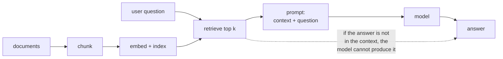

# Lesson 06 — RAG

**Goal:** give the model the source text instead of hoping it remembers, and
measure the part everyone assumes works.

## What you will learn

- Why chunking is the whole game
- Five chunking strategies, with retrieval numbers
- The accuracy ceiling RAG imposes on itself
- Where the extra context tokens stop buying anything

---

## The shape



The dotted arrow is the one to internalise. **RAG's accuracy is capped by
retrieval.** If the correct passage is not in the context window, no prompt,
model or temperature will recover it — the model will produce something
plausible instead, and that is a hallucination you built yourself.

So the number to measure first is not answer quality. It is **how often the
retrieved context contains the answer at all.**

---

## Setup

```python
import os, warnings
os.environ.setdefault("TOKENIZERS_PARALLELISM", "false")
warnings.filterwarnings("ignore")
from transformers.utils import logging as hf_logging
hf_logging.set_verbosity_error()
hf_logging.disable_progress_bar()

import sys
sys.path.insert(0, "/tmp")            # kb.py, written in lesson 05
from kb import DOCS, QUERIES

import numpy as np, torch, tiktoken
from transformers import AutoTokenizer, AutoModel

MODEL = "sentence-transformers/all-MiniLM-L6-v2"
tok = AutoTokenizer.from_pretrained(MODEL)
enc_model = AutoModel.from_pretrained(MODEL).eval()
def embed(texts, batch=32):
    out = []
    for i in range(0, len(texts), batch):
        b = tok(texts[i:i+batch], padding=True, truncation=True, max_length=256,
                return_tensors="pt")
        with torch.no_grad():
            h = enc_model(**b).last_hidden_state
        m = b["attention_mask"].unsqueeze(-1).float()
        v = (h * m).sum(1) / m.sum(1)
        out.append(torch.nn.functional.normalize(v, dim=1))
    return torch.cat(out).numpy()

# one long document, the way real sources arrive
HANDBOOK = "\n".join(f"{i+1}. {t}" for i, (_, t) in enumerate(DOCS))
```

```python
# one long document, the way real sources arrive
HANDBOOK = "\n".join(f"{i+1}. {t}" for i, (_, t) in enumerate(DOCS))
gpt_enc = tiktoken.get_encoding("cl100k_base")
print(f"handbook: {len(HANDBOOK)} characters, {len(gpt_enc.encode(HANDBOOK))} tokens")
print(f"a 4k-token context window would hold it "
      f"{4096 // len(gpt_enc.encode(HANDBOOK))} times over - but a real handbook is 200x this")
```

```text
handbook: 2552 characters, 613 tokens
a 4k-token context window would hold it 6 times over - but a real handbook is 200x this
```

Real sources do not arrive as tidy paragraphs with labels. They arrive as one
long handbook, contract or manual. Lesson 05 cheated by starting from 30
separate documents; here the same content is one 613-token blob, and **the first
engineering decision is how to cut it up.**

---

## Five ways to chunk

```python
def fixed_chunks(text, size, overlap=0):
    toks = gpt_enc.encode(text)
    out, start = [], 0
    while start < len(toks):
        end = min(start + size, len(toks))
        out.append(gpt_enc.decode(toks[start:end]))
        if end >= len(toks):
            break
        start = end - overlap
    return out

def line_chunks(text, per=1):
    lines = [l for l in text.split("\n") if l.strip()]
    return ["\n".join(lines[i:i+per]) for i in range(0, len(lines), per)]

strategies = {
    "fixed 40 tokens": fixed_chunks(HANDBOOK, 40),
    "fixed 40, overlap 10": fixed_chunks(HANDBOOK, 40, 10),
    "fixed 120 tokens": fixed_chunks(HANDBOOK, 120),
    "one line per chunk": line_chunks(HANDBOOK, 1),
    "three lines per chunk": line_chunks(HANDBOOK, 3),
}
ANSWER_TEXT = {qid: text for qid, text in DOCS}

def context_hit(chunks, chunk_vecs, query, relevant, k):
    sims = chunk_vecs @ embed([query])[0]
    top = [chunks[i] for i in np.argsort(sims)[::-1][:k]]
    joined = " ".join(top)
    # did the retrieved context contain the relevant document's text?
    return any(ANSWER_TEXT[r][:40] in joined for r in relevant)

print(f"{'strategy':<24}{'chunks':>8}{'ctx@1':>8}{'ctx@3':>8}{'ctx@5':>8}{'tok@3':>8}")
for name, chunks in strategies.items():
    cv = embed(chunks)
    row = []
    for k in (1, 3, 5):
        row.append(np.mean([context_hit(chunks, cv, q, rel, k) for q, rel in QUERIES]))
    avg_tok = int(np.mean([len(gpt_enc.encode(c)) for c in chunks]) * 3)
    print(f"{name:<24}{len(chunks):>8}{row[0]:>8.2f}{row[1]:>8.2f}{row[2]:>8.2f}{avg_tok:>8}")
```

```text
strategy                  chunks   ctx@1   ctx@3   ctx@5   tok@3
fixed 40 tokens               16    0.62    0.79    0.88     114
fixed 40, overlap 10          21    0.58    0.83    0.96     116
fixed 120 tokens               6    0.54    0.83    0.96     306
one line per chunk            30    0.79    0.96    1.00      61
three lines per chunk         10    0.71    0.88    0.92     183
```

`ctx@k` is the fraction of queries whose retrieved context actually contains the
answering text. `tok@3` is what three chunks cost in the prompt.

**Chunking on the document's own boundaries wins on every column.** One line per
chunk scores 0.79 / 0.96 / 1.00 and costs **61 tokens** at k=3. The naive
"fixed 120 tokens" scores worse (0.54 / 0.83 / 0.96) and costs **306 tokens** —
five times the price for less accuracy.

Why fixed-size chunking loses:

- **It splits answers in half.** A 40-token window lands mid-sentence, so the
  chunk containing "refunds are issued within" may not contain "5 business days".
- **It merges unrelated topics.** A 120-token chunk here holds six unrelated
  policies, so its embedding is an average of six meanings and matches nothing
  strongly. This is the same averaging problem as mean pooling in lesson 05,
  one level up.

**Overlap helps, but it is a patch.** Adding 10 tokens of overlap lifts ctx@5
from 0.88 to 0.96 — it repairs answers split across a boundary — while
increasing the index by a third. Prefer boundaries the document already has:
headings, list items, paragraphs, table rows, function definitions.

---

## The ceiling, and where to stop paying

```python
chunks = strategies["one line per chunk"]
cv = embed(chunks)
for k in (1, 2, 3, 5, 10):
    hit = np.mean([context_hit(chunks, cv, q, rel, k) for q, rel in QUERIES])
    tokens = int(np.mean([len(gpt_enc.encode(c)) for c in chunks]) * k)
    print(f"k={k:<3} context contains the answer {hit:>6.2f} of the time, "
          f"~{tokens} context tokens")
```

```text
k=1   context contains the answer   0.79 of the time, ~20 context tokens
k=2   context contains the answer   0.88 of the time, ~40 context tokens
k=3   context contains the answer   0.96 of the time, ~61 context tokens
k=5   context contains the answer   1.00 of the time, ~102 context tokens
k=10  context contains the answer   1.00 of the time, ~204 context tokens
```

This table is how you choose `k`, and it should be in every RAG project's
repository.

**At k=5 the ceiling is 1.00, for about 102 context tokens.** At k=10 the
ceiling is still 1.00 and the cost has **doubled**. Every token past k=5 on this
corpus is pure waste — and worse than waste, because long contexts degrade
attention to the relevant passage and slow the response.

Recall lesson 02's cost table: 2,000 extra context tokens took a feature from
$604 to $2,359 a month at 10,000 calls a day. A team that sets `k=20` "to be
safe" is choosing to pay that, for nothing.

The shape generalises even though the numbers do not: retrieval recall rises
steeply, then flattens. **Find your flattening point and stop there.**

---

## Evaluating the whole pipeline

`ctx@k` is necessary but not sufficient. A complete RAG evaluation has three
layers, and they fail differently:

| Layer | Question | Metric | Failure |
|---|---|---|---|
| **Retrieval** | Is the answer in the context? | `ctx@k` (above) | The model invents an answer |
| **Grounding** | Did the answer come from the context? | Claims supported by the context | The model uses its own memory |
| **Correctness** | Is the answer right? | Exact match / human review | Both of the above, plus reasoning |

Measure them **in that order**, because a failure at layer 1 makes layers 2 and
3 meaningless, and because layer 1 is the cheapest to measure — no generation is
involved, so it costs nothing per evaluation.

Practical grounding techniques, in order of effectiveness:

1. **Put an id on every chunk and require the answer to cite it.** Then check
   the cited chunk actually contains the claim. This is checkable in code.
2. **Instruct refusal explicitly**: "If the context does not contain the answer,
   reply exactly `NOT_IN_CONTEXT`." Then count how often it does — and test that
   it does so on questions you know are unanswerable.
3. **Show the retrieved passage to the user.** Half of grounding is letting the
   reader check.

Lesson 09 turns the first of these into validated structured output.

---

## When RAG is the wrong tool

| Question type | RAG works? |
|---|---|
| "What is our refund window?" | **Yes.** The answer is in one passage |
| "Summarise all complaints from March" | No. That is aggregation over many rows — write a query |
| "How many customers churned?" | No. That is SQL, and the model will invent a number |
| "Compare our policy to last year's" | Poorly. Two passages plus reasoning |
| "What changed in the handbook?" | No. That is a diff |

The failure mode for the "no" rows is specific and dangerous: the model returns
a **confident, well-formatted, wrong number** — because lesson 01 showed it will
always produce the most plausible continuation, and a plausible-looking number
is exactly that.

**If the answer requires counting, joining or arithmetic, retrieve the data and
compute it in code.**

---

## Common mistakes

| Mistake | Why it hurts |
|---|---|
| Fixed-size chunking by default | 0.54 ctx@1 against 0.79, at five times the tokens |
| Not measuring `ctx@k` | You are debugging the model for a retrieval bug |
| Choosing k by feel | k=10 cost double k=5 for zero extra recall |
| Embedding whole documents | Silently truncated; one vector for six topics |
| No "not in context" path | The model fills the gap with fluent invention |
| Using RAG for aggregation | Confident wrong numbers |
| Evaluating answer quality first | Meaningless while retrieval is broken |

---

## Exercises

1. Build the "unanswerable" query set: 10 questions the handbook does not
   answer. Measure how often your pipeline refuses versus invents.
2. Re-chunk by paragraph after joining the handbook into flowing prose with no
   line breaks. How much does ctx@3 fall, and what does that say about how much
   of your retrieval quality is really document formatting?
3. Add a chunk id to each chunk and require the answer to cite it. Write the
   code that verifies the citation.
4. Plot ctx@k against context tokens for k = 1..10 and mark the knee. Then
   compute the monthly cost difference between the knee and k=10 at 5,000 calls
   a day, using lesson 02's prices.
5. Duplicate every document three times in the index. What happens to ctx@3,
   and what does that predict about a real corpus full of near-duplicates?

---

**Next:** [Lesson 07 — Evaluating LLM Output](07-evaluation.md)
