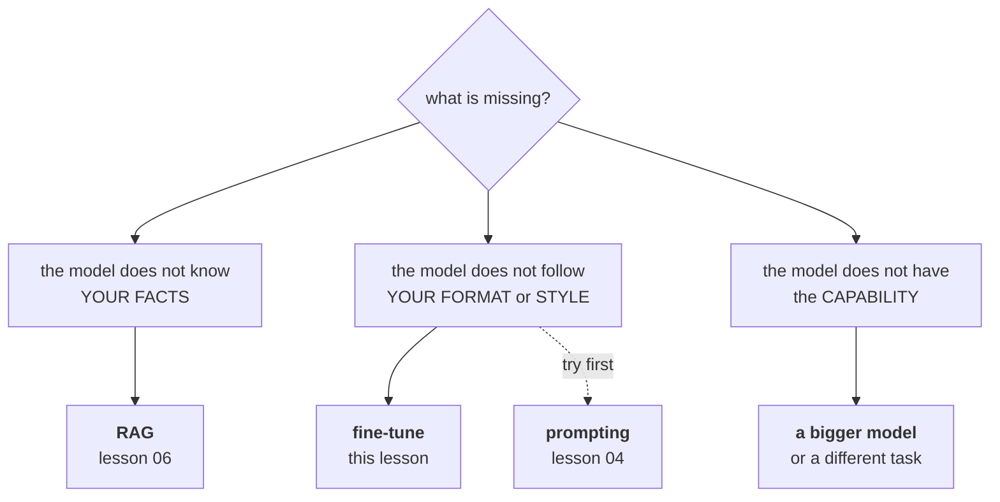

# Lesson 08 — Prompt, RAG, or Fine-tune

**Goal:** choose between the three ways of making a model do your task, using
cost and latency rather than fashion.

## What you will learn

- The three options, and what each one actually changes
- A fine-tuned 4.4M model against a prompted 355M one
- How little data a small model needs
- The decision table

---

## The three options



The distinction that saves the most wasted work: **fine-tuning teaches form, not
facts.** Teams fine-tune a model on their documentation hoping it will memorise
the content, then find it produces confident, fluent, wrong answers in exactly
the right house style. Facts belong in retrieval; fine-tuning is for behaviour,
format and tone.

---

## A task and a dataset

```python
from pathlib import Path

DATA = r'''
import random

SUBJECTS = ["coffee", "latte", "cake", "service", "staff", "wifi", "seating",
            "juice", "sandwich", "music", "price", "atmosphere"]
POS = ["excellent", "fresh", "fast", "friendly", "clean", "generous", "warm",
       "reliable", "delicious", "comfortable"]
NEG = ["terrible", "stale", "slow", "rude", "dirty", "stingy", "cold",
       "unreliable", "tasteless", "uncomfortable"]
POS_TAIL = ["I will come back.", "Highly recommended.", "Worth the price.",
            "Best in the area.", "I stayed for hours."]
NEG_TAIL = ["I will not return.", "Very disappointing.", "Not worth the price.",
            "Avoid this branch.", "I left after ten minutes."]

def make_dataset(n, seed=0):
    rng = random.Random(seed)
    rows = []
    for _ in range(n):
        label = rng.randint(0, 1)
        subj = rng.choice(SUBJECTS)
        adj = rng.choice(POS if label else NEG)
        tail = rng.choice(POS_TAIL if label else NEG_TAIL)
        shape = rng.randint(0, 2)
        if shape == 0:
            text = f"The {subj} was {adj}. {tail}"
        elif shape == 1:
            text = f"Really {adj} {subj}. {tail}"
        else:
            text = f"{tail} The {subj} here is {adj}."
        rows.append((text, label))
    return rows
'''
Path("/tmp/reviews.py").write_text(DATA)
import sys
sys.path.insert(0, "/tmp")
from reviews import make_dataset

train = make_dataset(400, seed=0)
test = make_dataset(200, seed=99)
print(f"train {len(train)}  test {len(test)}")
print("example:", train[0])
```

```text
train 400  test 200
example: ('Worth the price. The seating here is excellent.', 1)
```

**A warning before the numbers.** This dataset is template-generated, so the
task is easy — both systems below reach 1.000 accuracy. That makes it a bad
demonstration of *quality* differences and a very good one of **cost**, which is
what the comparison usually turns on once quality is adequate.

---

## Prompting a 355M model

```python
# skip-verify: wall-clock timings vary by machine
import os, warnings, time
os.environ.setdefault("TOKENIZERS_PARALLELISM", "false")
warnings.filterwarnings("ignore")
from transformers.utils import logging as hf_logging
hf_logging.set_verbosity_error()
hf_logging.disable_progress_bar()

import numpy as np, torch
from transformers import (AutoTokenizer, AutoModelForCausalLM,
                          AutoModelForSequenceClassification)

gtok = AutoTokenizer.from_pretrained("gpt2-medium")
gpt = AutoModelForCausalLM.from_pretrained("gpt2-medium").eval()
POS_ID = gtok(" positive").input_ids[0]; NEG_ID = gtok(" negative").input_ids[0]
SHOTS = train[:4]
def prompt_for(t):
    head = "".join(f"Review: {s}\nSentiment: {'positive' if l else 'negative'}\n\n"
                   for s, l in SHOTS)
    return head + f"Review: {t}\nSentiment:"
t0 = time.perf_counter()
correct = 0
for text, label in test:
    ids = gtok(prompt_for(text), return_tensors="pt")
    with torch.no_grad():
        lg = gpt(**ids).logits[0, -1]
    correct += int((lg[POS_ID] > lg[NEG_ID]) == bool(label))
prompt_acc = correct / len(test)
prompt_time = time.perf_counter() - t0
print(f"4-shot accuracy {prompt_acc:.3f}   {prompt_time:.0f}s for {len(test)} items"
      f"   ({prompt_time / len(test) * 1000:.0f} ms/item)")
```

```text
4-shot accuracy 1.000   33s for 200 items   (165 ms/item)
```

## Fine-tuning a 4.4M model

```python
# skip-verify: wall-clock timings vary by machine
btok = AutoTokenizer.from_pretrained("prajjwal1/bert-tiny")
bert = AutoModelForSequenceClassification.from_pretrained("prajjwal1/bert-tiny", num_labels=2)
opt = torch.optim.AdamW(bert.parameters(), lr=5e-4)
Xtr = btok([t for t, _ in train], padding=True, truncation=True, max_length=48, return_tensors="pt")
ytr = torch.tensor([l for _, l in train])
Xte = btok([t for t, _ in test], padding=True, truncation=True, max_length=48, return_tensors="pt")
yte = torch.tensor([l for _, l in test])
t0 = time.perf_counter()
bert.train()
for epoch in range(6):
    perm = torch.randperm(len(ytr))
    for i in range(0, len(ytr), 32):
        idx = perm[i:i+32]
        out = bert(input_ids=Xtr["input_ids"][idx], attention_mask=Xtr["attention_mask"][idx],
                   labels=ytr[idx])
        opt.zero_grad(); out.loss.backward(); opt.step()
train_time = time.perf_counter() - t0
bert.eval()
t0 = time.perf_counter()
with torch.no_grad():
    preds = bert(**Xte).logits.argmax(1)
infer_time = time.perf_counter() - t0
ft_acc = float((preds == yte).float().mean())
print(f"accuracy {ft_acc:.3f}   trained in {train_time:.0f}s"
      f"   inference {infer_time / len(test) * 1000:.2f} ms/item")
print(f"parameters: gpt2-medium {sum(p.numel() for p in gpt.parameters())/1e6:.0f}M"
      f"   bert-tiny {sum(p.numel() for p in bert.parameters())/1e6:.1f}M")
```

```text
accuracy 1.000   trained in 2s   inference 0.07 ms/item
parameters: gpt2-medium 355M   bert-tiny 4.4M
```

Same accuracy. Now compare everything else.

| | Prompted gpt2-medium | Fine-tuned bert-tiny |
|---|---|---|
| Accuracy | 1.000 | 1.000 |
| Parameters | 355M | **4.4M** (80x smaller) |
| Latency per item | 165 ms | **0.07 ms** (2,357x faster) |
| Training cost | none | 2 seconds |
| Labelled data needed | 4 examples | see below |
| Changing the task | edit a string | retrain |

**2,357 times faster.** At 100,000 classifications a day that is the difference
between 4.6 hours of compute and 7 seconds. On a hosted API it is the difference
between a real monthly bill and none at all, because the fine-tuned model runs
on the CPU you already have.

This is the trade the industry keeps rediscovering: **for a narrow, stable,
high-volume task, a small fine-tuned model beats prompting a large one on every
axis except time-to-first-version.**

---

## How little data does the small model need?

```python
for n in (25, 50, 100, 200, 400):
    torch.manual_seed(0)
    sub = train[:n]
    m = AutoModelForSequenceClassification.from_pretrained(
        "prajjwal1/bert-tiny", num_labels=2)
    o = torch.optim.AdamW(m.parameters(), lr=5e-4)
    X = btok([t for t, _ in sub], padding=True, truncation=True,
             max_length=48, return_tensors="pt")
    y = torch.tensor([l for _, l in sub])
    m.train()
    g = torch.Generator().manual_seed(0)
    for epoch in range(12):
        perm = torch.randperm(len(y), generator=g)
        for i in range(0, len(y), 16):
            idx = perm[i:i + 16]
            out = m(input_ids=X["input_ids"][idx],
                    attention_mask=X["attention_mask"][idx], labels=y[idx])
            o.zero_grad()
            out.loss.backward()
            o.step()
    m.eval()
    with torch.no_grad():
        acc = float((m(**Xte).logits.argmax(1) == yte).float().mean())
    print(f"{n:>4} training examples: accuracy {acc:.3f}")
```

```text
  25 training examples: accuracy 0.800
  50 training examples: accuracy 0.995
 100 training examples: accuracy 1.000
 200 training examples: accuracy 1.000
 400 training examples: accuracy 1.000
```

**Fifty labelled examples** reached 0.995, and a hundred saturated the task. Not fifty
thousand.

The instinct that fine-tuning requires a large dataset comes from training
models from scratch. Fine-tuning a *pretrained* model adjusts a classifier head
and nudges existing representations — for a narrow task with clean labels, a few
hundred examples is a normal amount, and the honest first step is always to
label 100 and see.

(On a genuinely hard task the curve keeps climbing past 400. The lesson is to
plot the curve, not to assume either extreme.)

---

## The decision

| Situation | Choose | Why |
|---|---|---|
| You are exploring; requirements unclear | **Prompting** | Minutes to change. Do this first, always |
| Answers depend on your documents | **RAG** | Facts change; retraining on facts is a trap |
| Answers depend on documents that change hourly | **RAG**, definitely | A fine-tune is stale on arrival |
| Narrow task, high volume, stable | **Fine-tune a small model** | 2,357x the throughput |
| You need a specific format or house style | Fine-tune, or constrain the output (lesson 09) | |
| You need the model to reason better | **A bigger model** | Fine-tuning will not add capability |
| Low volume, broad task | Prompting | Fine-tuning cannot pay back its cost |
| Strict latency budget | Fine-tuned small model | 0.07 ms against 165 ms |

And the combination that most production systems converge on: **RAG for facts,
a small fine-tuned model for routing and classification, a large prompted model
only for the open-ended generation that actually needs it.** Each request should
reach the expensive model only when the cheap ones cannot serve it.

### What fine-tuning costs that the table hides

- **A labelled dataset**, maintained. When the task drifts, you relabel.
- **A training pipeline**, versioned and reproducible — Data-Science lesson 07.
- **A deployment**, monitored for drift — Data-Science lesson 09.
- **A rollback**, because the new checkpoint will sometimes be worse.

Prompting has none of these. That is why the honest order is prompt first,
measure, and fine-tune only when the volume justifies owning all four.

---

## LoRA, briefly

Full fine-tuning of a large model updates every weight and needs the optimiser
state in memory. **LoRA** freezes the base model and trains a pair of small
low-rank matrices per layer — typically under 1% of the parameters — which makes
a fine-tune of a 7B model fit on one GPU, and makes each task a few megabytes of
adapter instead of a full copy of the model.

The Optimization course covers the mechanics in
[lesson 07](../../Optimization/lessons/07-parameter-efficient-finetuning.md). The
decision logic in this lesson is unchanged: LoRA makes fine-tuning *cheaper*, not
more appropriate for teaching facts.

---

## Common mistakes

| Mistake | Why it hurts |
|---|---|
| Fine-tuning to teach facts | You get fluent wrong answers in the right style |
| Fine-tuning before trying a prompt | Days of work to discover 4 examples were enough |
| Prompting a 355M model for a high-volume classifier | 2,357x the latency of the small fine-tune |
| "We need 50,000 examples" | 50 saturated this task |
| Fine-tuning on facts that change weekly | Stale on arrival; use RAG |
| Comparing only accuracy | Both were 1.000; everything that mattered was elsewhere |
| Forgetting the four hidden costs | Dataset, pipeline, deployment, rollback |

---

## Exercises

1. Make the task hard: add negation ("not bad at all") and sarcasm to the
   generator. Does the small model still reach the prompted model's accuracy,
   and at what training-set size?
2. Plot the learning curve to 2,000 examples. Where does it flatten, and what
   would you tell a manager asking how much labelling to fund?
3. Measure the throughput of both systems with a batch size of 64. Does the gap
   narrow, and why?
4. Take a RAG question from lesson 06 and try to answer it by fine-tuning
   instead. Document exactly how the failure looks.
5. Estimate the break-even volume: at what number of daily requests does the
   fine-tune's four hidden costs pay for themselves against a hosted API?

---

**Next:** [Lesson 09 — Structured Output and Guardrails](09-structured-output.md)
