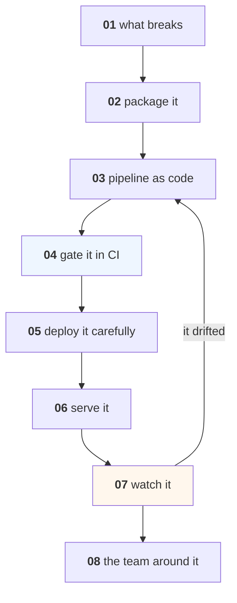

# MLOps

Taking a model from "it works on my machine" to "it works on Monday, and we
know when it stops."

This course assumes you can already build a model. Every lesson is about the
distance between a good model and a reliable system, and every number in it is
measured — the cost of a missing gate, the hours a canary needs, the AUC a
column swap destroys.

---

## Lessons

| # | Lesson | The measured finding |
|---|---|---|
| 01 | [What MLOps Is](lessons/01-what-mlops-is.md) | Code, data and weights change independently — that is the whole problem |
| 02 | [Packaging and Environments](lessons/02-packaging.md) | 20 unpinned dependencies: 8.6% chance of building in 3 months |
| 03 | [The Pipeline as Code](lessons/03-pipeline-as-code.md) | Content addressing: a changed learning rate re-runs 1 stage, not 3 |
| 04 | [The CI Gate](lessons/04-ci-gate.md) | No gate 90,120 EGP/month; eval gate 16,020 |
| 05 | [Deployment Strategies](lessons/05-deployment.md) | Shadowing for a week is the **most** expensive option: 201,600 EGP |
| 06 | [Serving](lessons/06-serving.md) | A 40 ms model answers in 598 ms at 95% utilisation |
| 07 | [Monitoring and Incidents](lessons/07-monitoring.md) | A units bug: AUC 0.81 (looks fine), log loss 14x worse |
| 08 | [Team Practices](lessons/08-team-practices.md) | The model card, review by evidence, and what all this costs |

Every lesson is also a notebook: `lessons/NN-name.ipynb`, generated from the
markdown by `tools/build_notebooks.py`.

---

## The shape of the course



The loop from 07 back to 03 is the point. MLOps is not a pipeline you build
once; it is the cycle you can afford to run every week.

---

## Project

**[Project 22 — Ship One Model Properly](Project-22/)** — take any model you
have already built in this library and put the whole loop around it.

---

## Prerequisites

| You need | From |
|---|---|
| A model you have trained and evaluated | [Machine-Learning](../Machine-Learning/) |
| Experiment tracking | [Data-Science 11](../Data-Science/lessons/11-experiment-tracking.md) |
| Drift and monitoring basics | [Data-Science 09](../Data-Science/lessons/09-monitoring-and-drift.md) |
| Reproducibility and seeds | [Data-Science 07](../Data-Science/lessons/07-reproducibility.md) |
| Time-based splitting | [Time-Series 02](../Time-Series-and-Forecasting/lessons/02-evaluating.md) |

Comfortable with git, the shell, and Docker's basic ideas. You do not need
Kubernetes, and this course will not teach it — the ideas here are the same at
every scale.

---

## What this course does not cover

Honest scope, so you know what you still need:

- **Kubernetes, Terraform, specific cloud consoles.** Tool-specific and
  changing; [HPC-and-Cloud](../HPC-and-Cloud/) covers the cost model instead.
- **Feature stores as products.** Lesson 07 covers the problem they solve; which
  one to buy is a procurement question.
- **LLM-specific operations** — evals, prompt versioning, token cost. That is
  [LLM-and-GenAI](../LLM-and-GenAI/) lessons 06-10.
- **Security of the pipeline.** [Data-Security-for-AI](../Data-Security-for-AI/).

---

## Setup

```bash
pip install -r requirements.txt
```

Everything in the lessons runs on a laptop in seconds. No cloud account, no
cluster, no GPU.
