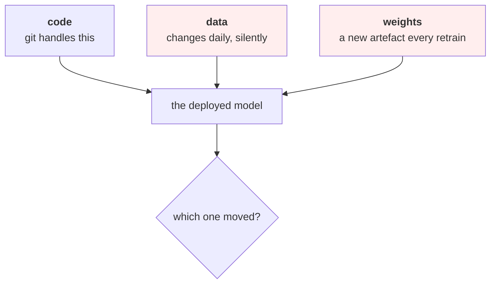

# Lesson 01 — What MLOps Actually Is

**Goal:** know which problems MLOps solves, and resist buying a platform for
problems you do not have.

## What you will learn

- The three things that make ML different from ordinary software delivery
- The maturity ladder, and where to stop
- What you already built in other courses
- When a platform is the answer

---

## Three differences

Ordinary CI/CD assumes **code is the only thing that changes**. For a model,
three things change independently:

| Difference | Consequence |
|---|---|
| **Data changes without a commit** | Behaviour changes with no diff to review |
| **The artefact is produced, not written** | You version a binary nobody can read |
| **Correctness is statistical** | "It passed the tests" does not mean "it is right" |

Those three are the whole subject. Everything called MLOps is an answer to one
of them.

---

## The maturity ladder

| Level | You have | Enough for |
|---|---|---|
| **0** | A notebook, a model file, manual deployment | Nothing in production |
| **1** | Scripts, pinned dependencies, run records | A first production model |
| **2** | A pipeline in CI, an eval gate, a registry, monitoring | **Most teams, most of the time** |
| **3** | Automated retraining, canary deploys, feature store | Many models, frequent change |
| **4** | Full platform, self-serve for data scientists | A large org with many teams |

**Level 2 is the target.** It is reachable with the tools you already know and
it covers the failures that actually happen. Levels 3 and 4 solve coordination
problems that only exist once you have many models and many people, and buying
them early is how teams end up maintaining a platform instead of a product.

---

## You have already built most of level 2

This course mostly connects things the rest of the track already taught:

| Level-2 capability | Where you built it |
|---|---|
| Run records: code, data, params, environment | [Data-Science 07](../../Data-Science/lessons/07-reproducibility.md) |
| Experiment tracking and a registry | [Data-Science 11](../../Data-Science/lessons/11-experiment-tracking.md) |
| A model bundle with threshold and versions | [Data-Science 08](../../Data-Science/lessons/08-shipping-the-model.md) |
| Input validation at the boundary | [Data-Science 08](../../Data-Science/lessons/08-shipping-the-model.md) |
| Drift and monitoring | [Data-Science 09](../../Data-Science/lessons/09-monitoring-and-drift.md) |
| An eval set that can gate a change | [LLM 07](../../LLM-and-GenAI/lessons/07-evaluation.md) |
| Scheduling, queues, idempotency, heartbeats | [AI-Agents 09](../../AI-Agents/lessons/09-automation.md) |
| Pinned environments, five-stage rollout | [HPC 08](../../HPC-and-Cloud/lessons/08-laptop-to-cloud.md) |
| The system diagram and the contract | [AI-System-Design 02-03](../../AI-System-Design/lessons/02-diagrams-as-code.md) |
| Supply chain, retention, incident response | [Data-Security 08](../../Data-Security-for-AI/lessons/08-security-review.md) |

**What this course adds** is the glue: packaging (02), the pipeline as code
(03), the CI gate (04), deployment strategy (05), serving (06), incident
response (07), and the team practices that keep it working (08).

---

## What MLOps does not fix

Be clear about this, because platforms are sold on the opposite claim:

| Problem | MLOps helps? |
|---|---|
| The model is not accurate enough | **No.** That is modelling |
| The problem was framed wrong | **No.** [Data-Science 02](../../Data-Science/lessons/02-framing-the-problem.md) |
| Nobody acts on the predictions | **No.** [Data-Science 01](../../Data-Science/lessons/01-what-data-science-is.md) |
| The threshold is wrong | **No.** [Data-Science 06](../../Data-Science/lessons/06-evaluating-the-decision.md) |
| Nobody noticed it broke | **Yes** |
| You cannot reproduce last month's number | **Yes** |
| A deploy made it worse and you cannot roll back | **Yes** |
| Three people deploy three different ways | **Yes** |
| Retraining is manual and skipped | **Yes** |

The first four are the ones that most often kill projects, and no amount of
tooling touches them. **MLOps makes a working model survive. It does not make a
model work.**

---

## Common mistakes

| Mistake | Why it hurts |
|---|---|
| Buying a platform before level 1 | You now maintain a platform and a problem |
| Treating a model deploy like a code deploy | Data and weights changed too; the diff is empty |
| "It passed the tests" | Tests check code paths, not whether the model is right |
| Reaching for MLOps to fix accuracy | Different problem, different course |
| Skipping run records because a tool will do it | The discipline is the point, not the tool |
| Level 3 with one model | Automation of something that happens monthly |

---

## Exercises

1. Place your team on the maturity ladder honestly. What is the next single
   level-2 capability you are missing?
2. For your last production incident, say which of the three — code, data,
   weights — moved.
3. List the level-2 capabilities you already have from other courses in this
   track. How many are left?
4. Name a problem your team wants MLOps to solve. Check it against the "does
   not fix" table.

---

**Next:** [Lesson 02 — Packaging and Environments](02-packaging.md)
