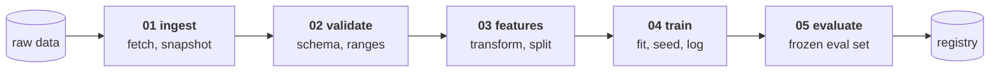

# Lesson 03 — The Pipeline as Code

**Goal:** turn "I ran some notebooks in the right order" into something a
machine can re-run, cache, and audit.

## What you will learn

- Why a notebook is not a pipeline
- Stages, and what makes a stage well-formed
- Content addressing: how a pipeline knows what it can skip
- What to write down about every run

---

## The notebook problem

A notebook is the right tool for finding out what works. It is the wrong
artefact for producing a model, for one reason: **its output depends on
execution order, and the order is not recorded.**

```text
notebook                          pipeline
--------------------------------  --------------------------------
cells, run in any order           stages, with declared inputs
state lives in the kernel         state lives in files
"it worked yesterday"             re-runnable from scratch
output = whatever is in memory    output = a function of the inputs
```

The test is simple: **restart the kernel, run top to bottom, and see if you get
the same model.** If you have never done this, you do not have a pipeline — and
[Data-Science lesson 07](../../Data-Science/lessons/07-reproducibility.md)
measured what that costs.

---

## Five stages

Almost every model pipeline is the same five stages:



A stage is well-formed when all four hold:

| Property | What it means | How you check |
|---|---|---|
| **Declared inputs** | Everything it reads is named | Run it in an empty directory |
| **Declared outputs** | Everything it writes is named | Nothing appears outside them |
| **Deterministic** | Same inputs → same outputs | Run it twice, diff the bytes |
| **Idempotent** | Running it twice is safe | Run it twice, nothing breaks |

The one people skip is **determinism**, and it is the one that makes everything
else possible — including the caching below.

The validate stage is lesson 04's layer 2, and
[Data-Engineering lesson 07](../../Data-Engineering/lessons/07-data-quality.md)
is where the rules themselves were written.

---

## Content addressing

Here is the mechanism that makes a pipeline fast enough to actually use. A
stage's output is named by a **hash of its inputs and its parameters**. If the
hash already exists, the stage is skipped.

```python
import hashlib, json

CACHE = {}
RUNS = {"clean": 0, "features": 0, "train": 0}

def key(stage, inputs, params):
    h = hashlib.sha256()
    h.update(stage.encode())
    for i in inputs:
        h.update(i.encode())
    h.update(json.dumps(params, sort_keys=True).encode())
    return h.hexdigest()[:12]

def stage(name, inputs, params):
    k = key(name, inputs, params)
    if k in CACHE:
        return k, True                    # cache hit, nothing to do
    RUNS[name] += 1
    CACHE[k] = k
    return k, False

def pipeline(raw_hash, feature_params, model_params, label):
    c, h1 = stage("clean",    [raw_hash],         {})
    f, h2 = stage("features", [c],                feature_params)
    m, h3 = stage("train",    [f],                model_params)
    hits = sum([h1, h2, h3])
    print(f"{label:<34}{hits} cached, {3-hits} ran   model={m}")

FP = {"window": 7}
MP = {"lr": 0.1, "depth": 6}
pipeline("raw@v1", FP, MP,                    "first run")
pipeline("raw@v1", FP, MP,                    "re-run, nothing changed")
pipeline("raw@v1", FP, {"lr": 0.05, "depth": 6}, "changed the learning rate")
pipeline("raw@v1", {"window": 14}, MP,        "changed a feature parameter")
pipeline("raw@v2", FP, MP,                    "new data arrived")
print()
print("stage runs:", RUNS)
```

```text
first run                         0 cached, 3 ran   model=08105e768f08
re-run, nothing changed           3 cached, 0 ran   model=08105e768f08
changed the learning rate         2 cached, 1 ran   model=a3f8b4227ba1
changed a feature parameter       1 cached, 2 ran   model=eaf9d90aa181
new data arrived                  0 cached, 3 ran   model=d65bb4966ef2

stage runs: {'clean': 2, 'features': 3, 'train': 4}
```

Four things in that output are worth stopping on.

**Re-running with nothing changed does no work and returns the same model id.**
`08105e768f08` both times. That is reproducibility as a property of the system
rather than a promise in a README.

**Changing the learning rate re-runs one stage, not three.** Cleaning and
feature-building were untouched, so their hashes were untouched. This is why a
hyperparameter sweep on a content-addressed pipeline is cheap and a sweep on a
notebook is a night of your life.

**Changing a feature parameter re-runs two.** The blast radius of a change is
exactly its downstream cone — no more, and crucially no less.

**New data re-runs everything.** `raw@v2` changes the first hash, so every hash
below it changes. There is no way to accidentally train on new data with stale
features, which is the single most common silent bug in this whole subject.

And over five runs: `clean` ran twice, `features` three times, `train` four
times. **Twelve stage-runs collapsed to nine** on a toy example; on a real
pipeline where cleaning is forty minutes, this is the difference between
iterating and not.

This is what `make`, DVC, Dagster, Airflow's datasets, and every build system
since 1976 are doing. You do not need the tool to get the benefit — **you need
your stages to be deterministic and your parameters to be in a file.**

---

## Parameters in a file

```yaml
# no-run
data:
  source: s3://bucket/orders/
  snapshot: "2026-09-01"          # a date, not "latest"
features:
  window: 7
  lags: [1, 7, 14, 28]
train:
  model: ridge
  alpha: 1.0
  seed: 0                          # Data-Science 07
eval:
  split: time                      # Time-Series 02
  horizon: 28
```

Two rules that make this worth doing:

**No parameter appears anywhere else.** The moment a number lives in both the
config and the code, the config is a lie.

**The snapshot is a date, not "latest".** `latest` means two runs of the same
commit produce different models, and you will spend a day finding out why.

---

## What to record about every run

Every run should write a row somewhere you can query later
([Data-Science 11](../../Data-Science/lessons/11-experiment-tracking.md) built
this with MLflow):

```text
run id          git commit      a clean tree, or the diff is lost
                data snapshot   the hash, not the path
                config          the whole file, verbatim
                seed            Data-Science 07
                metrics         on the frozen eval set
                artefacts       model file + its hash
                environment     the lockfile hash (lesson 02)
                duration        so you notice when it triples
```

The test of this record: **six months from now, can you rebuild this exact
model from it?** If any line is missing, you cannot, and the honest answer when
someone asks "why did the model change in March" is "we don't know."

---

## Common mistakes

| Mistake | Why it hurts |
|---|---|
| Notebooks as the production path | Order is not recorded; restart and it breaks |
| A stage that writes outside its declared outputs | Caching becomes wrong, not just slow |
| A non-deterministic stage | Nothing below it can be cached or trusted |
| `snapshot: latest` | Same commit, different model |
| Parameters in both code and config | The config is now documentation |
| No lockfile hash in the run record | Lesson 02: the environment is an input |
| Hashing the data's *path* instead of its contents | The path is stable while the data moves |

---

## Exercises

1. Restart your kernel, run your training notebook top to bottom. Does it work?
2. Split it into the five stages. Which one is not deterministic?
3. Move every parameter into one YAML file. How many were hardcoded twice?
4. Add a content hash to one stage and re-run. Does it skip?
5. Pick a model from three months ago. Can you rebuild it from what you logged?

---

**Next:** [Lesson 04 — The CI Gate](04-ci-gate.md)
