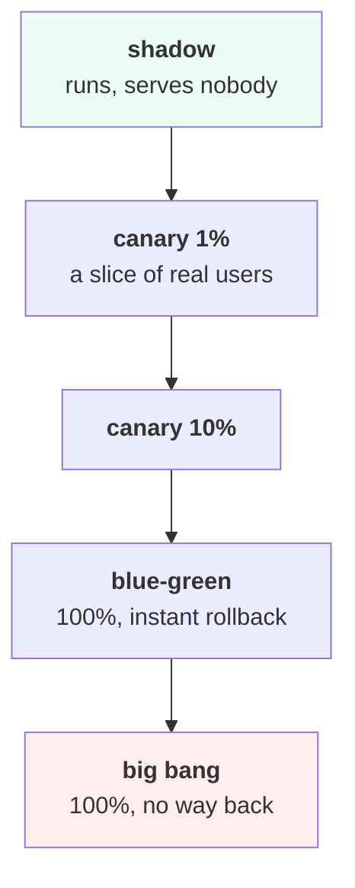

# Lesson 05 — Deployment Strategies

**Goal:** choose how a new model reaches users, and price the choice.

## What you will learn

- The five strategies
- How long a canary takes to tell you anything
- Blast radius, in money
- Why the safest option can be the most expensive

---

## The five



| Strategy | Exposure | Rollback | Tells you about |
|---|---|---|---|
| **Shadow** | 0% | n/a | Predictions and latency. **Not** user behaviour |
| **Canary 1%** | 1% | Instant | Real behaviour, slowly |
| **Canary 10%** | 10% | Instant | Real behaviour, faster |
| **Blue-green** | 100% | Instant (flip back) | Everything, at once |
| **Big bang** | 100% | A redeploy | Everything, and you own it |

---

## How long before a canary says anything?

```python
import numpy as np

def requests_to_detect(baseline, degraded, alpha=0.05, power=0.80):
    from scipy import stats
    za, zb = stats.norm.ppf(1 - alpha / 2), stats.norm.ppf(power)
    p = (baseline + degraded) / 2
    n = ((za * np.sqrt(2 * p * (1 - p)) +
          zb * np.sqrt(baseline * (1 - baseline) + degraded * (1 - degraded))) ** 2
         / (degraded - baseline) ** 2)
    return int(np.ceil(n))

BASE = 0.02          # a 2% error rate in production today
print(f"baseline error rate {BASE:.1%}")
print(f"{'regression to':>15}{'per arm':>12}{'at 10% canary':>16}{'hours @ 50 req/s':>19}")
for new in (0.04, 0.03, 0.025, 0.022):
    n = requests_to_detect(BASE, new)
    total = 2 * n
    at_canary = n / 0.10
    hours = at_canary / (50 * 3600)
    print(f"{new:>15.1%}{n:>12,}{int(at_canary):>16,}{hours:>19.2f}")
print("\na canary that carries 10% of traffic needs 10x the requests to see its share")
```

```text
baseline error rate 2.0%
  regression to     per arm   at 10% canary   hours @ 50 req/s
           4.0%       1,141          11,410               0.06
           3.0%       3,826          38,260               0.21
           2.5%      13,809         138,090               0.77
           2.2%      80,682         806,820               4.48

a canary that carries 10% of traffic needs 10x the requests to see its share
```

**A doubling of the error rate shows up in four minutes. A 10% relative
regression — 2.0% to 2.2% — takes four and a half hours** of a 10% canary at 50
requests per second.

That asymmetry decides the strategy:

- **A canary catches catastrophes fast.** If the new model is broken, you know in
  minutes.
- **A canary is almost useless for small regressions.** At 2.0% → 2.2% you would
  need nearly a million canary requests, and most teams promote long before
  that.

So: **use a canary to catch disasters, and the eval gate (lesson 04) to catch
small regressions.** They are not substitutes. A team relying on a canary alone
will ship a quietly-worse model, every time.

Note also that a 10% canary needs **ten times the total traffic** to accumulate
its share. Smaller canary, safer, slower.

---

## Blast radius, in money

```python
TRAFFIC_PER_HOUR = 180_000
HARM_PER_BAD = 4.0        # EGP of damage per bad decision
BAD_RATE = 0.08           # the new model is wrong 8% more often
print(f"{'strategy':<24}{'exposure':>10}{'detect after':>14}{'bad decisions':>15}{'cost EGP':>12}")
for name, share, detect_h in [("big bang", 1.00, 2.0),
                              ("blue-green", 1.00, 0.5),
                              ("canary 10%", 0.10, 2.0),
                              ("canary 1%", 0.01, 6.0),
                              ("shadow (no traffic)", 0.00, 24.0)]:
    bad = TRAFFIC_PER_HOUR * detect_h * share * BAD_RATE
    print(f"{name:<24}{share:>10.0%}{detect_h:>13.1f}h{int(bad):>15,}{bad*HARM_PER_BAD:>12,.0f}")
print("\nshadow mode costs nothing in harm and tells you nothing about")
print("user behaviour. Canary costs a little of both.")
```

```text
strategy                  exposure  detect after  bad decisions    cost EGP
big bang                      100%          2.0h         28,800     115,200
blue-green                    100%          0.5h          7,200      28,800
canary 10%                     10%          2.0h          2,880      11,520
canary 1%                       1%          6.0h            864       3,456
shadow (no traffic)             0%         24.0h              0           0

shadow mode costs nothing in harm and tells you nothing about
user behaviour. Canary costs a little of both.
```

**Big bang costs 115,200 EGP when the model is bad; a 1% canary costs 3,456.**
A 33x difference in exposure, and the only thing that changed is the dial.

Blue-green is interesting: it exposes **everyone**, like big bang, but detection
is fast and rollback is a flip — so its cost is a quarter of big bang's. If you
cannot do a canary, do blue-green; the ability to go back in thirty seconds is
worth more than most things in this lesson.

---

## The safest option is not the cheapest

Harm is only one side. **Delay has a cost too** — every hour the better model is
not live is value you are not getting.

```python
print(f"{'strategy':<24}{'harm cost':>12}{'delay cost':>12}{'total':>12}")
VALUE_PER_HOUR = 1_200     # the new model is worth this much per hour, if good
for name, share, detect_h, rollout_h in [("big bang", 1.00, 2.0, 0.0),
                                         ("canary 10%", 0.10, 2.0, 4.0),
                                         ("canary 1% then 10%", 0.01, 6.0, 12.0),
                                         ("shadow 1 week first", 0.00, 24.0, 168.0)]:
    harm = TRAFFIC_PER_HOUR * detect_h * share * BAD_RATE * HARM_PER_BAD
    delay = rollout_h * VALUE_PER_HOUR
    print(f"{name:<24}{harm:>12,.0f}{delay:>12,.0f}{harm+delay:>12,.0f}")
print("\nthe cheapest strategy depends on how bad a bad model is")
print("and how valuable a good one is. Both are numbers you can estimate.")
```

```text
strategy                   harm cost  delay cost       total
big bang                     115,200           0     115,200
canary 10%                    11,520       4,800      16,320
canary 1% then 10%             3,456      14,400      17,856
shadow 1 week first                0     201,600     201,600

the cheapest strategy depends on how bad a bad model is
and how valuable a good one is. Both are numbers you can estimate.
```

**Shadowing for a week is the most expensive option in the table** — 201,600
EGP — and it is the one that feels safest. It has zero harm cost and a week of
foregone value.

Big bang is second-worst. The winner is **canary 10%, at 16,320**, and
canary-1%-then-10% is close behind at 17,856.

This is the same shape as
[Data-Science lesson 06](../../Data-Science/lessons/06-evaluating-the-decision.md)'s
profit curve: the extremes are both wrong and the optimum is in the middle, and
**the only way to find it is to price both sides.**

The two numbers you need:

```text
HARM     traffic x exposure x detection time x bad-decision rate x cost per bad decision
DELAY    hours not live x value per hour of the better model
```

Both are estimable within a factor of two, which is enough — the answer is not
close.

---

## Rollback

Whatever you choose, the rollback path decides how much a mistake costs:

- [ ] The **previous model is still in the registry** and loadable
- [ ] Rollback is a **config change or an alias flip**, not a redeploy
- [ ] It takes **under five minutes**, and someone has done it in a drill
- [ ] It does **not** require the person who deployed
- [ ] Rolling back the model does not require rolling back the code
- [ ] The dashboard shows which version is live right now
      ([Data-Science 11](../../Data-Science/lessons/11-experiment-tracking.md))

The fourth is the one that fails at 2 a.m. A rollback only one person can
perform is not a rollback.

---

## Common mistakes

| Mistake | Why it hurts |
|---|---|
| Relying on a canary to catch small regressions | 806,820 requests to see 2.0% → 2.2% |
| No eval gate, because "the canary will catch it" | It will not |
| Big bang | 115,200 EGP of exposure for zero delay saved |
| Shadowing for a week "to be safe" | The most expensive option in the table |
| Promoting a canary on a hunch | Decide the sample size first |
| A rollback that needs a redeploy | Minutes become an hour |
| A rollback only one person can do | It is not a rollback |

---

## Exercises

1. Compute, for your own traffic and error rate, how long a 10% canary needs to
   detect a 10% relative regression.
2. Price all five strategies with your harm and delay numbers. Which wins?
3. Time your rollback, with a stopwatch, in a drill.
4. Check that someone who did not build the system can roll it back.
5. Write the promotion rule: what must be true before a canary goes to 100%?

---

**Next:** [Lesson 06 — Serving](06-serving.md)
