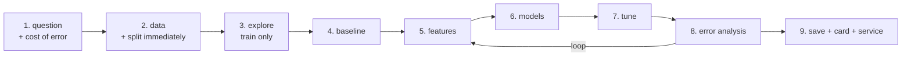

# Project 3 — A Model Someone Could Actually Use

**Do this after the thirteen lessons.**

You take a real prediction problem from raw data to a saved, documented,
serveable model — and you defend every number in it.

Project 1 asked whether you can analyse data. Project 2 asked whether you can
build a system. This one asks whether you can be **trusted with a model**: no
leakage, an honest baseline, a metric that matches the cost, and limits you
state before someone else finds them.

---

## The pipeline



Note where the split is: **step 2**, before exploration. You explore the
training set. The test set is not yours to look at yet.

---

## Requirements

### 1. The question, and the cost of being wrong

Before any code, write in the README:

- The prediction, precisely: *"Given a customer's first 30 days, will they
  place another order in days 31–60?"*
- Classification or regression, and why.
- **What a false positive costs, and what a false negative costs.** One
  sentence each. This decides your metric and your threshold, and every later
  decision refers back to it.

### 2. Data

A real dataset: **at least 2,000 rows** with a genuine target. Kaggle,
data.gov.eg, the World Bank, a public API, or your own work data. Synthetic
data does not count.

Split it in the first ten lines of your notebook, with `random_state` set.
For anything with a time dimension, split by time, not randomly.

### 3. Baselines, before any model

- `DummyClassifier` / `DummyRegressor`
- One simple rule a human might write, if one exists

Report their scores. Everything later is measured against these, and a model
that does not beat them is a finding you must report, not hide.

### 4. Features

- Handle missing values deliberately, and justify each choice in a markdown
  cell
- Encode categories correctly — one-hot for nominal, ordinal only for real
  orders
- **At least three engineered features** that did not exist in the raw data:
  ratios, differences, counts, time since an event, aggregates per group
- Everything inside a `ColumnTransformer` in a `Pipeline`

State explicitly, in one sentence per feature, that it would be **available at
prediction time**. Most leakage dies here.

### 5. Models

Train at least four, all in pipelines, all cross-validated on the training set:

| Required | Why |
|---|---|
| A linear model (logistic / linear regression) | Interpretable baseline |
| A tree-based model (random forest) | Non-linear, no scaling |
| Gradient boosting | The likely winner |
| One other of your choice (KNN, SVM, MLP) | Your judgement |

Report mean ± std for each. Pick the winner on cross-validation, not on test.

### 6. Tuning

`RandomizedSearchCV` over at least four hyperparameters, `n_iter >= 20`, on the
best one or two models. Report the search budget, the best configuration, and
the cross-validated score before and after.

If tuning gains less than the standard deviation, say so. That is a real
result and it is worth more than a fabricated improvement.

### 7. Evaluation — on the test set, once

- The metric your cost analysis chose, with a justification
- The full `classification_report`, or MAE/RMSE/R² for regression
- A confusion matrix (classification) or a predicted-vs-actual plot
  (regression)
- **The threshold sweep**, if classification: precision and recall across
  thresholds, and the one you chose, with the reason
- The comparison against your baselines, in a table

### 8. Error analysis — the part that separates good projects

Look at what the model gets wrong, and group it:

- Which segments does it fail on? (Split errors by category, by value range,
  by date.)
- Take the **ten most confident wrong predictions** and read the rows. What do
  they have in common?
- Is there a subgroup where the model is materially worse? Report it.

Write at least three concrete findings, each with a number. "The model is worse
on customers with fewer than 3 orders, recall 0.41 against 0.72 overall" is a
finding. "Performance could be improved" is not.

### 9. Ship it

- `joblib.dump` the **whole pipeline**
- A `predict()` function with input validation, returning probabilities
- A metadata JSON: training date, library versions, feature order, metrics,
  threshold
- A **model card** — use the template in
  [lesson 13](../lessons/13-from-model-to-product.md), including the
  **NOT for** and **Known limits** sections
- A FastAPI service, or a batch scoring script. Either is fine; say which and
  why.

---

## Deliverables

```text
project-3/
├── README.md              question, method, results, limits
├── MODEL_CARD.md
├── notebooks/
│   ├── 01-explore.ipynb
│   └── 02-model.ipynb     runs top to bottom, no errors
├── src/
│   ├── features.py        feature building, tested
│   ├── train.py           trains and saves the pipeline
│   └── predict.py         load, validate, predict
├── tests/                 at least 8 pytest tests
├── models/
│   ├── model.joblib
│   └── metadata.json
└── data/
    ├── raw/               read-only, never edited
    └── processed/
```

---

## Marking

| Weight | Criterion |
|---|---|
| 15% | Question and cost analysis; the metric follows from them |
| 20% | No leakage — split first, everything inside the pipeline |
| 15% | Baselines present and honestly compared |
| 15% | Model comparison and tuning, cross-validated with ± reported |
| 15% | Error analysis with concrete, numbered findings |
| 10% | Saved pipeline, metadata, working `predict()`, tests |
| 10% | Model card, with limits stated |

Automatic deductions: any transformer fitted outside the pipeline; a test score
quoted after tuning against it; a notebook that does not run end to end; a
claim in the README with no number behind it; `data/raw/` edited by hand.

---

## Milestones

| Day | Done by end of day |
|---|---|
| 1 | Question, cost analysis, data loaded and split |
| 2 | EDA on train, baselines, first features |
| 3 | Four model families cross-validated |
| 4 | Tuning, then test-set evaluation — once |
| 5 | Error analysis |
| 6 | Save, service, tests, model card, README |

---

## Before you submit

- [ ] Restart the kernel, run all — no errors
- [ ] The split happens before any exploration or fitting
- [ ] Every transformer lives inside a `Pipeline`
- [ ] The test set was evaluated once, after tuning finished
- [ ] Baselines are in the results table
- [ ] The chosen metric is justified by the cost of each error
- [ ] Three error-analysis findings, each with a number
- [ ] `predict()` validates input and returns probabilities
- [ ] The model card names what the model must **not** be used for
- [ ] Someone else can clone the repo and reproduce your number
