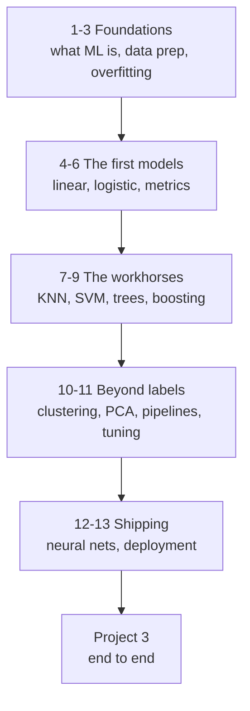

# Machine Learning — Tayel AI Labs

The second course. You arrive able to write Python and use pandas; you leave
able to frame a problem as a learning task, train a model that is honestly
evaluated, and say what it can and cannot be trusted to do.

Every lesson exists twice: a **`.md`** to read on GitHub, and a **`.ipynb`**
with the same code to run. The notebooks are generated from the markdown.

**Prerequisite:** [`../Python/Basic-Python`](../Python/Basic-Python) — the
eleven lessons and the libraries section. In particular NumPy, pandas and
scikit-learn. If `groupby` and `fit/predict` are new words, go back first.

---

## The road



---

## Lessons

| # | Lesson | You will be able to |
|---|---|---|
| 01 | [What Is Machine Learning](lessons/01-what-is-machine-learning.md) | Tell a learning problem from a rules problem |
| 02 | [Data Preparation](lessons/02-data-preparation.md) | Encode, scale, and handle missing values |
| 03 | [Splitting and Overfitting](lessons/03-splitting-and-overfitting.md) | Measure a model honestly |
| 04 | [Linear Regression](lessons/04-linear-regression.md) | Predict a number, and read the coefficients |
| 05 | [Logistic Regression](lessons/05-logistic-regression.md) | Predict a class, and tune the threshold |
| 06 | [Evaluation Metrics](lessons/06-evaluation-metrics.md) | Choose the metric the problem deserves |
| 07 | [KNN and SVM](lessons/07-knn-and-svm.md) | Use distance-based models, and scale for them |
| 08 | [Decision Trees and Random Forests](lessons/08-trees-and-forests.md) | Model non-linear data, read feature importance |
| 09 | [Gradient Boosting](lessons/09-gradient-boosting.md) | Win on tabular data |
| 10 | [Unsupervised Learning](lessons/10-unsupervised-learning.md) | Cluster and reduce dimensions |
| 11 | [Pipelines and Tuning](lessons/11-pipelines-and-tuning.md) | Build a leak-proof, tunable model |
| 12 | [Neural Networks — the Idea](lessons/12-neural-networks-intro.md) | Know when a network earns its cost |
| 13 | [From Model to Product](lessons/13-from-model-to-product.md) | Save, serve, and monitor a model |

## Then

- [`Project-3/`](Project-3/) — a complete supervised learning project, defended

---

## Setup

```bash
python3 -m venv .venv
source .venv/bin/activate
pip install -r requirements.txt
```

Everything runs on a laptop. No GPU is needed anywhere in this course.

## Regenerating the notebooks

Edit the markdown, never the notebook. Then:

```bash
python3 ../tools/build_notebooks.py
```

---

## Three things to carry through every lesson

1. **The data matters more than the model.** A week spent on features beats a
   week spent on hyperparameters, nearly every time.
2. **A score you cannot reproduce is not a score.** Set `random_state`, split
   before you touch anything, and never evaluate on data the model has seen.
3. **Most model failures are data leakage.** If your accuracy is surprisingly
   high, assume a leak and go looking for it before you celebrate.
