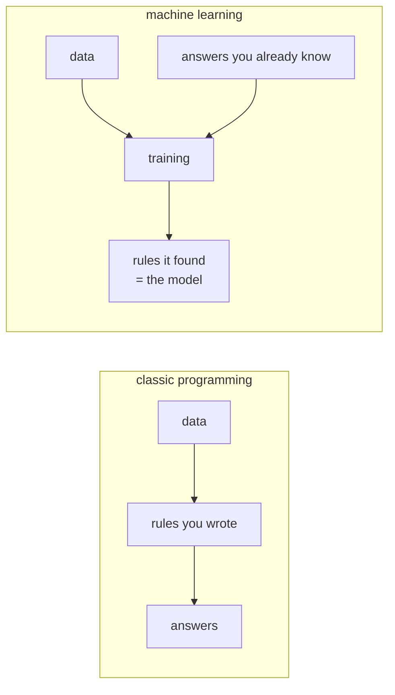
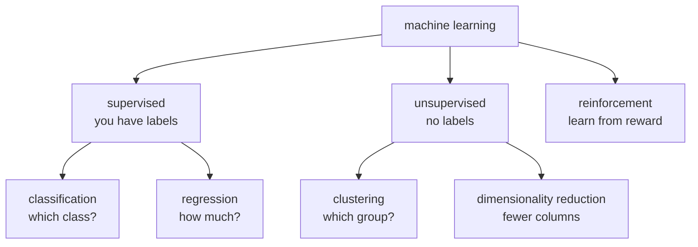
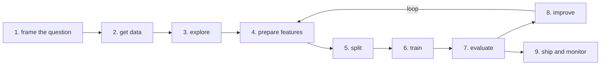

# Lesson 01 — What Is Machine Learning

**Goal:** know what kind of problem you are looking at, before writing code.

## What you will learn

- Rules versus learning
- Supervised, unsupervised, reinforcement
- The vocabulary: features, labels, model, training, inference
- The workflow you will repeat for the rest of your career

---

## Rules or learning?

Here is a rule-based program:

```python
def is_free_delivery(order_total):
    """A rule a human wrote, because a human knows the policy."""
    return order_total >= 200

print(is_free_delivery(250), is_free_delivery(80))
```

```text
True False
```

You know the rule, so you write it. No machine learning is needed, and using
it here would be worse in every way — slower, less accurate, and impossible
to explain.

Now: **will this customer come back next month?** You cannot write that rule.
It depends on how often they ordered, what they spent, how long since the last
visit, and a dozen things you have not thought of. Nobody can write it down.

That is the line. Machine learning is for problems where **you have examples
of the answer, but not the rule**.



Programming goes from rules to answers. Learning goes from answers back to
rules. That inversion is the whole idea.

**Do not use machine learning when:** the rule is known, the decision must be
fully explainable by law, you have fewer than a few hundred examples, or a
mistake is unacceptable and there is no human checking the output.

---

## The vocabulary

| Word | Means | In a spreadsheet |
|---|---|---|
| **Sample** / row / instance | One thing you are learning about | A row |
| **Feature** (`X`) | An input you measure | A column you have |
| **Label** / target (`y`) | The answer you want | The column you want to predict |
| **Model** | The learned rule | — |
| **Training** | Finding the rule from examples | — |
| **Inference** / prediction | Applying it to new data | — |
| **Parameter** | What the model learns | A coefficient |
| **Hyperparameter** | What you choose before training | Tree depth, learning rate |

```python
import pandas as pd

data = pd.DataFrame({
    "orders_last_month": [12, 2, 7, 1, 15],
    "avg_basket":        [85, 40, 60, 30, 110],
    "days_since_visit":  [3, 40, 12, 60, 2],
    "returned":          [1, 0, 1, 0, 1],
})

X = data[["orders_last_month", "avg_basket", "days_since_visit"]]
y = data["returned"]

print(X.shape, y.shape)
print(list(X.columns))
```

```text
(5, 3) (5,)
['orders_last_month', 'avg_basket', 'days_since_visit']
```

`X` is a table of features — one row per customer. `y` is one value per row,
the thing you want to predict. **Capital `X`, lowercase `y`** is the universal
convention: a matrix and a vector.

---

## The three kinds



### Supervised — you have the answers for past data

This is 90% of applied machine learning, and all of lessons 04 to 09.

- **Classification** — the label is a category.
  Spam or not. Which of five products. Will churn or not.
- **Regression** — the label is a number.
  Tomorrow's revenue. Delivery time in minutes. House price.

The test is simple: **is the thing you are predicting a category or a number?**

```python
examples = [
    ("Is this transaction fraud?",          "classification"),
    ("How many cups will we sell tomorrow?", "regression"),
    ("Which of 5 plans will they choose?",   "classification"),
    ("How many days until this part fails?", "regression"),
]
for question, kind in examples:
    print(f"{kind:<15} {question}")
```

```text
classification  Is this transaction fraud?
regression      How many cups will we sell tomorrow?
classification  Which of 5 plans will they choose?
regression      How many days until this part fails?
```

### Unsupervised — no labels, find structure

Customer segments nobody defined. Anomalies in server logs. Compressing 200
columns into 10. Lesson 10.

### Reinforcement — learn by trying

An agent takes actions and gets rewards: game playing, robotics, and the
alignment stage of language models. Powerful, data-hungry, and out of scope
for this course.

---

## The workflow



Two honest notes about this diagram.

**Steps 2 to 4 are most of the work.** Expect 70–80% of your time in data, not
modelling. This surprises everyone once.

**Step 8 loops back to 4, not to 6.** When a model underperforms, better
features beat a different algorithm almost every time. Changing
`RandomForest` to `XGBoost` buys a point; adding the right feature buys ten.

---

## The smallest complete example

Everything above, in fifteen lines:

```python
from sklearn.datasets import load_breast_cancer
from sklearn.model_selection import train_test_split
from sklearn.linear_model import LogisticRegression
from sklearn.preprocessing import StandardScaler
from sklearn.pipeline import make_pipeline
from sklearn.metrics import accuracy_score

X, y = load_breast_cancer(return_X_y=True)          # 2. data

X_train, X_test, y_train, y_test = train_test_split(  # 5. split
    X, y, test_size=0.2, random_state=42, stratify=y
)

model = make_pipeline(StandardScaler(), LogisticRegression(max_iter=5000))
model.fit(X_train, y_train)                           # 6. train

predictions = model.predict(X_test)                   # inference
print("accuracy:", round(accuracy_score(y_test, predictions), 3))   # 7. evaluate
```

```text
accuracy: 0.982
```

Read that again and find the split. The model was evaluated on 114 samples it
had never seen — that is the only reason the number means anything. Lesson 03
is about nothing else.

---

## Common mistakes

| Mistake | What happens |
|---|---|
| Using ML where a rule would do | Slower, less accurate, harder to explain |
| Starting with the model instead of the question | A precise answer to the wrong thing |
| Evaluating on training data | A score of 1.00 and a useless model |
| Ignoring the class balance | 98% accuracy predicting "no" every time |
| Fewer examples than features | The model memorises and cannot generalise |

---

## Exercises

1. Write down three problems from your own work. For each: rules or learning?
   If learning — classification or regression?
2. For one of them, list the features you would need and where each comes from.
3. Run the fifteen-line example. Change `test_size` to 0.5 and explain what
   happens to the accuracy and why.
4. Remove `stratify=y`, run it five times with different `random_state`, and
   describe the variation.
