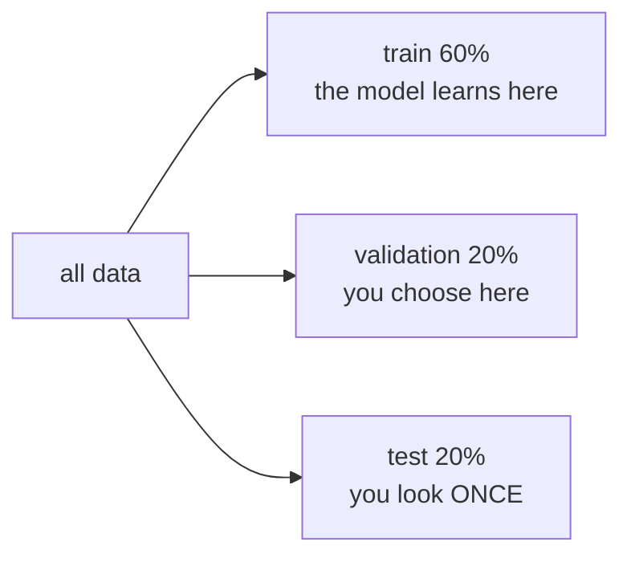
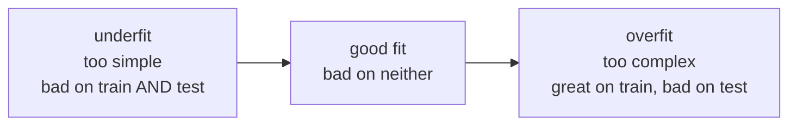
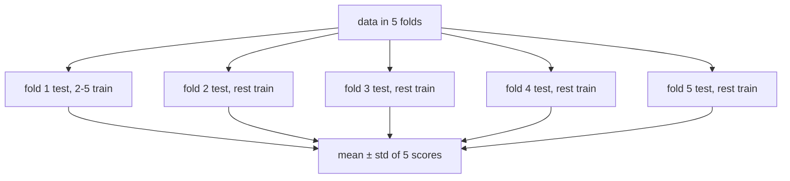

# Lesson 03 — Splitting and Overfitting

**Goal:** produce a number you can defend.

## What you will learn

- Train, validation, test — three sets, three jobs
- Overfitting and underfitting, seen in code
- Cross-validation
- Learning curves: more data, or a different model?

---

## Why a split exists

A model that has seen the answers can repeat them. That is memory, not
learning, and memory scores perfectly.

```python
from sklearn.datasets import load_breast_cancer
from sklearn.model_selection import train_test_split
from sklearn.tree import DecisionTreeClassifier

X, y = load_breast_cancer(return_X_y=True)
X_train, X_test, y_train, y_test = train_test_split(
    X, y, test_size=0.2, random_state=42, stratify=y
)

tree = DecisionTreeClassifier(random_state=42).fit(X_train, y_train)

print("train accuracy:", round(tree.score(X_train, y_train), 3))
print("test accuracy: ", round(tree.score(X_test, y_test), 3))
```

```text
train accuracy: 1.0
test accuracy:  0.912
```

A perfect training score is never good news. It means the model grew branches
until every training row had its own path — including the noise. The test
score is the honest one.

---

## Three sets



| Set | Used for | Touched how often |
|---|---|---|
| Train | Fitting parameters | Every experiment |
| Validation | Comparing models, tuning | Every experiment |
| Test | The final, reported number | Once, at the end |

Each time you look at the test set and change something, a little of it leaks
into your decisions. Tune on validation. Report on test. Then stop.

```python
from sklearn.datasets import load_breast_cancer
from sklearn.model_selection import train_test_split

X, y = load_breast_cancer(return_X_y=True)

X_temp, X_test, y_temp, y_test = train_test_split(
    X, y, test_size=0.2, random_state=42, stratify=y
)
X_train, X_val, y_train, y_val = train_test_split(
    X_temp, y_temp, test_size=0.25, random_state=42, stratify=y_temp
)

print(len(X_train), len(X_val), len(X_test))
```

```text
341 114 114
```

Two splits: 20% off for test, then a quarter of what remains for validation —
which is 20% of the original.

**For time series, never split randomly.** Train on the past, test on the
future, or you are predicting Monday using Tuesday. Use `TimeSeriesSplit`.

---

## Underfitting and overfitting



Seen directly, by fitting polynomials of increasing degree to a curve:

```python
import numpy as np
from sklearn.preprocessing import PolynomialFeatures
from sklearn.linear_model import LinearRegression
from sklearn.pipeline import make_pipeline
from sklearn.model_selection import train_test_split
from sklearn.metrics import mean_squared_error

rng = np.random.default_rng(0)
X = np.sort(rng.uniform(-3, 3, 60)).reshape(-1, 1)
y = X.ravel() ** 2 + rng.normal(0, 1.5, 60)          # a parabola plus noise

X_train, X_test, y_train, y_test = train_test_split(X, y, test_size=0.3, random_state=0)

for degree in [1, 2, 15]:
    model = make_pipeline(PolynomialFeatures(degree), LinearRegression())
    model.fit(X_train, y_train)
    train_mse = mean_squared_error(y_train, model.predict(X_train))
    test_mse = mean_squared_error(y_test, model.predict(X_test))
    print(f"degree {degree:>2}  train MSE {train_mse:7.2f}   test MSE {test_mse:8.2f}")
```

```text
degree  1  train MSE    8.88   test MSE    15.75
degree  2  train MSE    2.60   test MSE     1.84
degree 15  train MSE    1.51   test MSE 22262.20
```

Read the three rows:

- **Degree 1** — a straight line cannot bend into a parabola. Both errors are
  high: underfitting.
- **Degree 2** — the true shape. Train and test agree. This is the model.
- **Degree 15** — the lowest training error of the three, and a test error
  four orders of magnitude worse. It learned the noise, and between the
  training points the curve swings wildly.

**The gap between train and test is the diagnosis.** Small gap and bad scores:
too simple. Large gap: too complex.

| Symptom | Cause | Fix |
|---|---|---|
| Bad train, bad test | Underfit | More features, more complexity, train longer |
| Great train, bad test | Overfit | More data, fewer features, regularisation, simpler model |
| Good train, good test | Fit | Ship it |

---

## Cross-validation

One split is one opinion. Change `random_state` and the score moves — on a
small dataset, by a lot. Cross-validation averages over several splits.



```python
from sklearn.datasets import load_breast_cancer
from sklearn.model_selection import cross_val_score, StratifiedKFold
from sklearn.linear_model import LogisticRegression
from sklearn.preprocessing import StandardScaler
from sklearn.pipeline import make_pipeline

X, y = load_breast_cancer(return_X_y=True)
model = make_pipeline(StandardScaler(), LogisticRegression(max_iter=5000))

cv = StratifiedKFold(n_splits=5, shuffle=True, random_state=42)
scores = cross_val_score(model, X, y, cv=cv, scoring="accuracy")

print(scores.round(3))
print(f"mean {scores.mean():.3f} ± {scores.std():.3f}")
```

```text
[0.974 0.947 0.965 0.991 0.991]
mean 0.974 ± 0.017
```

Report the mean **and** the spread. A model at 0.80 ± 0.02 is a different
proposition from 0.80 ± 0.15, and only one of them is ready for anything.

Use `StratifiedKFold` for classification — it keeps the class balance in every
fold. For grouped data (several rows per customer), use `GroupKFold`, or the
same customer lands in train and test and the score is a lie.

**The pipeline is doing real work here.** Because scaling lives inside it,
`cross_val_score` refits the scaler on each training fold. Scaling outside
would leak every fold's test data into its own training.

---

## Learning curves — more data, or a better model?

```python
import numpy as np
from sklearn.datasets import load_breast_cancer
from sklearn.model_selection import learning_curve
from sklearn.linear_model import LogisticRegression
from sklearn.preprocessing import StandardScaler
from sklearn.pipeline import make_pipeline

X, y = load_breast_cancer(return_X_y=True)
model = make_pipeline(StandardScaler(), LogisticRegression(max_iter=5000))

sizes, train_scores, val_scores = learning_curve(
    model, X, y, cv=5, train_sizes=np.linspace(0.1, 1.0, 5), random_state=0
)

for n, tr, va in zip(sizes, train_scores.mean(axis=1), val_scores.mean(axis=1)):
    print(f"n={n:<5} train {tr:.3f}   validation {va:.3f}")
```

```text
n=45    train 1.000   validation 0.793
n=147   train 0.984   validation 0.947
n=250   train 0.982   validation 0.960
n=352   train 0.985   validation 0.970
n=455   train 0.989   validation 0.981
```

Read the two columns as they move right:

- The curves **converging** and still apart → more data will help.
- The curves **already met** and both are low → more data will not help; you
  need better features or a stronger model.

Plot it in the notebook. This one chart answers "should I collect more data?",
which is usually an expensive question.

---

## Common mistakes

| Mistake | What happens |
|---|---|
| Reporting the training score | Meaningless — it measures memory |
| Tuning against the test set | The test set is now a validation set |
| Random split on time series | You predict the past from the future |
| No `stratify` on imbalanced data | A fold with no positive class at all |
| Rows of the same entity in both sets | Memorised, not learned |
| Trusting one split on small data | ±10% swings between random seeds |

---

## Exercises

1. Train a decision tree with `max_depth` from 1 to 15; plot train and test
   accuracy against depth and mark where overfitting starts.
2. Split a dataset three ways and report the three set sizes.
3. Run 5-fold cross-validation and report mean ± std. Change `random_state`
   and see how much moves.
4. Plot a learning curve and answer, with evidence: would more data help?
