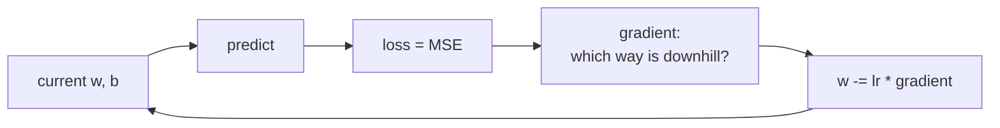

# Lesson 04 — Linear Regression

**Goal:** predict a number, and understand every part of how.

## What you will learn

- The line, the loss, and gradient descent
- Linear regression in scikit-learn
- Reading coefficients
- Regression metrics, and regularisation

---

## The model

One feature:

```text
y = w · x + b
```

`w` is the slope — how much `y` moves when `x` moves by one. `b` is the
intercept. With many features it is the same thing, widened:

```text
y = w₁x₁ + w₂x₂ + ... + wₙxₙ + b
```

Training means finding the `w`s and `b` that make the predictions closest to
the truth. "Closest" needs a definition, and that is the loss:

```text
MSE = mean( (y_true - y_pred)² )
```

Squared, so that errors of +5 and −5 both count, and so that one error of 10
hurts more than two errors of 5.



---

## Gradient descent, by hand

Twenty lines, no library, so nothing stays mysterious:

```python
import numpy as np

rng = np.random.default_rng(0)
X = rng.uniform(0, 10, 100)
y = 3.5 * X + 12 + rng.normal(0, 2, 100)      # true slope 3.5, true intercept 12

w, b = 0.0, 0.0
learning_rate = 0.01
n = len(X)

for step in range(1, 1001):
    y_pred = w * X + b
    error = y_pred - y

    dw = (2 / n) * np.sum(error * X)          # slope of the loss w.r.t. w
    db = (2 / n) * np.sum(error)

    w -= learning_rate * dw
    b -= learning_rate * db

    if step in (1, 10, 100, 1000):
        mse = np.mean(error ** 2)
        print(f"step {step:>4}  w={w:5.2f}  b={b:5.2f}  MSE={mse:8.2f}")
```

```text
step    1  w= 4.04  b= 0.62  MSE= 1077.60
step   10  w= 4.99  b= 1.22  MSE=   31.15
step  100  w= 4.47  b= 4.87  MSE=   15.72
step 1000  w= 3.49  b=11.87  MSE=    3.76
```

Watch `w` land near 3.5 within ten steps while `b` needs a thousand to reach
12. That asymmetry is exactly
why scaling matters: features on different scales have gradients on different
scales, and the small ones take forever.

Two knobs, and both fail loudly:

- **Learning rate too small** — it never arrives.
- **Learning rate too large** — the loss grows instead of shrinking, often to
  `nan`. If you see that, divide the rate by ten.

---

## The library version

```python
import numpy as np
from sklearn.linear_model import LinearRegression

rng = np.random.default_rng(0)
X = rng.uniform(0, 10, 100).reshape(-1, 1)
y = 3.5 * X.ravel() + 12 + rng.normal(0, 2, 100)

model = LinearRegression().fit(X, y)

print("slope:    ", round(model.coef_[0], 3))
print("intercept:", round(model.intercept_, 3))
print("predict(5):", round(model.predict([[5.0]])[0], 2))
```

```text
slope:     3.474
intercept: 11.985
predict(5): 29.35
```

scikit-learn solves it directly rather than by descent, so it is exact and
instant. Use it. The loop above was to show you what it is doing.

---

## A real dataset, with the pipeline

```python
from sklearn.datasets import fetch_california_housing
from sklearn.model_selection import train_test_split
from sklearn.preprocessing import StandardScaler
from sklearn.pipeline import make_pipeline
from sklearn.linear_model import LinearRegression
from sklearn.metrics import mean_absolute_error, mean_squared_error, r2_score
import numpy as np

data = fetch_california_housing()
X_train, X_test, y_train, y_test = train_test_split(
    data.data, data.target, test_size=0.2, random_state=42
)

model = make_pipeline(StandardScaler(), LinearRegression()).fit(X_train, y_train)
predictions = model.predict(X_test)

print("MAE: ", round(mean_absolute_error(y_test, predictions), 3))
print("RMSE:", round(np.sqrt(mean_squared_error(y_test, predictions)), 3))
print("R²:  ", round(r2_score(y_test, predictions), 3))
```

```text
MAE:  0.533
RMSE: 0.746
R²:   0.576
```

---

## Reading the metrics

| Metric | Meaning | Units |
|---|---|---|
| **MAE** | Average size of the error | Same as `y` |
| **RMSE** | Like MAE, but punishes large errors | Same as `y` |
| **R²** | Share of the variance explained | 0 to 1 (can go negative) |

Say them out loud to a non-technical person:

- MAE 0.533 → "on average we are off by about 53,000 dollars" (the target is
  in hundreds of thousands).
- R² 0.576 → "the model explains about 58% of the variation in price".

R² of 0 means you are no better than always predicting the mean. **Negative
R² means you are worse than that**, which is a signal to stop and look at the
data.

Report MAE when every error matters equally. Report RMSE when a large miss is
disproportionately bad.

---

## Coefficients say what the model learned

```python
import pandas as pd
from sklearn.datasets import fetch_california_housing
from sklearn.model_selection import train_test_split
from sklearn.preprocessing import StandardScaler
from sklearn.pipeline import make_pipeline
from sklearn.linear_model import LinearRegression

data = fetch_california_housing()
X_train, X_test, y_train, y_test = train_test_split(
    data.data, data.target, test_size=0.2, random_state=42
)
model = make_pipeline(StandardScaler(), LinearRegression()).fit(X_train, y_train)

coefficients = pd.Series(
    model.named_steps["linearregression"].coef_, index=data.feature_names
).sort_values(key=abs, ascending=False)

print(coefficients.round(3))
```

```text
Latitude     -0.897
Longitude    -0.870
MedInc        0.854
AveBedrms     0.339
AveRooms     -0.294
HouseAge      0.123
AveOccup     -0.041
Population   -0.002
dtype: float64
```

Because the features were scaled, the coefficients are comparable: median
income has a strong positive effect, and location dominates.

Two cautions, both important:

- **Comparable only after scaling.** On raw features, a coefficient's size
  reflects the column's units, not its importance.
- **Correlation, not cause.** A positive coefficient does not mean raising
  that feature raises the price. Two correlated features can even split a
  single effect between them and both look weak.

---

## Regularisation

When features are many or correlated, plain linear regression chases noise
with large opposing coefficients. Regularisation adds a penalty for large
weights.

```python
from sklearn.linear_model import Ridge, Lasso, LinearRegression
from sklearn.datasets import fetch_california_housing
from sklearn.model_selection import train_test_split, cross_val_score
from sklearn.preprocessing import StandardScaler
from sklearn.pipeline import make_pipeline
import numpy as np

data = fetch_california_housing()
X_train, _, y_train, _ = train_test_split(
    data.data, data.target, test_size=0.2, random_state=42
)

for name, estimator in [("linear", LinearRegression()),
                        ("ridge alpha=1", Ridge(alpha=1.0)),
                        ("lasso alpha=0.1", Lasso(alpha=0.1))]:
    model = make_pipeline(StandardScaler(), estimator)
    scores = cross_val_score(model, X_train, y_train, cv=5, scoring="r2")
    print(f"{name:<16} R² {scores.mean():.3f} ± {scores.std():.3f}")
```

```text
linear           R² 0.611 ± 0.006
ridge alpha=1    R² 0.611 ± 0.006
lasso alpha=0.1  R² 0.497 ± 0.004
```

| | Penalty | Effect |
|---|---|---|
| **Ridge** (L2) | sum of squared weights | Shrinks everything, keeps all features |
| **Lasso** (L1) | sum of absolute weights | Drives weak weights to exactly 0 |
| **ElasticNet** | both | A mixture |

`alpha` controls the strength: 0 is plain regression, large is a flat line.
Tune it — the default is a starting point, never an answer. Here Lasso at 0.1
is too strong and has thrown away useful features; that is what over-penalised
looks like.

---

## What linear regression assumes

1. The relationship really is roughly linear.
2. Errors are independent and of roughly constant spread.
3. Features are not near-duplicates of each other.

When the truth curves, a linear model underfits and no tuning will save it.
Check by plotting residuals (`y_true - y_pred`) against the prediction: a
shapeless cloud is healthy; a curve or a fan means the model is missing
something structural.

---

## Common mistakes

| Mistake | What happens |
|---|---|
| Comparing coefficients on unscaled features | You rank units, not importance |
| Reading coefficients as causes | Wrong decisions from a correct model |
| Ignoring a curved residual plot | A structural miss you could have fixed |
| Outliers left in | Squared error lets one row move the whole line |
| `alpha` left at the default | Under- or over-regularised by luck |

---

## Exercises

1. Run the gradient descent loop with `learning_rate = 0.1`. What happens, and
   why?
2. Fit a linear model on California housing and report MAE, RMSE and R².
3. Plot residuals against predictions. Is there a pattern?
4. Tune Ridge's `alpha` over `[0.01, 0.1, 1, 10, 100]` and plot R² against it.
