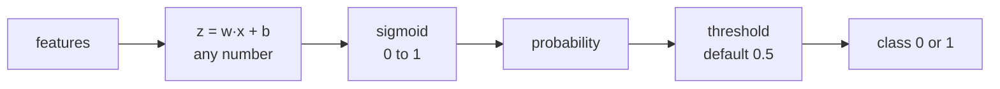

# Lesson 05 — Logistic Regression

**Goal:** predict a class, and control the trade-off you are making.

## What you will learn

- Why linear regression cannot classify
- The sigmoid, and probabilities
- The decision threshold — the knob nobody tells beginners about
- Imbalanced classes, and multi-class

---

## The problem with a line

You want a yes/no answer: will this customer churn? Fit a straight line to
0/1 labels and it will happily predict 1.4 and −0.2, which mean nothing.

Logistic regression fixes this by squashing the line through a function that
can only ever output a number between 0 and 1:

```text
z = w₁x₁ + ... + wₙxₙ + b          the same line as before
p = sigmoid(z) = 1 / (1 + e^(-z))  squashed into (0, 1)
```

```python
import numpy as np

def sigmoid(z):
    return 1 / (1 + np.exp(-z))

for z in [-4, -1, 0, 1, 4]:
    print(f"z={z:>3}  ->  p={sigmoid(z):.3f}")
```

```text
z= -4  ->  p=0.018
z= -1  ->  p=0.269
z=  0  ->  p=0.500
z=  1  ->  p=0.731
z=  4  ->  p=0.982
```



Despite the name, this is a **classifier**. The "regression" is the `z` part.

---

## Training it

```python
from sklearn.datasets import load_breast_cancer
from sklearn.model_selection import train_test_split
from sklearn.preprocessing import StandardScaler
from sklearn.pipeline import make_pipeline
from sklearn.linear_model import LogisticRegression
from sklearn.metrics import accuracy_score

X, y = load_breast_cancer(return_X_y=True)
X_train, X_test, y_train, y_test = train_test_split(
    X, y, test_size=0.2, random_state=42, stratify=y
)

model = make_pipeline(StandardScaler(), LogisticRegression(max_iter=5000))
model.fit(X_train, y_train)

print("accuracy:", round(accuracy_score(y_test, model.predict(X_test)), 3))
```

```text
accuracy: 0.982
```

Scaling is not optional here. Logistic regression is regularised by default in
scikit-learn, and the penalty treats all coefficients alike — which is only
fair if the features share a scale.

---

## predict_proba — the output you should actually use

```python
probabilities = model.predict_proba(X_test)

print(probabilities[:5].round(3))
print("classes:", model.classes_)
print("predicted:", model.predict(X_test[:5]))
```

```text
[[1.    0.   ]
 [0.    1.   ]
 [0.994 0.006]
 [0.466 0.534]
 [1.    0.   ]]
classes: [0 1]
predicted: [0 1 0 1 0]
```

Each row holds the probability of each class, summing to 1. Column 1 is the
probability of the positive class.

`predict()` is just `predict_proba()[:, 1] >= 0.5`. That 0.5 is a default,
not a law — and changing it is often the highest-value thing you can do.

---

## The threshold is a business decision

```python
import numpy as np
from sklearn.metrics import precision_score, recall_score

proba = model.predict_proba(X_test)[:, 1]

print(f"{'threshold':>10}{'precision':>12}{'recall':>9}{'flagged':>9}")
for threshold in [0.1, 0.3, 0.5, 0.7, 0.9]:
    predictions = (proba >= threshold).astype(int)
    print(f"{threshold:>10}{precision_score(y_test, predictions):>12.3f}"
          f"{recall_score(y_test, predictions):>9.3f}{predictions.sum():>9}")
```

```text
 threshold   precision   recall  flagged
       0.1       0.935    1.000       77
       0.3       0.973    1.000       74
       0.5       0.986    0.986       72
       0.7       0.985    0.931       68
       0.9       0.984    0.847       62
```

Lower the threshold and you catch more of the positives (recall up) at the
cost of more false alarms (precision down). Raise it and the reverse.

There is no correct threshold in general — only the one that matches the cost
of each kind of mistake:

- **Cancer screening.** A missed case is catastrophic, a false alarm means one
  more test. Threshold low, recall high.
- **Blocking a customer's card.** A false block angers a real customer. Higher
  threshold, or send it to a human.

Choose the threshold on the **validation** set, then report on test.

---

## Imbalanced classes

```python
import numpy as np
from sklearn.datasets import make_classification
from sklearn.model_selection import train_test_split
from sklearn.linear_model import LogisticRegression
from sklearn.preprocessing import StandardScaler
from sklearn.pipeline import make_pipeline
from sklearn.metrics import accuracy_score, recall_score

X, y = make_classification(n_samples=5000, n_features=10, weights=[0.97, 0.03],
                           random_state=42)
X_train, X_test, y_train, y_test = train_test_split(
    X, y, test_size=0.2, random_state=42, stratify=y
)
print("positive rate:", round(y.mean(), 3))

for label, weight in [("default", None), ("balanced", "balanced")]:
    model = make_pipeline(
        StandardScaler(), LogisticRegression(max_iter=5000, class_weight=weight)
    ).fit(X_train, y_train)
    predictions = model.predict(X_test)
    print(f"{label:<9} accuracy {accuracy_score(y_test, predictions):.3f}"
          f"   recall {recall_score(y_test, predictions):.3f}")
```

```text
positive rate: 0.036
default   accuracy 0.968   recall 0.139
balanced  accuracy 0.830   recall 0.806
```

Read those two rows carefully. The default model is **more accurate** and
finds fewer than one positive case in seven. If the positive class is fraud,
or churn, or disease, the accurate model is the useless one.

`class_weight="balanced"` tells the model that a mistake on the rare class
costs proportionally more. Accuracy drops fourteen points, recall goes from
0.14 to 0.81 — nearly six times as many real cases caught. That is a good
trade, and accuracy was the wrong metric all along — lesson 06.

Other tools for imbalance: lower the threshold, resample (SMOTE), or collect
more positives. Try the first two before the third.

---

## Coefficients and odds

```python
import numpy as np
import pandas as pd
from sklearn.datasets import load_breast_cancer
from sklearn.model_selection import train_test_split
from sklearn.preprocessing import StandardScaler
from sklearn.pipeline import make_pipeline
from sklearn.linear_model import LogisticRegression

data = load_breast_cancer()
X_train, _, y_train, _ = train_test_split(
    data.data, data.target, test_size=0.2, random_state=42, stratify=data.target
)
model = make_pipeline(StandardScaler(), LogisticRegression(max_iter=5000)).fit(X_train, y_train)

coefficients = pd.Series(
    model.named_steps["logisticregression"].coef_[0], index=data.feature_names
).sort_values(key=abs, ascending=False).head(5)

print(coefficients.round(3))
print("\nodds multiplier per 1 std:")
print(np.exp(coefficients).round(3))
```

```text
worst texture          -1.255
radius error           -1.083
worst concave points   -0.954
worst area             -0.948
worst radius           -0.948
dtype: float64

odds multiplier per 1 std:
worst texture           0.285
radius error            0.339
worst concave points    0.385
worst area              0.388
worst radius            0.388
dtype: float64
```

A coefficient is a change in **log-odds**. Exponentiate it and you get
something sayable: one standard deviation more "worst texture" multiplies the
odds of the positive class by 0.29 — it cuts them by about 70%.

This interpretability is why logistic regression survives in banking and
medicine long after fancier models arrive. When a regulator asks why someone
was refused, "the gradient boosting said so" is not an answer.

---

## More than two classes

```python
from sklearn.datasets import load_iris
from sklearn.model_selection import train_test_split
from sklearn.preprocessing import StandardScaler
from sklearn.pipeline import make_pipeline
from sklearn.linear_model import LogisticRegression

X, y = load_iris(return_X_y=True)
X_train, X_test, y_train, y_test = train_test_split(
    X, y, test_size=0.2, random_state=42, stratify=y
)

model = make_pipeline(StandardScaler(), LogisticRegression(max_iter=1000)).fit(X_train, y_train)

print("classes:", model.classes_)
print("probabilities:", model.predict_proba(X_test[:1]).round(3))
print("accuracy:", round(model.score(X_test, y_test), 3))
```

```text
classes: [0 1 2]
probabilities: [[0.979 0.021 0.   ]]
accuracy: 0.933
```

The same estimator handles many classes: softmax instead of sigmoid, one
probability per class, still summing to 1. You change nothing in your code.

---

## Common mistakes

| Mistake | What happens |
|---|---|
| Not scaling | Regularisation punishes large-unit features unfairly |
| Using `predict()` when you needed probabilities | You threw away the confidence |
| Leaving the threshold at 0.5 on imbalanced data | The rare class is never predicted |
| Judging an imbalanced problem by accuracy | 97% accurate, catches nothing |
| Reporting a threshold chosen on the test set | A number that will not hold up |
| `max_iter` too low | `ConvergenceWarning`, and a half-trained model |

---

## Exercises

1. Plot the sigmoid from −10 to 10 and mark where `p = 0.5`.
2. Train on an imbalanced set with and without `class_weight="balanced"`;
   report accuracy and recall for both.
3. Sweep the threshold from 0.05 to 0.95 and plot precision and recall.
   Choose a threshold and justify it in one sentence.
4. Exponentiate the coefficients and explain the top three in plain words.
