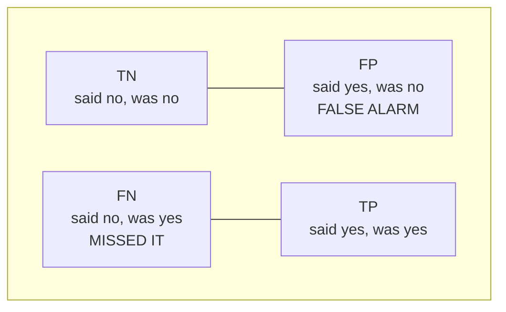

# Lesson 06 — Evaluation Metrics

**Goal:** pick the number that reflects what the mistake actually costs.

## What you will learn

- The confusion matrix
- Precision, recall, F1 — and when each one is the right one
- ROC-AUC and average precision
- Regression metrics, and the baseline you must beat

---

## Accuracy lies

```python
import numpy as np
from sklearn.metrics import accuracy_score

y_true = np.array([0] * 970 + [1] * 30)       # 3% positive
y_pred = np.zeros(1000, dtype=int)            # predict "no" every time

print("accuracy:", accuracy_score(y_true, y_pred))
```

```text
accuracy: 0.97
```

A model that has learned nothing scores 97%. Any time the classes are
imbalanced — fraud, disease, churn, defects — accuracy measures the imbalance,
not the model.

---

## The confusion matrix

Everything else is built from four counts.



```python
import numpy as np
from sklearn.metrics import confusion_matrix

y_true = np.array([1, 1, 1, 1, 0, 0, 0, 0, 0, 0])
y_pred = np.array([1, 1, 0, 0, 0, 0, 0, 0, 1, 0])

matrix = confusion_matrix(y_true, y_pred)
print(matrix)

tn, fp, fn, tp = matrix.ravel()
print(f"TN={tn}  FP={fp}  FN={fn}  TP={tp}")
```

```text
[[5 1]
 [2 2]]
TN=5  FP=1  FN=2  TP=2
```

Rows are truth, columns are prediction. Read the off-diagonal first: that is
where the model is wrong, and the two cells usually cost very different
amounts.

---

## Precision and recall

```text
precision = TP / (TP + FP)    of everything I flagged, how much was right?
recall    = TP / (TP + FN)    of everything real, how much did I catch?
```

```python
from sklearn.metrics import precision_score, recall_score, f1_score
import numpy as np

y_true = np.array([1, 1, 1, 1, 0, 0, 0, 0, 0, 0])
y_pred = np.array([1, 1, 0, 0, 0, 0, 0, 0, 1, 0])

print("precision:", round(precision_score(y_true, y_pred), 3))
print("recall:   ", round(recall_score(y_true, y_pred), 3))
print("f1:       ", round(f1_score(y_true, y_pred), 3))
```

```text
precision: 0.667
recall:    0.5
f1:        0.571
```

They pull against each other. Flag everything and recall hits 1.0 while
precision collapses; flag only the certain cases and precision rises while
recall falls.

**Which one to optimise is a question about cost, not about statistics:**

| Situation | Care about | Because |
|---|---|---|
| Cancer screening | **Recall** | A missed case can be fatal; a false alarm is another test |
| Spam filter | **Precision** | A real email in the spam folder is worse than spam in the inbox |
| Fraud review queue | Depends on capacity | Analysts can only review so many per day |
| Balanced, symmetric costs | **F1** or accuracy | Neither error dominates |

F1 is their harmonic mean — one number when both matter. It is the default
report, not the default decision.

---

## The full report

```python
from sklearn.datasets import make_classification
from sklearn.model_selection import train_test_split
from sklearn.linear_model import LogisticRegression
from sklearn.preprocessing import StandardScaler
from sklearn.pipeline import make_pipeline
from sklearn.metrics import classification_report

X, y = make_classification(n_samples=2000, n_features=10, n_informative=3,
                           weights=[0.9, 0.1], flip_y=0.05, class_sep=0.8,
                           random_state=0)
X_train, X_test, y_train, y_test = train_test_split(
    X, y, test_size=0.3, random_state=0, stratify=y
)

model = make_pipeline(StandardScaler(), LogisticRegression(max_iter=1000)).fit(X_train, y_train)
print(classification_report(y_test, model.predict(X_test), digits=3))
```

```text
              precision    recall  f1-score   support

           0      0.885     1.000     0.939       530
           1      1.000     0.014     0.028        70

    accuracy                          0.885       600
   macro avg      0.942     0.507     0.484       600
weighted avg      0.898     0.885     0.833       600
```

Look at row 1. Precision 1.000 and recall 0.014: of seventy real positives the
model found **one**, and happened to be right about it. The headline accuracy
is 0.885 and the model is worthless.

Three columns worth naming:

- **support** — how many real examples of that class exist. Seventy positives
  means every metric on row 1 is noisy; do not read the third decimal.
- **macro avg** — the unweighted mean across classes. It treats the rare class
  as equally important, which is why it sits at 0.484 and tells the truth.
- **weighted avg** — weighted by support, so the majority class dominates: it
  reports 0.833 and flatters you.

For imbalanced problems, read **macro avg** and the rare class's own row.

---

## ROC-AUC and average precision

Both judge the ranking, across every threshold at once — so they answer "is
the model separating the classes?" independently of where you set the cut.

```python
from sklearn.datasets import make_classification
from sklearn.model_selection import train_test_split
from sklearn.linear_model import LogisticRegression
from sklearn.preprocessing import StandardScaler
from sklearn.pipeline import make_pipeline
from sklearn.metrics import roc_auc_score, average_precision_score

X, y = make_classification(n_samples=2000, n_features=10, n_informative=3,
                           weights=[0.9, 0.1], flip_y=0.05, class_sep=0.8,
                           random_state=0)
X_train, X_test, y_train, y_test = train_test_split(
    X, y, test_size=0.3, random_state=0, stratify=y
)
model = make_pipeline(StandardScaler(), LogisticRegression(max_iter=1000)).fit(X_train, y_train)
proba = model.predict_proba(X_test)[:, 1]

print("ROC-AUC:          ", round(roc_auc_score(y_test, proba), 3))
print("average precision:", round(average_precision_score(y_test, proba), 3))
```

```text
ROC-AUC:           0.695
average precision: 0.328
```

| Value | Means |
|---|---|
| 0.5 | Random — the model ranks no better than a coin |
| 0.7 – 0.8 | Usable |
| 0.8 – 0.9 | Good |
| > 0.95 | Excellent, **or** you have a leak — go and check |

ROC-AUC has one weakness: with a very rare positive class it stays optimistic,
because the huge number of true negatives dilutes the false positives.
**Average precision** (the area under the precision-recall curve) does not,
which makes it the better headline number for rare events.

---

## Regression metrics

```python
import numpy as np
from sklearn.metrics import mean_absolute_error, mean_squared_error, r2_score

y_true = np.array([100.0, 150.0, 200.0, 250.0, 300.0])
y_pred = np.array([110.0, 140.0, 210.0, 240.0, 400.0])   # last one badly wrong

print("MAE: ", round(mean_absolute_error(y_true, y_pred), 2))
print("RMSE:", round(np.sqrt(mean_squared_error(y_true, y_pred)), 2))
print("R²:  ", round(r2_score(y_true, y_pred), 3))
```

```text
MAE:  28.0
RMSE: 45.61
R²:   0.584
```

Four errors of 10 and one of 100. MAE says 28; RMSE says 45.6. The gap between
them **is** the outlier — when RMSE is much larger than MAE, a few big misses
are driving your error, and that is usually worth investigating separately.

| Metric | Use when |
|---|---|
| MAE | Every unit of error costs the same |
| RMSE | Large errors are disproportionately bad |
| MAPE | You need a percentage — but it explodes near zero |
| R² | Explaining "how much of the variation do we capture" |

---

## Always beat a baseline

A score means nothing on its own. Compare it to the dumbest possible model.

```python
from sklearn.datasets import make_classification
from sklearn.model_selection import train_test_split
from sklearn.dummy import DummyClassifier
from sklearn.linear_model import LogisticRegression
from sklearn.preprocessing import StandardScaler
from sklearn.pipeline import make_pipeline
from sklearn.metrics import f1_score

X, y = make_classification(n_samples=2000, n_features=10, n_informative=3,
                           weights=[0.9, 0.1], flip_y=0.05, class_sep=0.8,
                           random_state=0)
X_train, X_test, y_train, y_test = train_test_split(
    X, y, test_size=0.3, random_state=0, stratify=y
)

dummy = DummyClassifier(strategy="most_frequent").fit(X_train, y_train)
model = make_pipeline(StandardScaler(), LogisticRegression(max_iter=1000)).fit(X_train, y_train)

print("dummy    accuracy", round(dummy.score(X_test, y_test), 3),
      " f1", round(f1_score(y_test, dummy.predict(X_test), zero_division=0), 3))
print("logistic accuracy", round(model.score(X_test, y_test), 3),
      " f1", round(f1_score(y_test, model.predict(X_test)), 3))
```

```text
dummy    accuracy 0.883  f1 0.0
logistic accuracy 0.885  f1 0.028
```

The dummy is 88.3% accurate by predicting "no" every time. The trained model
reaches 88.5% — two tenths of a point better, which is nothing. Without that
comparison, 88.5% reads like a decent model; with it, the truth is obvious.

This is what a failed problem looks like, and it is a normal thing to find.
The response is lesson 02 and lesson 08 — better features, then a model that
can use them — not another round of hyperparameter tuning.

Use `DummyClassifier` and `DummyRegressor` at the start of every project.
They cost one line and they tell you whether the problem is even hard.

---

## Choosing, in one table

| Problem | Report |
|---|---|
| Balanced classification | Accuracy, F1, confusion matrix |
| Imbalanced classification | Macro F1, average precision, the rare class's recall |
| Ranking / scoring | ROC-AUC, average precision |
| Regression | MAE and RMSE together, plus R² |
| Anything | The baseline, next to your model |

---

## Common mistakes

| Mistake | What happens |
|---|---|
| Accuracy on imbalanced data | A useless model looks excellent |
| One metric only | You optimise a number nobody asked for |
| No baseline | You cannot tell whether the model did anything |
| Reading `weighted avg` on imbalanced data | The majority class hides the failure |
| Reporting to four decimals on 60 samples | Precision you do not have |
| Threshold chosen on the test set | The number will not survive production |

---

## Exercises

1. Build a confusion matrix by hand from 20 predictions, then check it with
   scikit-learn.
2. For a spam filter, a cancer test and a hiring screen: which of precision or
   recall matters more, and why? Two sentences each.
3. Compare ROC-AUC and average precision on data with 1% positives.
4. Add a `DummyClassifier` to any project you have and report both scores.
