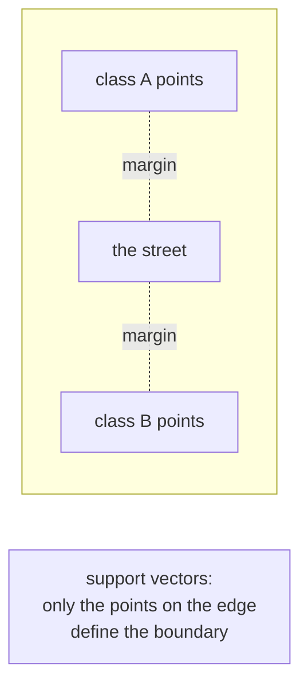

# Lesson 07 — KNN and SVM

**Goal:** two models built on distance, and what that implies.

## What you will learn

- K-nearest neighbours: no training at all
- Choosing `k`
- Support vector machines and the margin
- The kernel trick, in plain words

---

## KNN — the simplest idea in machine learning

To classify a new point: find the `k` closest points you have seen, and take
the majority vote.


There is no training. The model *is* the dataset.

```python
from sklearn.datasets import load_iris
from sklearn.model_selection import train_test_split
from sklearn.neighbors import KNeighborsClassifier
from sklearn.preprocessing import StandardScaler
from sklearn.pipeline import make_pipeline

X, y = load_iris(return_X_y=True)
X_train, X_test, y_train, y_test = train_test_split(
    X, y, test_size=0.2, random_state=42, stratify=y
)

model = make_pipeline(StandardScaler(), KNeighborsClassifier(n_neighbors=5))
model.fit(X_train, y_train)

print("accuracy:", round(model.score(X_test, y_test), 3))
```

```text
accuracy: 0.933
```

---

## Scaling is not optional here

```python
from sklearn.datasets import make_classification
from sklearn.model_selection import train_test_split
from sklearn.neighbors import KNeighborsClassifier
from sklearn.preprocessing import StandardScaler
from sklearn.pipeline import make_pipeline
import numpy as np

X, y = make_classification(n_samples=600, n_features=6, n_informative=3,
                           n_redundant=0, random_state=0)
X[:, 0] *= 10_000            # one column now has huge units

X_train, X_test, y_train, y_test = train_test_split(X, y, test_size=0.3, random_state=0)

raw = KNeighborsClassifier().fit(X_train, y_train)
scaled = make_pipeline(StandardScaler(), KNeighborsClassifier()).fit(X_train, y_train)

print("unscaled:", round(raw.score(X_test, y_test), 3))
print("scaled:  ", round(scaled.score(X_test, y_test), 3))
```

```text
unscaled: 0.489
scaled:   0.817
```

One column measured in different units and the model dropped to worse than a
coin toss. KNN sees only distance, and distance is dominated by whichever
column has the largest numbers — the other five stopped existing. The same is
true of SVM and K-Means.

---

## Choosing k

```python
from sklearn.datasets import load_breast_cancer
from sklearn.model_selection import cross_val_score
from sklearn.neighbors import KNeighborsClassifier
from sklearn.preprocessing import StandardScaler
from sklearn.pipeline import make_pipeline

X, y = load_breast_cancer(return_X_y=True)

for k in [1, 3, 5, 15, 51]:
    model = make_pipeline(StandardScaler(), KNeighborsClassifier(n_neighbors=k))
    scores = cross_val_score(model, X, y, cv=5)
    print(f"k={k:<3} accuracy {scores.mean():.3f} ± {scores.std():.3f}")
```

```text
k=1   accuracy 0.954 ± 0.018
k=3   accuracy 0.960 ± 0.019
k=5   accuracy 0.965 ± 0.010
k=15  accuracy 0.961 ± 0.013
k=51  accuracy 0.951 ± 0.018
```

- **k = 1** — the model copies the training set exactly, noise included. Low
  bias, high variance: overfitting.
- **k too large** — the vote is drowned by distant points and every prediction
  drifts towards the majority class: underfitting.

Use an odd `k` for two classes so the vote cannot tie, and tune it rather than
accepting the default 5.

---

## What KNN costs

| | Cost |
|---|---|
| Training | O(1) — it stores the data |
| Predicting one point | O(n × d) — compares against everything |
| Memory | The whole training set, forever |

That is backwards from every other model in this course, and it is why KNN
rarely survives to production: prediction is the expensive part, and it gets
slower as your dataset grows. It is excellent as a baseline and on small data.

It also suffers badly from the **curse of dimensionality**: in high dimensions
every point becomes roughly equidistant from every other, and "nearest" stops
meaning anything. Above ~20 features, reduce dimensions first or use something
else.

---

## SVM — the widest street

A linear SVM does not just find *a* separating line. It finds the one with the
largest **margin** — the widest empty corridor between the classes.



Only the points on the edge — the *support vectors* — matter. Move a point far
from the boundary and the model does not change at all.

```python
from sklearn.datasets import load_breast_cancer
from sklearn.model_selection import train_test_split
from sklearn.svm import SVC
from sklearn.preprocessing import StandardScaler
from sklearn.pipeline import make_pipeline

X, y = load_breast_cancer(return_X_y=True)
X_train, X_test, y_train, y_test = train_test_split(
    X, y, test_size=0.2, random_state=42, stratify=y
)

model = make_pipeline(StandardScaler(), SVC(kernel="linear", C=1.0)).fit(X_train, y_train)

print("accuracy:", round(model.score(X_test, y_test), 3))
print("support vectors:", model.named_steps["svc"].n_support_)
```

```text
accuracy: 0.974
support vectors: [15 17]
```

Thirty-two points out of 455 define the entire boundary. The rest could be
deleted and the model would be identical.

---

## The kernel trick

When classes cannot be separated by a straight line, an SVM can act as if the
data had been lifted into a higher dimension where they can — without ever
computing those coordinates.

```python
import numpy as np
from sklearn.datasets import make_circles
from sklearn.model_selection import train_test_split
from sklearn.svm import SVC
from sklearn.preprocessing import StandardScaler
from sklearn.pipeline import make_pipeline

X, y = make_circles(n_samples=500, noise=0.08, factor=0.4, random_state=0)
X_train, X_test, y_train, y_test = train_test_split(
    X, y, test_size=0.3, random_state=0, stratify=y
)

for kernel in ["linear", "rbf"]:
    model = make_pipeline(StandardScaler(), SVC(kernel=kernel)).fit(X_train, y_train)
    print(f"{kernel:<7} accuracy {model.score(X_test, y_test):.3f}")
```

```text
linear  accuracy 0.627
rbf     accuracy 1.000
```

One circle inside another. No straight line can separate them, so the linear
kernel lands near chance. The RBF kernel — which measures similarity as "how
close are these two points?" — separates them perfectly.

Kernels available: `linear`, `rbf` (the default and the right first try),
`poly`, `sigmoid`.

---

## The two knobs

```python
from sklearn.datasets import load_breast_cancer
from sklearn.model_selection import cross_val_score
from sklearn.svm import SVC
from sklearn.preprocessing import StandardScaler
from sklearn.pipeline import make_pipeline

X, y = load_breast_cancer(return_X_y=True)

for C in [0.01, 1, 100]:
    for gamma in ["scale", 0.5]:
        model = make_pipeline(StandardScaler(), SVC(C=C, gamma=gamma))
        score = cross_val_score(model, X, y, cv=5).mean()
        print(f"C={C:<6} gamma={str(gamma):<6} accuracy {score:.3f}")
```

```text
C=0.01   gamma=scale  accuracy 0.627
C=0.01   gamma=0.5    accuracy 0.627
C=1      gamma=scale  accuracy 0.974
C=1      gamma=0.5    accuracy 0.803
C=100    gamma=scale  accuracy 0.958
C=100    gamma=0.5    accuracy 0.807
```

- **`C`** — how much to punish misclassified training points. Low `C` accepts
  mistakes for a wider margin (more regularised); high `C` insists on getting
  training points right (risking overfit).
- **`gamma`** — how far one point's influence reaches in the RBF kernel. Large
  `gamma` means very local influence, and the model wraps tightly around
  individual points. Here `gamma=0.5` costs seventeen points at every value of
  `C`, and `C=0.01` is so regularised that the model predicts the majority
  class and scores exactly the class balance, 0.627.

Leave `gamma="scale"` unless you are tuning deliberately, and tune `C` on a
log scale.

---

## KNN or SVM or neither

| | KNN | SVM |
|---|---|---|
| Training | Instant | Slow — roughly O(n²) to O(n³) |
| Prediction | Slow | Fast |
| Scales to 100k+ rows | Poorly | Poorly (use `LinearSVC` or SGD) |
| Needs scaling | Yes | Yes |
| Probabilities | Yes, from vote fractions | Only with `probability=True`, which costs a refit |
| Interpretable | "These five neighbours" | Not really |

Both are worth knowing and neither is the default choice for tabular data in
2026 — that is gradient boosting, lesson 09. Reach for KNN as a quick baseline
on small data, and for SVM on small-to-medium datasets with clear margins,
especially text after TF-IDF.

---

## Common mistakes

| Mistake | What happens |
|---|---|
| Not scaling | The largest-unit feature decides everything |
| `k=1` | Perfect training score, noisy predictions |
| Even `k` in binary classification | Ties |
| KNN on 100k rows in production | Every prediction scans the dataset |
| SVM on a million rows | It never finishes — use `LinearSVC`/`SGDClassifier` |
| Tuning `gamma` without tuning `C` | They interact; grid them together |

---

## Exercises

1. Plot KNN accuracy for k = 1…30 and mark the best value.
2. Show the scaling effect: fit KNN with and without `StandardScaler` on data
   where one column is multiplied by 1,000.
3. On `make_circles`, compare linear and RBF kernels and explain the gap.
4. Grid-search `C` and `gamma` together; report the best pair and its score.
