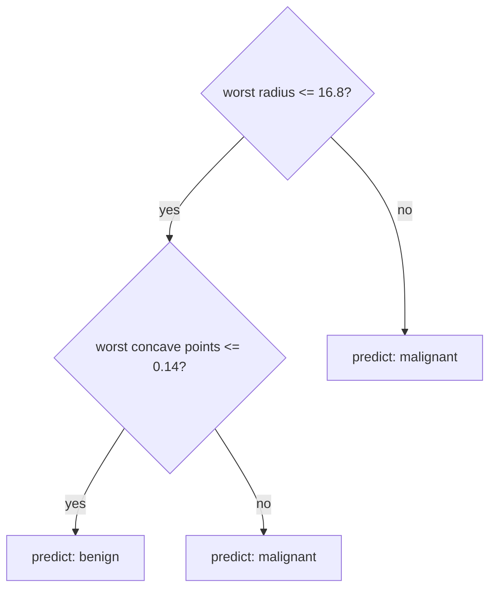
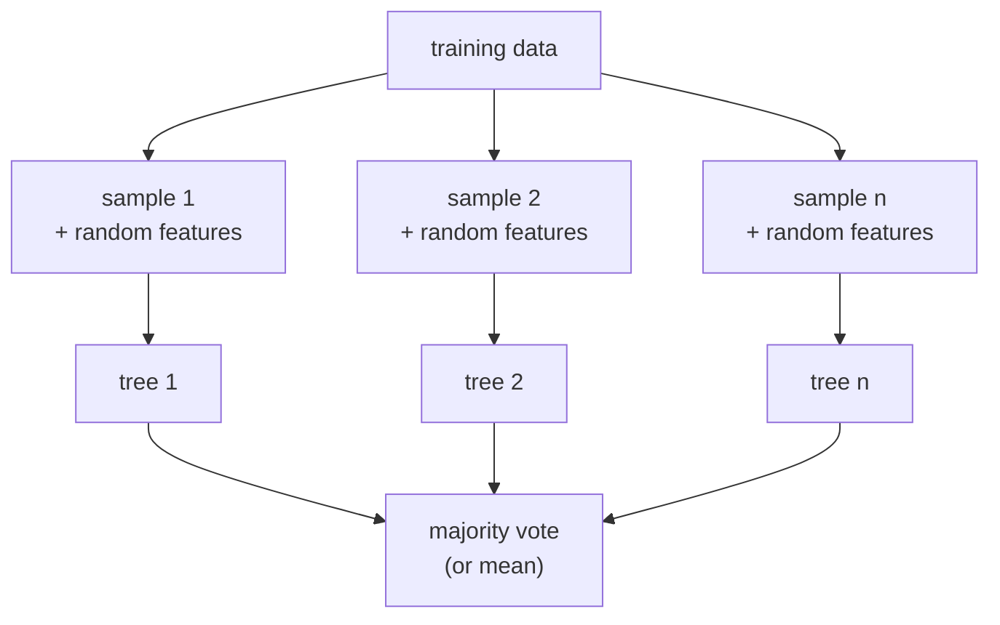

# Lesson 08 — Decision Trees and Random Forests

**Goal:** models that need no scaling, handle non-linearity, and explain
themselves.

## What you will learn

- How a tree splits
- Controlling depth — the only real defence against overfitting
- Random forests: many weak trees, voting
- Feature importance, and how it misleads

---

## A tree is a sequence of questions



At each node the tree asks one yes/no question about one feature, chosen to
make the two resulting groups as pure as possible — as close as it can get to
"all one class". It repeats until a stopping rule fires.

```python
from sklearn.datasets import load_breast_cancer
from sklearn.model_selection import train_test_split
from sklearn.tree import DecisionTreeClassifier, export_text

data = load_breast_cancer()
X_train, X_test, y_train, y_test = train_test_split(
    data.data, data.target, test_size=0.2, random_state=42, stratify=data.target
)

tree = DecisionTreeClassifier(max_depth=2, random_state=42).fit(X_train, y_train)

print("accuracy:", round(tree.score(X_test, y_test), 3))
print(export_text(tree, feature_names=list(data.feature_names)))
```

```text
accuracy: 0.895
|--- worst radius <= 16.80
|   |--- worst concave points <= 0.14
|   |   |--- class: 1
|   |--- worst concave points >  0.14
|   |   |--- class: 0
|--- worst radius >  16.80
|   |--- texture error <= 0.47
|   |   |--- class: 1
|   |--- texture error >  0.47
|   |   |--- class: 0
```

Two questions deep, 89.5% accuracy, and you can read the whole model aloud.
Nothing else in this course is this transparent.

**No scaling needed.** A tree compares a feature to a threshold; multiplying a
column by 1,000 moves the threshold and changes nothing else. The same goes
for forests and boosting.

---

## Depth is the overfitting knob

```python
from sklearn.datasets import load_breast_cancer
from sklearn.model_selection import train_test_split
from sklearn.tree import DecisionTreeClassifier

X, y = load_breast_cancer(return_X_y=True)
X_train, X_test, y_train, y_test = train_test_split(
    X, y, test_size=0.2, random_state=42, stratify=y
)

print(f"{'depth':>6}{'train':>9}{'test':>8}{'leaves':>8}")
for depth in [1, 2, 3, 5, 10, None]:
    tree = DecisionTreeClassifier(max_depth=depth, random_state=42).fit(X_train, y_train)
    print(f"{str(depth):>6}{tree.score(X_train, y_train):>9.3f}"
          f"{tree.score(X_test, y_test):>8.3f}{tree.get_n_leaves():>8}")
```

```text
 depth    train    test  leaves
     1    0.923   0.921       2
     2    0.958   0.895       4
     3    0.976   0.939       7
     5    0.993   0.921      15
    10    1.000   0.912      19
  None    1.000   0.912      19
```

The best test score is at depth 3. Past it the training score climbs to a
perfect 1.000 while the test score *falls* — the tree is growing leaves for
individual stubborn rows. This is overfitting made visible, in six lines.

The knobs that stop it:

| Parameter | Does |
|---|---|
| `max_depth` | Hard limit on question depth — the one to tune first |
| `min_samples_leaf` | A leaf must hold at least this many rows |
| `min_samples_split` | A node needs this many rows before it may split |
| `max_features` | How many features to consider per split |
| `ccp_alpha` | Cost-complexity pruning — prunes back after growing |

Start with `max_depth` between 3 and 8, and `min_samples_leaf` around 1% of
your data.

---

## Random forest — many trees, one answer

One deep tree overfits. Train hundreds of them, each on a different random
sample of rows and a random subset of features, and average their votes: the
individual errors are uncorrelated enough to cancel.



```python
from sklearn.datasets import load_breast_cancer
from sklearn.model_selection import train_test_split
from sklearn.tree import DecisionTreeClassifier
from sklearn.ensemble import RandomForestClassifier

X, y = load_breast_cancer(return_X_y=True)
X_train, X_test, y_train, y_test = train_test_split(
    X, y, test_size=0.2, random_state=42, stratify=y
)

tree = DecisionTreeClassifier(random_state=42).fit(X_train, y_train)
forest = RandomForestClassifier(n_estimators=300, random_state=42, n_jobs=-1).fit(X_train, y_train)

print("single tree:  ", round(tree.score(X_test, y_test), 3))
print("random forest:", round(forest.score(X_test, y_test), 3))
```

```text
single tree:   0.912
random forest: 0.947
```

Three and a half points, for one word changed, with no tuning and no scaling.
This is why "start with a random forest" is standard advice: it is hard to
make one embarrassingly bad.

The parameters that matter:

| Parameter | Guidance |
|---|---|
| `n_estimators` | More is better and slower; 300–500 is plenty. It cannot overfit by being too large |
| `max_depth` | Usually leave unlimited — the averaging handles it |
| `max_features` | `"sqrt"` for classification; lower it to decorrelate further |
| `class_weight` | `"balanced"` for imbalanced targets |
| `n_jobs=-1` | Use every core — free speed |

---

## Feature importance, and its trap

```python
import pandas as pd
from sklearn.datasets import load_breast_cancer
from sklearn.model_selection import train_test_split
from sklearn.ensemble import RandomForestClassifier

data = load_breast_cancer()
X_train, X_test, y_train, y_test = train_test_split(
    data.data, data.target, test_size=0.2, random_state=42, stratify=data.target
)
forest = RandomForestClassifier(n_estimators=300, random_state=42, n_jobs=-1).fit(X_train, y_train)

importances = pd.Series(forest.feature_importances_, index=data.feature_names)
print(importances.sort_values(ascending=False).head(5).round(4))
```

```text
worst perimeter         0.1373
worst area              0.1373
worst concave points    0.1155
mean concave points     0.0918
worst radius            0.0841
dtype: float64
```

Useful — and biased in two ways you must know about:

1. It **favours high-cardinality features.** A column with many distinct
   values offers more possible split points, so it wins more splits.
2. It **splits credit between correlated features.** `worst radius`,
   `worst perimeter` and `worst area` measure nearly the same thing; the
   importance is shared three ways and each looks less important than the
   concept is.

`permutation_importance` is the more honest measure: shuffle one column and
see how much the score drops.

```python
from sklearn.inspection import permutation_importance
import pandas as pd

result = permutation_importance(forest, X_test, y_test, n_repeats=10,
                                random_state=42, n_jobs=-1)
ranked = pd.Series(result.importances_mean, index=data.feature_names)
print(ranked.sort_values(ascending=False).head(5).round(4))
```

```text
mean concave points        0.0026
mean radius                0.0000
mean fractal dimension     0.0000
fractal dimension error    0.0000
symmetry error             0.0000
dtype: float64
```

Measured on the **test** set, in units of "accuracy lost when this column is
destroyed". And almost every value is zero — which is the second bias above,
seen from the other side: these thirty features are heavily correlated, so
destroying any single one costs nothing. The forest simply reads the same
information off its twin.

Two lessons in that table. Permutation importance answers "what would I lose
by dropping this column **alone**", which is the right question for feature
selection and the wrong one for "what drives this outcome". And neither
measure is causal: high importance means the model leans on the column, not
that changing it changes reality.

---

## Regression works the same way

```python
from sklearn.datasets import fetch_california_housing
from sklearn.model_selection import train_test_split
from sklearn.ensemble import RandomForestRegressor
from sklearn.metrics import mean_absolute_error, r2_score

data = fetch_california_housing()
X_train, X_test, y_train, y_test = train_test_split(
    data.data, data.target, test_size=0.2, random_state=42
)

forest = RandomForestRegressor(n_estimators=200, random_state=42, n_jobs=-1).fit(X_train, y_train)
predictions = forest.predict(X_test)

print("MAE:", round(mean_absolute_error(y_test, predictions), 3))
print("R²: ", round(r2_score(y_test, predictions), 3))
```

```text
MAE: 0.327
R²:  0.806
```

Compare with lesson 04: linear regression got MAE 0.533 and R² 0.576 on the
same split. The relationship is not linear, and a model that can bend fits it
far better.

**But a forest cannot extrapolate.** Every prediction is an average of
training labels, so it can never output a value outside the range it has seen.
For trends that continue upward — prices over time — a linear model is not
merely simpler, it is the only one of the two that can be right.

---

## Common mistakes

| Mistake | What happens |
|---|---|
| Unlimited depth on a single tree | Perfect training score, poor test score |
| Scaling before a tree | Harmless, but you wasted your time |
| Reading `feature_importances_` as truth | Biased by cardinality and correlation |
| Treating importance as causation | Confident, expensive, wrong decisions |
| Forest for extrapolation | Predictions flatten outside the training range |
| `n_estimators=10` | Unstable — the averaging needs numbers |

---

## Exercises

1. Print a `max_depth=3` tree with `export_text` and read it aloud as rules.
2. Plot train and test accuracy against depth from 1 to 20; mark the best.
3. Compare a single tree, a 10-tree forest and a 300-tree forest.
4. Compare `feature_importances_` with `permutation_importance` and explain any
   disagreement.
