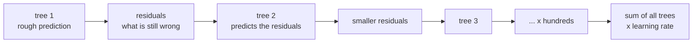

# Lesson 09 — Gradient Boosting

**Goal:** the model that wins on tabular data, and how to use it properly.

## What you will learn

- Boosting versus bagging
- `HistGradientBoosting` in scikit-learn
- XGBoost and LightGBM
- Early stopping and the parameters that matter

---

## The idea: correct your own mistakes

A random forest builds hundreds of trees **in parallel**, each on a different
sample, and averages them. Boosting builds trees **in sequence**, and each new
tree is trained on what the previous ones got wrong.



| | Bagging (forest) | Boosting |
|---|---|---|
| Trees are built | In parallel, independently | In sequence, each fixing the last |
| Each tree is | Deep, low bias, high variance | Shallow, weak on its own |
| Combining | Vote / average | Weighted sum |
| Main failure | Rarely overfits | **Overfits if you let it run too long** |
| Tuning | Forgiving | Needs care — and pays for it |

---

## The built-in one

```python
from sklearn.datasets import load_breast_cancer
from sklearn.model_selection import train_test_split
from sklearn.ensemble import HistGradientBoostingClassifier, RandomForestClassifier

X, y = load_breast_cancer(return_X_y=True)
X_train, X_test, y_train, y_test = train_test_split(
    X, y, test_size=0.2, random_state=42, stratify=y
)

forest = RandomForestClassifier(n_estimators=300, random_state=42, n_jobs=-1).fit(X_train, y_train)
boosted = HistGradientBoostingClassifier(random_state=42).fit(X_train, y_train)

print("random forest:    ", round(forest.score(X_test, y_test), 3))
print("gradient boosting:", round(boosted.score(X_test, y_test), 3))
```

```text
random forest:     0.947
gradient boosting: 0.974
```

`HistGradientBoosting` ships with scikit-learn, needs no extra install, is
fast, and **handles missing values natively** — no imputer required. For most
problems it is all you need.

---

## The learning rate and the number of trees

These two are one decision. The learning rate shrinks each tree's
contribution, so a smaller rate needs more trees to reach the same place — and
usually generalises better.

```python
from sklearn.datasets import fetch_california_housing
from sklearn.model_selection import train_test_split
from sklearn.ensemble import HistGradientBoostingRegressor
from sklearn.metrics import mean_absolute_error

data = fetch_california_housing()
X_train, X_test, y_train, y_test = train_test_split(
    data.data, data.target, test_size=0.2, random_state=42
)

for rate in [0.01, 0.1, 0.5]:
    for iterations in [50, 300]:
        model = HistGradientBoostingRegressor(
            learning_rate=rate, max_iter=iterations,
            early_stopping=False, random_state=42
        ).fit(X_train, y_train)
        mae = mean_absolute_error(y_test, model.predict(X_test))
        print(f"lr={rate:<5} trees={iterations:<4} MAE {mae:.3f}")
```

```text
lr=0.01  trees=50   MAE 0.678
lr=0.01  trees=300  MAE 0.363
lr=0.1   trees=50   MAE 0.327
lr=0.1   trees=300  MAE 0.288
lr=0.5   trees=50   MAE 0.318
lr=0.5   trees=300  MAE 0.324
```

Read the pattern. At lr=0.01 with 50 trees the model has barely started
learning — MAE 0.678, more than twice the best. At lr=0.5 more trees make it
*worse* (0.318 → 0.324): it has started fitting noise. The best cell is the
slow-and-many corner, and that is the usual recipe — **a low learning rate
with many trees, stopped automatically**.

---

## Early stopping — let it decide

```python
from sklearn.datasets import fetch_california_housing
from sklearn.model_selection import train_test_split
from sklearn.ensemble import HistGradientBoostingRegressor
from sklearn.metrics import mean_absolute_error

data = fetch_california_housing()
X_train, X_test, y_train, y_test = train_test_split(
    data.data, data.target, test_size=0.2, random_state=42
)

model = HistGradientBoostingRegressor(
    learning_rate=0.05,
    max_iter=2000,                 # an upper bound, not a target
    early_stopping=True,
    validation_fraction=0.1,       # held out from the training set
    n_iter_no_change=20,           # stop after 20 rounds with no gain
    random_state=42,
).fit(X_train, y_train)

print("trees actually built:", model.n_iter_)
print("MAE:", round(mean_absolute_error(y_test, model.predict(X_test)), 3))
```

```text
trees actually built: 722
MAE: 0.291
```

It asked for up to 2,000 and stopped at 722, because the next twenty trees
stopped improving the internal validation split. This is the single most
useful setting in boosting: set `max_iter` generously and let early stopping
find the number.

The validation split here is carved out of your **training** data — your test
set is still untouched.

---

## XGBoost and LightGBM

Same algorithm, different implementations. These two dominate Kaggle and most
production tabular systems.

```python
# pip install xgboost lightgbm
from xgboost import XGBClassifier
from lightgbm import LGBMClassifier

xgb = XGBClassifier(
    n_estimators=1000,
    learning_rate=0.05,
    max_depth=6,
    subsample=0.8,              # rows sampled per tree
    colsample_bytree=0.8,       # features sampled per tree
    early_stopping_rounds=50,
    eval_metric="logloss",
    random_state=42,
)
xgb.fit(X_train, y_train, eval_set=[(X_val, y_val)], verbose=False)

lgbm = LGBMClassifier(n_estimators=1000, learning_rate=0.05, num_leaves=31,
                      random_state=42, verbose=-1)
```

| | Strength |
|---|---|
| `HistGradientBoosting` | No install, native missing values, good defaults |
| XGBoost | The most battle-tested; excellent documentation |
| LightGBM | Fastest on large data; handles categories natively |
| CatBoost | Best with many categorical columns, strong defaults |

Learn one properly. They differ by a point or two, and a point of tuning is
worth far less than an hour of feature work.

---

## Parameters that matter, in order

1. **`learning_rate`** — 0.01 to 0.1. Lower is better if you can afford trees.
2. **`n_estimators` / `max_iter`** — set high, control with early stopping.
3. **`max_depth`** (3–8) or **`num_leaves`** — the main complexity knob.
4. **`min_child_samples` / `min_samples_leaf`** — raise it on noisy data.
5. **`subsample`, `colsample_bytree`** (0.7–0.9) — randomness that regularises.
6. **`reg_lambda`, `reg_alpha`** — L2/L1 penalties, if still overfitting.

Tune with `RandomizedSearchCV` rather than a full grid: with six parameters, a
grid is a combinatorial trap and random search finds a good region far faster.

---

## Overfitting looks like this

```python
from sklearn.datasets import load_breast_cancer
from sklearn.model_selection import train_test_split
from sklearn.ensemble import HistGradientBoostingClassifier

X, y = load_breast_cancer(return_X_y=True)
X_train, X_test, y_train, y_test = train_test_split(
    X, y, test_size=0.2, random_state=42, stratify=y
)

for iterations in [5, 50, 500]:
    model = HistGradientBoostingClassifier(
        max_iter=iterations, learning_rate=0.3, early_stopping=False, random_state=42
    ).fit(X_train, y_train)
    print(f"trees={iterations:<4} train {model.score(X_train, y_train):.3f}"
          f"   test {model.score(X_test, y_test):.3f}")
```

```text
trees=5    train 0.974   test 0.939
trees=50   train 1.000   test 0.974
trees=500  train 1.000   test 0.965
```

The training score hits 1.000 by fifty trees and stays there while the test
score quietly drops from 0.974 to 0.965. That is boosting's normal behaviour,
and it means **the training score tells you nothing at all here.** Watch a
validation score, or you are flying blind.

---

## When not to use boosting

- **Small data (< 1,000 rows).** It will overfit; use a regularised linear
  model.
- **You must explain every decision.** Use logistic regression or a shallow
  tree.
- **Images, audio, text.** Use a neural network — lesson 12.
- **You need extrapolation.** Like forests, boosted trees cannot predict
  outside the range of labels they have seen.

For everything else tabular, this is your default.

---

## Common mistakes

| Mistake | What happens |
|---|---|
| No early stopping | You guess the tree count, usually badly |
| High learning rate with many trees | Overfits fast |
| Early stopping on the test set | The test set becomes a tuning set |
| Watching the training score | It is 1.000 and means nothing |
| Grid-searching six parameters | Days of compute for a fraction of a point |
| Boosting on 500 rows | A worse result than ridge regression |

---

## Exercises

1. Compare `RandomForest` and `HistGradientBoosting` on the same split.
2. Sweep `learning_rate` over `[0.01, 0.05, 0.1, 0.3]` with early stopping and
   record the tree count each one chooses.
3. Show overfitting: plot train and validation score against `max_iter`.
4. Run `RandomizedSearchCV` over five parameters with `n_iter=20` and compare
   with the defaults.
