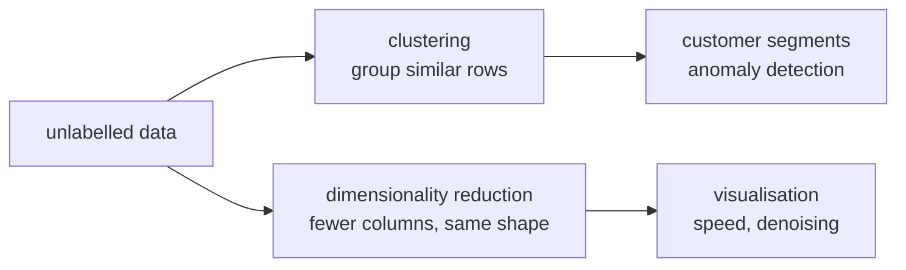

# Lesson 10 — Unsupervised Learning

**Goal:** find structure when nobody gave you labels.

## What you will learn

- K-Means, and choosing the number of clusters
- Silhouette score
- DBSCAN, which finds the number itself
- PCA for compression and for plotting

---

## No labels, no accuracy

Supervised learning has a right answer to score against. Here there is none —
you get structure, and you have to judge whether it is useful.



---

## K-Means

Pick `k`. Place `k` centres, assign every point to its nearest centre, move
each centre to the mean of its points, repeat until nothing moves.

```python
import numpy as np
from sklearn.datasets import make_blobs
from sklearn.cluster import KMeans
from sklearn.preprocessing import StandardScaler

X, true_labels = make_blobs(n_samples=500, centers=4, cluster_std=1.0, random_state=42)
X_scaled = StandardScaler().fit_transform(X)

model = KMeans(n_clusters=4, n_init=10, random_state=42).fit(X_scaled)

print("cluster sizes:", np.bincount(model.labels_))
print("inertia:", round(model.inertia_, 1))
```

```text
cluster sizes: [125 125 125 125]
inertia: 28.8
```

**Scale first.** K-Means is distance, and distance is dominated by the
largest-unit column — the same trap as lesson 07.

`inertia_` is the total squared distance from points to their centre. It
always falls as `k` rises, so it cannot choose `k` on its own.

---

## Choosing k

```python
import numpy as np
from sklearn.datasets import make_blobs
from sklearn.cluster import KMeans
from sklearn.preprocessing import StandardScaler
from sklearn.metrics import silhouette_score

X, _ = make_blobs(n_samples=500, centers=4, cluster_std=1.0, random_state=42)
X_scaled = StandardScaler().fit_transform(X)

print(f"{'k':>3}{'inertia':>12}{'silhouette':>13}")
for k in range(2, 8):
    model = KMeans(n_clusters=k, n_init=10, random_state=42).fit(X_scaled)
    score = silhouette_score(X_scaled, model.labels_)
    print(f"{k:>3}{model.inertia_:>12.1f}{score:>13.3f}")
```

```text
  k     inertia   silhouette
  2       522.2        0.561
  3       116.1        0.747
  4        28.8        0.798
  5        25.6        0.678
  6        22.9        0.544
  7        20.3        0.448
```

Two methods, agreeing here:

- **The elbow.** Plot inertia against `k` and look for where the steep fall
  flattens. It drops hard to 4 and then crawls.
- **Silhouette**, from −1 to 1: how much closer each point is to its own
  cluster than to the next nearest. It peaks at 4 — the real number of blobs.

Prefer silhouette: it gives a number rather than asking you to squint at a
bend. And remember that the best `k` statistically is not always the useful
one — if the business can run three campaigns, three segments is the answer.

---

## What K-Means assumes

```python
import numpy as np
from sklearn.datasets import make_moons
from sklearn.cluster import KMeans, DBSCAN
from sklearn.preprocessing import StandardScaler
from sklearn.metrics import adjusted_rand_score

X, y = make_moons(n_samples=500, noise=0.06, random_state=42)
X_scaled = StandardScaler().fit_transform(X)

kmeans = KMeans(n_clusters=2, n_init=10, random_state=42).fit(X_scaled)
dbscan = DBSCAN(eps=0.3, min_samples=5).fit(X_scaled)

print("k-means agreement:", round(adjusted_rand_score(y, kmeans.labels_), 3))
print("dbscan agreement: ", round(adjusted_rand_score(y, dbscan.labels_), 3))
print("dbscan clusters:  ", len(set(dbscan.labels_)) - (1 if -1 in dbscan.labels_ else 0))
```

```text
k-means agreement: 0.45
dbscan agreement:  1.0
dbscan clusters:   2
```

Two interleaved crescents. K-Means fails badly because it can only draw
straight boundaries around round, similarly-sized blobs — it slices both
crescents in half. DBSCAN recovers them perfectly.

(`adjusted_rand_score` compares two labellings; it is only available here
because this toy data *has* labels. In real unsupervised work you will not have
this luxury.)

---

## DBSCAN

Density-based: a cluster is a dense region, and anything in a sparse region is
noise.

| | K-Means | DBSCAN |
|---|---|---|
| Number of clusters | You choose | It decides |
| Cluster shape | Round blobs only | Any shape |
| Outliers | Forced into a cluster | Labelled `-1` — noise |
| Main parameters | `k` | `eps`, `min_samples` |
| Struggles when | Shapes are not round | Densities differ between clusters |

```python
import numpy as np
from sklearn.datasets import make_moons
from sklearn.cluster import DBSCAN
from sklearn.preprocessing import StandardScaler

X, _ = make_moons(n_samples=500, noise=0.1, random_state=42)
X_scaled = StandardScaler().fit_transform(X)

for eps in [0.1, 0.3, 0.9]:
    labels = DBSCAN(eps=eps, min_samples=5).fit_predict(X_scaled)
    clusters = len(set(labels)) - (1 if -1 in labels else 0)
    noise = (labels == -1).sum()
    print(f"eps={eps:<4} clusters={clusters:<3} noise points={noise}")
```

```text
eps=0.1  clusters=28  noise points=242
eps=0.3  clusters=2   noise points=1
eps=0.9  clusters=1   noise points=0
```

`eps` is the radius that counts as "nearby". At 0.1 it finds 28 "clusters" and
calls half the data noise; at 0.9 the whole dataset is one cluster. Only 0.3
recovers the two crescents. It is the whole game, and it must be tuned on
scaled data.

The `-1` label is a feature: DBSCAN doubles as an anomaly detector.

---

## PCA

Principal component analysis finds new axes — combinations of your existing
columns — ordered by how much variation they capture. Keep the first few and
you keep most of the information in far fewer columns.

```python
from sklearn.datasets import load_breast_cancer
from sklearn.decomposition import PCA
from sklearn.preprocessing import StandardScaler
import numpy as np

X, y = load_breast_cancer(return_X_y=True)
X_scaled = StandardScaler().fit_transform(X)

pca = PCA().fit(X_scaled)
cumulative = np.cumsum(pca.explained_variance_ratio_)

print("components for 80%:", np.argmax(cumulative >= 0.80) + 1)
print("components for 95%:", np.argmax(cumulative >= 0.95) + 1)
print("first 5 ratios:", pca.explained_variance_ratio_[:5].round(3))
```

```text
components for 80%: 5
components for 95%: 10
first 5 ratios: [0.443 0.19  0.094 0.066 0.055]
```

Thirty columns compressed to ten with 95% of the variance kept. The first
component alone carries 44%.

**Always scale before PCA** — it maximises variance, and an unscaled column
with big units has enormous variance for no meaningful reason.

Two uses, and they are different:

```python
from sklearn.datasets import load_breast_cancer
from sklearn.decomposition import PCA
from sklearn.preprocessing import StandardScaler
from sklearn.pipeline import make_pipeline
from sklearn.linear_model import LogisticRegression
from sklearn.model_selection import cross_val_score

X, y = load_breast_cancer(return_X_y=True)

plain = make_pipeline(StandardScaler(), LogisticRegression(max_iter=5000))
reduced = make_pipeline(StandardScaler(), PCA(n_components=10),
                        LogisticRegression(max_iter=5000))

print("all 30 features:", round(cross_val_score(plain, X, y, cv=5).mean(), 3))
print("10 components:  ", round(cross_val_score(reduced, X, y, cv=5).mean(), 3))
```

```text
all 30 features: 0.981
10 components:   0.981
```

Two-thirds of the columns removed and the accuracy did not move at all. That
is a good trade when you care about speed, memory, or collinearity — and a
pointless one when you care about explaining the model, because a principal
component has no meaning a human can name.

For **visualising** clusters, reduce to 2 components and scatter-plot them.
(For that purpose only, t-SNE and UMAP usually produce nicer pictures — but
they distort distances, so never feed their output into a model.)

---

## Common mistakes

| Mistake | What happens |
|---|---|
| Not scaling before K-Means, DBSCAN or PCA | One column defines the geometry |
| Choosing `k` by inertia alone | It always falls; you will pick the largest k |
| K-Means on non-round clusters | Confidently wrong groups |
| `n_init=1` | An unlucky start gives a poor solution |
| DBSCAN with default `eps` | Everything is one cluster, or everything is noise |
| PCA before splitting | Leakage — fit it inside the pipeline |
| Naming clusters before inspecting them | A story you invented, not a segment |

---

## Exercises

1. Cluster a real dataset; plot inertia and silhouette for k = 2…10 and choose.
2. Profile your clusters: group the original data by cluster and compare the
   means. Can you name each group in one phrase?
3. Run DBSCAN over five `eps` values and report clusters and noise for each.
4. Reduce a dataset to 2 components and scatter-plot it, coloured by a label
   you did not use.
